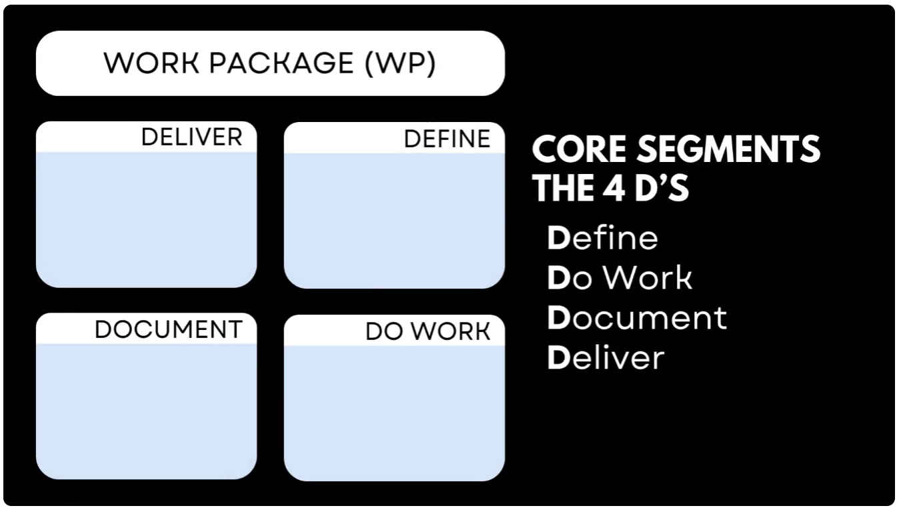
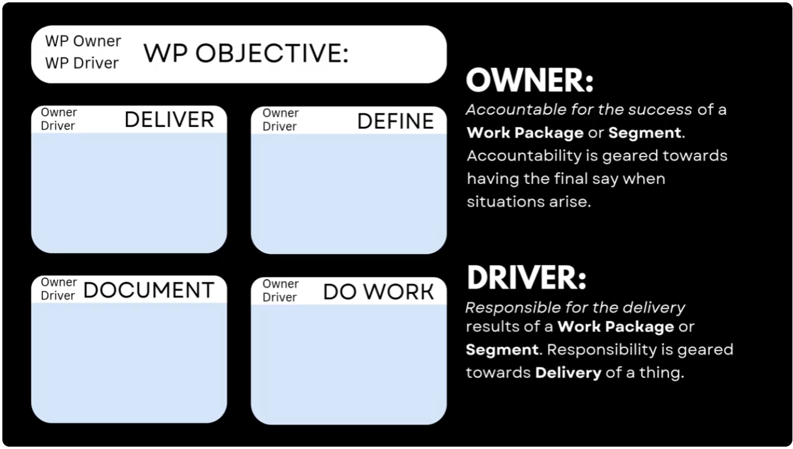
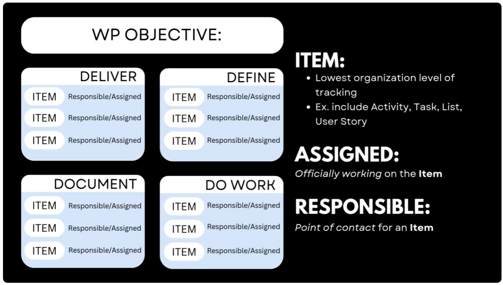
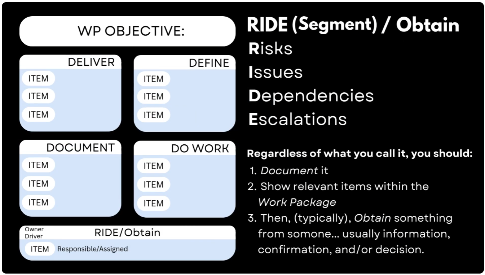
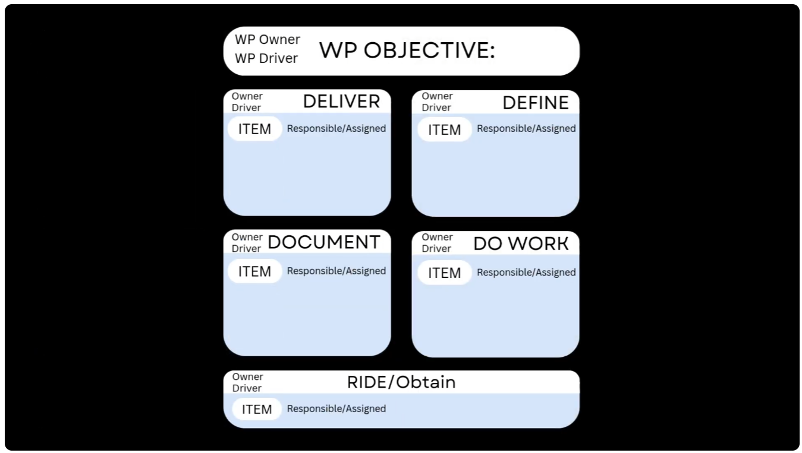
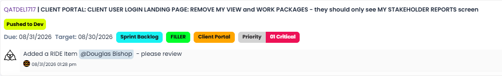
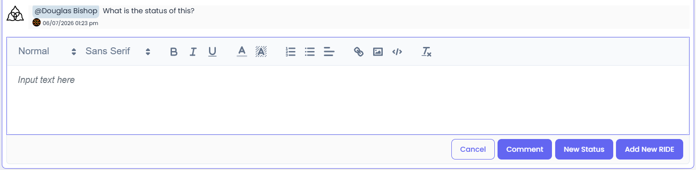
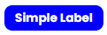
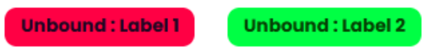
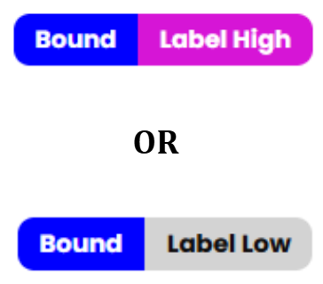

Agilic Fundamentals

*September 18, 2026 • Section 1*

There are a few terms and concepts that you should know in order to
understand how Agilic works.

# The Work Package

Most tools are either task trackers or they only track official
projects. Projects, however, are just one kind of Work Package.

A Work Package (WP) is one of the central concepts of Agilic. It is a
Body of Work of any size. Period. It can be a large, multi-team project
or a small, individual task list. It is whatever size body of work you
need to manage.

Official Projects have a defined beginning and end. However, Operational
Activities are ongoing with no end. And Leadership Goals may have a
beginning and an end --- but they aren't really managed in the same way
as an official project, and then there are cross-team 'best effort'
activities which are different from both Official Projects and Goals.

Agilic handles them all.

## Key Terms in a Work Package (WP)

**WP Objective ---** this is the short, single statement of what you are
trying to accomplish.

## Items

An Item is the lowest organizational level of tracking --- an Activity,
Task, User Story, etc. It also includes Milestones.

The difference between a regular Item and a Milestone is a Milestone is
a moment in time. Milestones only reference the Due Date or Target Due
Date.

## Work Item Types (4D's)

Every Work Package has four Item Types (also called the 4D's):

-   Define

-   Do Work

-   Document

-   Deliver

The 4D's are Agilic's native methodology. Regardless of the Industry,
this is how people talk about their work at the water cooler.

**DEFINE ---** (aka Requirements) What is required to be defined in
order to accomplish the WP Objective.

**DO WORK ---** Who is doing what work once we have Defined the WP
Objective.

**DELIVER ---** What are ALL the External and Internal Deliverables
required in order to say we have officially finished this Work Package.

**DOCUMENT ---** All the Documentation required to support the DEFINE,
DO WORK and DELIVER Items.

## Basic Roles in a Work Package

There are only 4 basic players within a Work Package:

-   Owner --- Accountable for the Success of a Work Package. They
    typically have the final say when a situation arises.

-   Driver --- Responsible for the delivery results of a Work Package.
    They typically are ensuring everyone in the effort is moving in the
    same direction.

-   Assigned --- Anyone officially working on an Item (could be multiple
    people Assigned to an Item).

-   Responsible --- The Point of Contact for an Item. You can only have
    one Responsible person on an Item.

## RIDE Items

Every Work Package also has a special Item Type called a RIDE.

-   Risks

-   Issues

-   Dependencies

-   Escalations

The RIDE handles all the day-to-day things that pop up. It doesn't
matter what you call them --- Risks, Issues, Dependencies or Escalations
--- you have to do the same thing with all of them:

-   Document the RIDE

-   Show relevant Items within the Work Package --- and possibly have
    potential solutions captured.

-   Then Obtain something from someone... usually information,
    confirmation and/or some kind of decision.

Most project tools can't handle this because these types of things are
not officially part of a project plan. This is where most projects fail,
because this work stays hidden in emails and chat channels --- and even
if handled in those channels... two months later no one can find the
decision that was actually made.

Agilic has designed the RIDE to work seamlessly with the regular Item
Types --- allowing easy capture and escalation for Decisions, along with
linking to other Items (including other Work Packages) so you can see
the full impact of any given RIDE Item.

**Note:** Escalated RIDE Items are automatically shown on Executive
reporting and can be seen as a dedicated column in Kanban Boards.

RIDE Items have many special features that other Items do not:

-   Any RIDE Item can be Escalated.

-   RIDEs have an optional Mitigation Management section --- allowing
    for more detailed Mitigation like selecting Likelihood (High,
    Medium, Low) and Impact (High, Medium, Low).

-   RIDEs have an optional Decision Management feature --- a
    lightweight, but full process for asking for Decisions, capturing
    those decisions and then communicating those decisions. Every RIDE
    can have multiple Decision Requests --- because sometimes things get
    complicated.

How all this fits together in Agilic:

# State vs Status

The Problem with Traditional Tools is that "Status" is a catch-all
field. Blocked, In Progress, Complete is all you usually can see. Agilic
enables the rest of the story to be easily captured and seen by all.

In Agilic, we use State for where your Item is within your process
steps. This is where Blocked, In Progress and Complete belong. Status is
a free-form text field that allows you to put WHY you're blocked. This
saves a significant amount of time by others combing through the
Comments, sending you emails and even can reduce the amount of meetings
that may be needed.

Most views showing Items have the 'Comment Box Icon.'

Clicking on this opens the Comment Box for just this Item without the
need to fully load the Item --- saving you time, every time, when you
need to update an item.

You can even update Status directly on any Kanban Board.

## Why State vs Status Matters

-   Clarity: No more Mystery Statuses

-   Team and Executive Alignment: Everyone knows what's going on

-   Momentum: Quicker Triage when things go off track

# Label Types

Agilic uses multiple Label types, all of which can be used as a column
in the Kanban Boards. A Label Strategy for your Organization is highly
recommended.

***See also:** [Things to Consider when Setting Up Your Org (Section
2)](/s2-setting-up-your-org/things-to-consider-when-setting-up-your-org.md).*

The Core Labels available in Agilic can be set up at the Organization
Level (Global) and/or at the Work Package Level. Global labels are
available in every Work Package and are available as a Kanban Column for
the Organization Reporting Kanbans. Every Work Package can use existing
Global labels, but they can also create their own Labels for use within
the Work Package.

**Note:** All Labels attached to an Item will be able to be used as a
Kanban column in My View Reporting and Team View Reporting.

## Simple Labels

Are what most people think about when talking about Labels:

-   Categories

-   Groupings

-   Etc.

You can add as many Simple Labels as you want to any item.

## Unbound Labels

Are the same as Simple Labels except Unbound Labels have 2 parts:

-   TECH : Hardware

-   TECH : Software

-   TEAM : Alpha

-   TEAM : Bravo

You can add as many Unbound Labels as you want to any item.

## Bound Labels

Are similar to Unbound Labels except Bound Labels can only have one of
each Label Name applied:

-   Complexity :: High

-   Complexity :: Low

-   PRIORITY :: 1

-   PRIORITY :: 2

-   PRIORITY :: 3

-   PRIORITY :: High

You can be Complexity High or Low --- but not both. You can only add 1
of each type of Bound Label to any item.\
Note: Bound Labels function similar to Item States

**Note:** At the Organization level (Org Settings), Labels are also
available to be applied at the Work Package (Project) Level --- not just
the Item Level.
