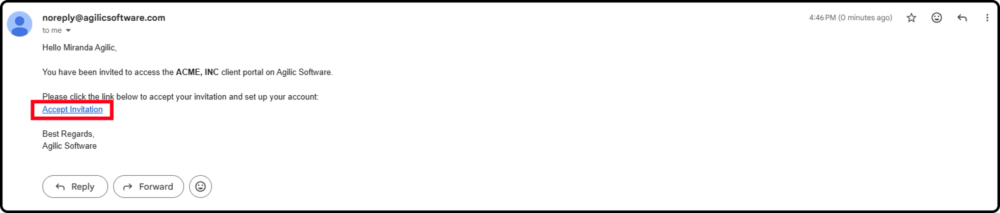
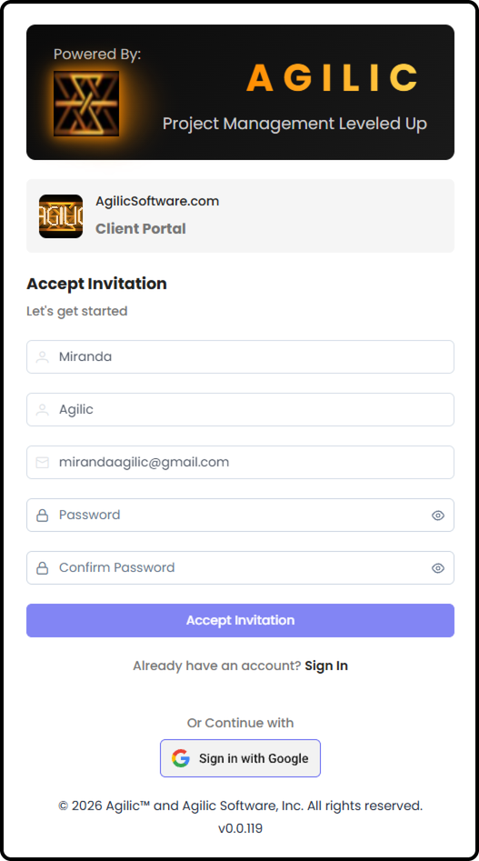
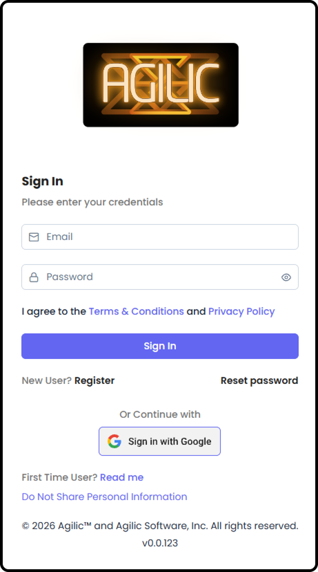
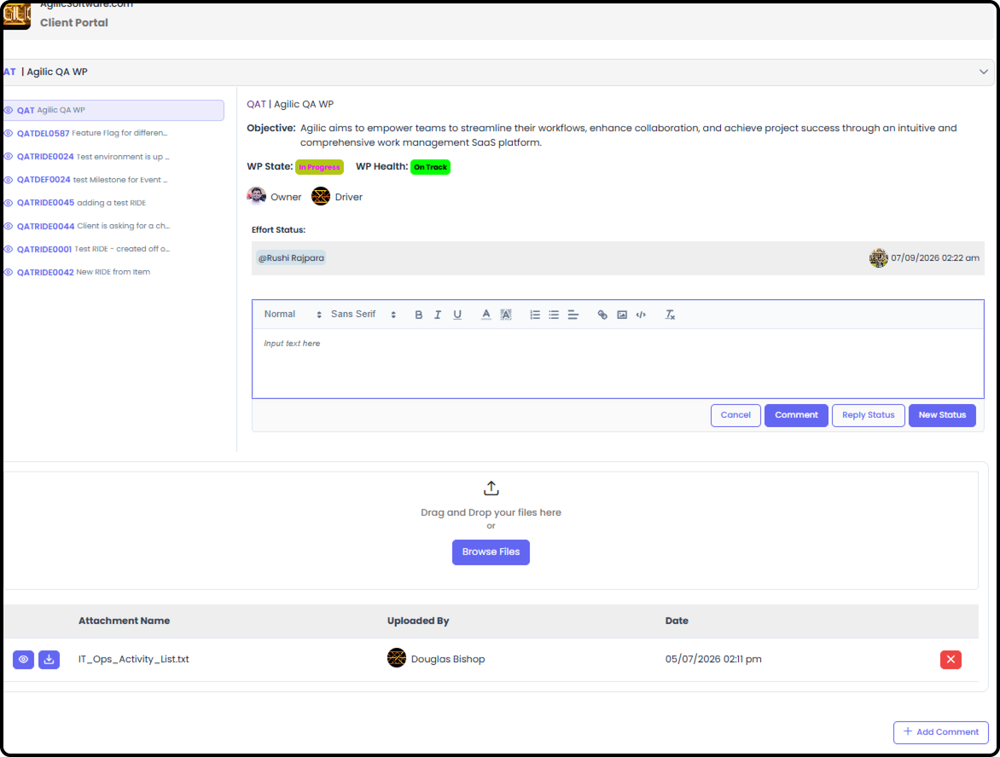
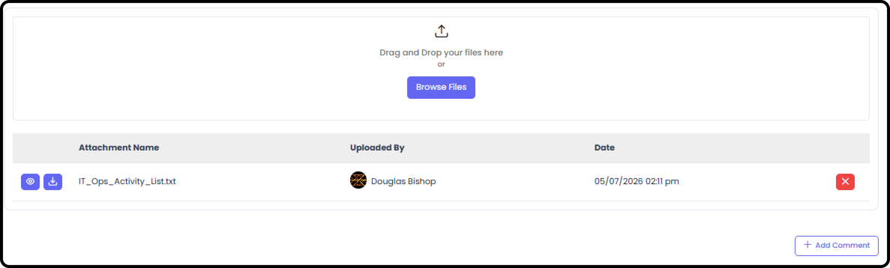

*September 18, 2026 • Section 10: External Collaboration • For: Client
Portal users (external)*

Welcome! This guide will help you get started with your Client Portal
--- a simple, secure way to stay up to date on the work being done for
you, without needing to dig through emails or ask for status updates.

# Signing In

**Step 1: Access to the Client Portal**

You'll receive an email invitation from your project team with a link
to sign in. If you don't have an account yet, the link will let you
create one in just a couple of steps.

-   Click on the link to Accept Invitation

-   You will be taken to an Invitation Sign In screen - which will have prefilled information. If you need to change the First Name, Last Name or email - please contact your Project Team.

-   Create a Password. Re-enter that password - then Select 'Accept Invitation'. Alternatively, you can Sign in with Google instead.

**DOUG - update image after QATDEL1732**\

-   Once you hit Accept Invitation - you will be taken directly to the Sign In page where you will need to enter your email and Password. Alternatively, you can Sign in with Google instead.

**Tip:** Bookmark the sign-in page after your first visit --- you'll
come back to it regularly.

# Your Portal at a Glance

Once you're signed in, you'll see a simplified view built just for you
--- not the full internal tool your project team uses.

# Viewing Your Projects

**Step 1: Open a Project**

Select the Project you want to see.

**Step 2: Check Milestones and Updates**

For the project you've selected, you'll see key milestones and any
risks, issues, or escalations your project team needs for you to be
aware of --- this is not everything they track internally, only what's
relevant for you to see.

**Tip:** Your project team decides exactly what shows up here, screen by
screen --- so you're only ever looking at what actually matters to you.

***See also:** Your project team controls what you see from their side
using Client Milestone Management and Client RIDE Management --- see
[Work Package Client Portal Management (Section
3)](https://agilic-wiki.local/s3-work-package-client-portal-management).*

**Step 3: Leave a Comment**

If comments are enabled for your project, you can respond directly ---
no need to send a separate email.

**Step 4: View or Upload Attachments**

Any files your project team has shared will appear here, and you can
always download them. Depending on your project's setup, you may also
be able to upload your own files.

***See also:** The underlying permission rules for client comments and
attachments are covered in [Permissions for People (Section
2)](https://agilic-wiki.local/s2-permissions-for-people).*

# Need Help?

If something looks wrong, or you can't find information you're
expecting, reach out to your main point of contact on the project team
--- they manage what's shared with you and can help sort out any
issues.
