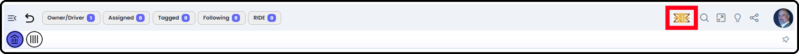
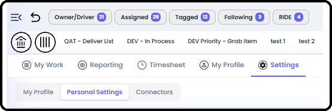
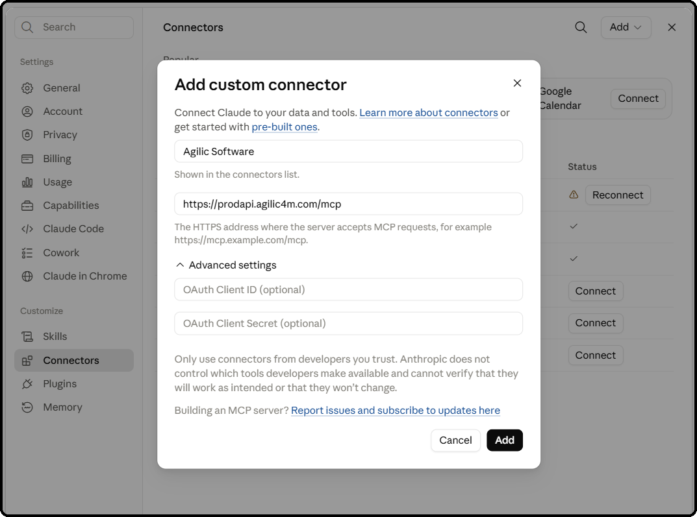
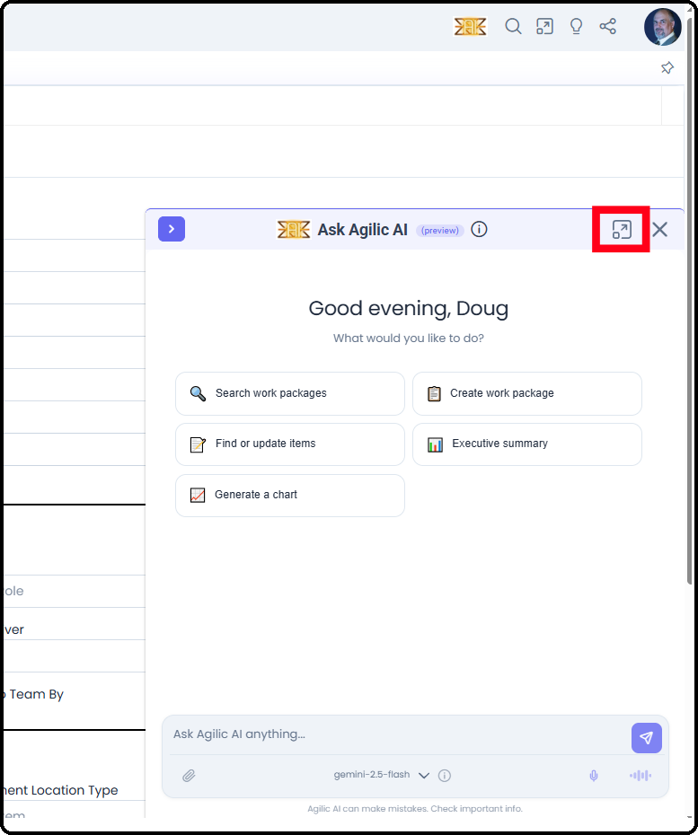
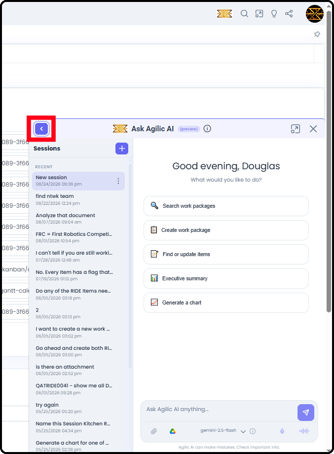
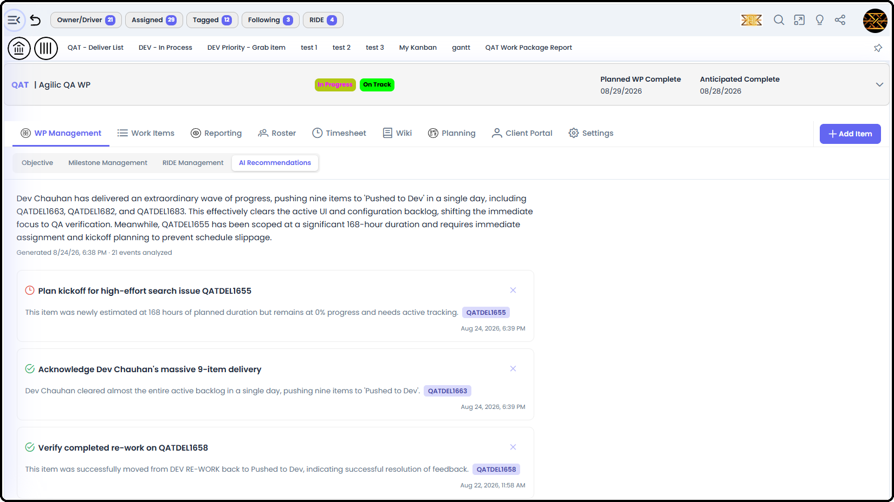
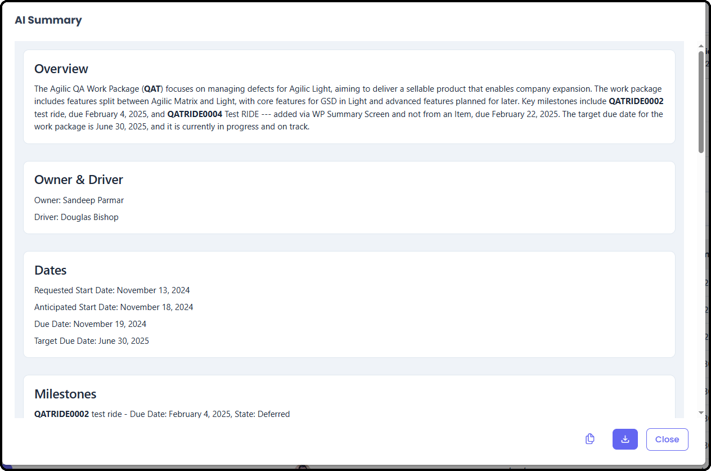
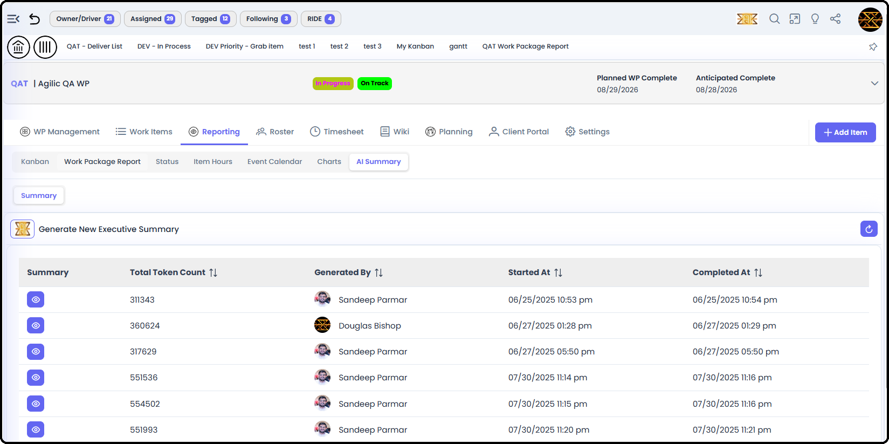
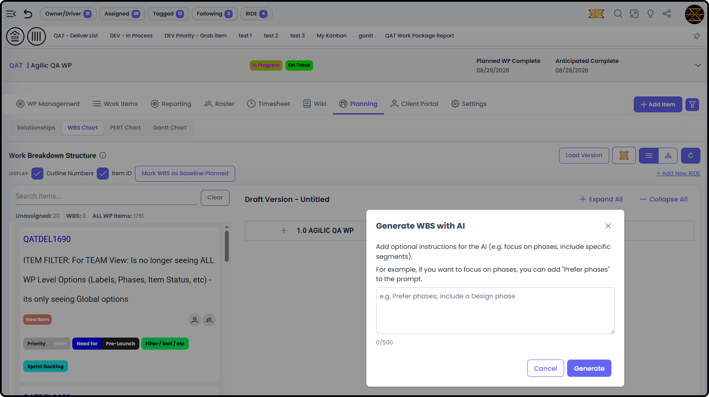

*September 18, 2026 • Section 11: AI-Powered Assistance • For: All
users*

The Agilic AI Assistant is a chat-based companion built into Agilic.
Rather than clicking through screens, you can ask it questions in plain
language and have it look things up, summarize, chart, or make updates
for you.

# Getting There

The Assistant is available from the top-right corner of the screen, no
matter where you are in Agilic --- one of the persistent top toolbar's
Right-Side Icons.

# Standard AI Protocol --- How to Work With It

A few habits make the Assistant far more useful:

-   Be specific about which Work Package or item you mean, especially early in a conversation --- the Assistant remembers context after that, but needs a clear starting point

-   State what you want as an outcome ("summarize this WP for my exec update") rather than describing UI steps --- it's a request-based tool, not a click-recorder

-   Review the confirmation prompt before approving any change --- the Assistant always shows you the before/after, it won't apply anything silently

-   If a request could plausibly touch data you can't normally see, don't expect the Assistant to bypass that --- it follows the same visibility rules as the rest of Agilic

# Internal to Your Organization 

**Note:** The Assistant is entirely internal to your organization's own
Agilic data. It does not have general internet access --- it can't
browse the web, look up outside information, or answer questions
unrelated to your Agilic content.

-   It only knows what's in your organization's Work Packages, items, attachments, and (if connected) your attached Google Drive files

-   It won't have real-world knowledge beyond what it can infer from your data --- don't expect it to answer general questions unrelated to Agilic

# What It Can Do

The Assistant is organized around a few specialist agents working behind
the scenes. You don't need to know which one is handling your request
--- just ask naturally, and it routes itself.

**Work Packages**

-   Search for and pull up details on a Work Package

-   Update a Work Package's state, health, or other fields

-   Create a new Work Package

-   Track tasks/subtasks at the Work Package level

**Work Item Types (aka Segment Types)**

-   Search for and pull up details on items (Deliver, Define, Do Work, Document, or RIDE)

-   Update item fields --- state, assignees, due dates, and more

-   Create new items

-   Track tasks/subtasks at the item level

***See also:** For background on Work Item Types and RIDE, see [Work
Item Types (Section
6)](https://agilic-wiki.local/s6-work-item-types),
[Working Standard Items (Section
6)](https://agilic-wiki.local/s6-working-standard-items)
and [Working RIDE Items (Section
6)](https://agilic-wiki.local/s6-working-ride-items).*

**Documents and Google Drive**

-   List the files attached to a Work Package or item

-   Answer questions about a document's content

-   Read and answer questions about a Google Drive file you've attached to the chat

-   Attach a Google Drive file to a Work Package or item directly through the chat (currently in QA)

**Charts and Summaries**

-   Generate a chart or graph from a plain-language request

-   Build a roadmap or timeline view of milestones or items

-   Produce an executive summary or health overview of a specific Work Package

**Note:** All charts generated are downloadable

# Connect Your Drive

**Step 1:** Go to My Profile → Personal Connectors, and connect your
Google Drive account.

***See also:** Personal Connectors are covered in [My View Overview
(Section
5)](https://agilic-wiki.local/s5-my-view-overview).*

**Step 2:** Reference a Drive File in Chat

Once connected, attach or reference a Google Drive file in your
conversation with the Assistant --- it can read the file's content and
answer questions about it, or attach it directly to a Work Package or
item on your behalf.

# Tie Your Own AI Service to Agilic

Any AI Service that uses MCP can be utilized to access your login to
Agilic

**Step 1:** Go to your Connector Settings in your AI Service

For instance, in [Claude.ai](http://claude.ai) you can go
to Settings → Connectors → add a custom connector

{width="3.401042213473316in"
height="2.5562314085739284in"}*.*

*[Image Ref: 11-003]*

Then add the MCP server and Name your connections

**[https://prodapi.agilic4m.com/mcp](https://prodapi.agilic4m.com/mcp)**

**Note:** Chart and summary requests are handled separately from data
updates --- the Assistant won't make changes to your data while
generating a chart or summary.

**Example: Getting Information From a Specific Work Package**

A typical flow for asking about one Work Package's status:

**Step 1:** Open the Assistant from anywhere in Agilic

**Step 2:** If you want information from a specific Work Package, then
name the Work Package directly ("Find [WPID]")

**Step 3:** Ask for what you want directly: "summarize this," "chart
items by state," "what's overdue," "who's overloaded this week"

**Step 4:** Follow up conversationally --- the Assistant remembers
you're still talking about that same Work Package until you name a
different one

# Your Private Work Package

Every user has one personal, private Work Package. The Assistant can
create or update items in it through chat (e.g. "add a personal
to-do"), using your own custom categories --- but the Assistant isn't
the only way to use it. It's a fully-featured Work Package accessible
through the normal interface too, with you as its default Owner/Driver.

***See also:** For the full picture --- including the toolbar button and
custom Work Item Type naming --- see [My Private Work Package (Section
5)](https://agilic-wiki.local/s5-my-private-work-package).*

# How It Behaves

**It Confirms Before Changing Anything**

Before making any update, the Assistant will show you the current value
and the proposed change, and ask you to confirm --- it won't silently
modify your data.

**It Remembers Context**

Within a conversation, you can refer back to something you just
discussed --- "update the date on that" or "change its title" ---
without repeating which Work Package or item you mean.

**It Respects Security**

The Assistant never shows you data you wouldn't otherwise be able to
see.

***See also:** See [Permissions for People (Section
2)](https://agilic-wiki.local/s2-permissions-for-people)
for the full security model.*

**What It Won't Show You**

-   Internal IDs, GUIDs, or technical identifiers --- only names and human-readable details

-   Details about its own internal architecture, tools, or how it's built

-   The current date from its own internal knowledge --- it always checks Agilic's own reference date first, so date-based answers (e.g. "what's due this week") are accurate

# How to Use Agilic AI Agent

There are two different types of AI Agents in use within Agilic:

1.  The general Agilic AI Agent

2.  Dedicated Views powered by AI that need little or no input from the user

**Accessing the general Agilic AI Agent**

This is similar to other tools. Located in the top-right corner of the
screen, Agilic's AI Agent is available no matter where you are.

Clicking on the Agent, gives you a small box to work from - which can be
expanded to Full screen

Additionally, you can open the sidebar to see the history of threads you
have used

You can also:

-   Add attachments into the AI Agent, including from your Google Drive (if you have one connected)

-   Speak your commands

-   Have the output read aloud to you

**Dedicated Views powered by AI**

There are several views throughout Agilic that are powered by AI but
require little to no input from the User.

**Work Package Management:** AI Recommendations - Gives a summary of
what's potentially important to know since the last time the AI
Recommendations were looked at. It also calls out kudos to individuals
on the Roster.

***See also:** AI Recommendations is also mentioned in [Work Package
Management (Section
3)](https://agilic-wiki.local/s3-work-package-management)
--- this is the fuller description of what it shows.*

**Work Package: Reporting:** AI Summary - Gives a detailed, current
Executive Summary of the Work Package. The AI Summary is fairly long,
but is downloadable.

This summary is automatically stored and is copyable and downloadable.

***See also:** Full detail on AI Summary is in [Work Package Reporting
(Section
3)](https://agilic-wiki.local/s3-work-package-reporting).*

**Work Package: Planning:** WBS AI - On the Work Breakdown Structure
(WBS) of the Planning views, there is an additional AI button. Selecting
this gives you the option to have the AI generate a WBS for you based on
your preference. For instance, you can tell it to focus on Phases, or
set up by Work Item Type, or try other options.

***See also:** Full detail on AI WBS is in [Work Package Planning
(Section
3)](https://agilic-wiki.local/s3-work-package-planning).*
