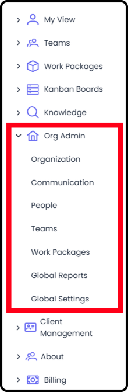
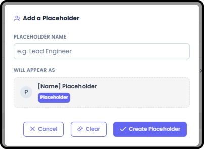
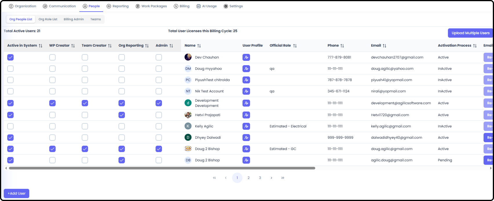
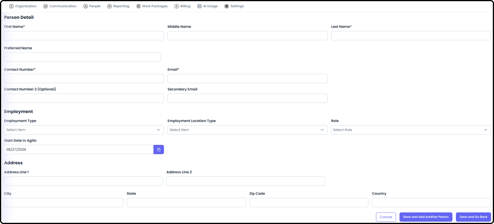

*September 18, 2026 • Section 2: Recurring Admin Tasks • For: Org
Admins*

This guide covers the ongoing admin task of inviting new people into
your organization, assigning them permissions, and keeping the People
list current. Unlike Organization setup, this is something you'll come
back to regularly as your team grows or changes.

***See also:** For a full breakdown of every access layer, see
[Permissions for People (Section
2)](/s2-setting-up-your-org/permissions-for-people.md).*

# Getting There

Go to Org Admin, then select the People tab.

**Step 1: Review the Org People List**

The Org People List shows everyone currently in your organization, along
with their role, employment type, and activation/verification status.

**Tip:** Check the verification/activation status column if someone says
they can't log in --- they may not have completed their invitation yet.

**Step 2: Set Up Org Roles (If Needed)**

Before adding people, make sure the Org Role List reflects your
organization's actual job titles/functions --- this is what you'll
assign each new person to.

**Tip:** Agilic also supports "Role Placeholders," available for
pre-planning across the org --- a role that exists in the system but
isn't yet filled by a real person. Individual Work Packages can also
use these org-level role placeholders, or create their own.

***See also:** A Role is a job title/skillset label only --- it carries
no permissions of its own. [See Permissions for People (Section
2)](/s2-setting-up-your-org/permissions-for-people.md).*

**Step 3: Add a New Person**

From the Org Admin → People → Org People List:Select Add User

then fill in the relevant information:

The Required fields are:

-   First name

-   Last name

-   Contact Number

-   Email - Note that the email listed here is where the invitation for access to Agilic will be sent.

Once saved, the new person receives an invitation to join your
organization.

**Step 4: Grant Standard Permission Types (As Needed)**

A person's Role doesn't grant them any special access on its own. If
they need to create Work Packages, create Teams, access org-level
reporting, or manage the organization, grant the relevant Standard
Permission Type from the Org People List:

-   WP Creator --- can create Work Packages

-   Team Creator --- can create Teams

-   Org Reporting --- can access org-level reporting

-   Admin --- full Org Admin access, which includes all other levels

**Tip:** Every organization must always have at least 1 person with Org
Admin access --- the system won't let you remove the last one.

**Step 5: Grant Billing Admin (As Needed)**

Only one person can be Billing Admin at a time, and they must already
have Org Admin access. Go to Org Admin → Billing Admin, then select the
person to hold the role.

***See also:** For the full Billing Admin rules, see Permissions for
People (Section 2).*

**Step 6: Track Invitation Status**

A newly added person won't be able to use Agilic until they accept
their invitation and complete registration. Check back on the Org People
List to see their verification status.

# Related Tasks

-   To add someone to a Work Package, see Work Package Roster / Add People to WP (Section 3)

-   To add someone to a Team, see Team Roster / Add a Person to the Team (Section 4)

-   To grant Billing Admin, see Step 5 above

-   For details on what different access levels mean, see [Permissions for People (Section 2)](/s2-setting-up-your-org/permissions-for-people.md)
