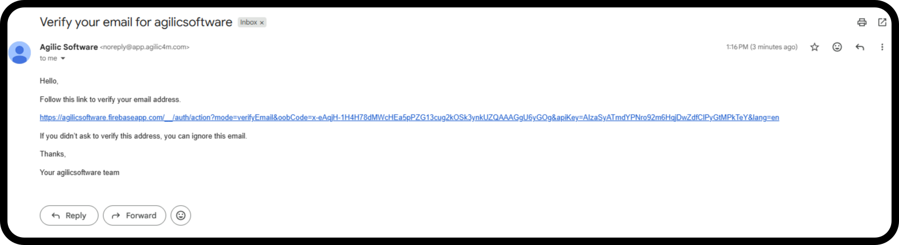
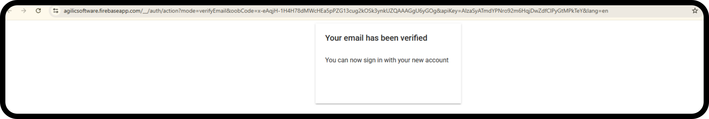
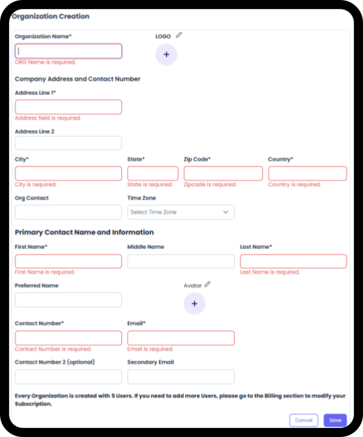
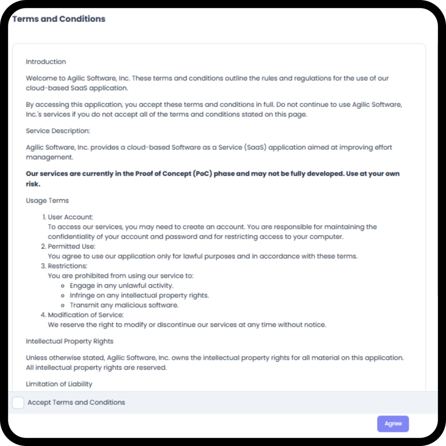
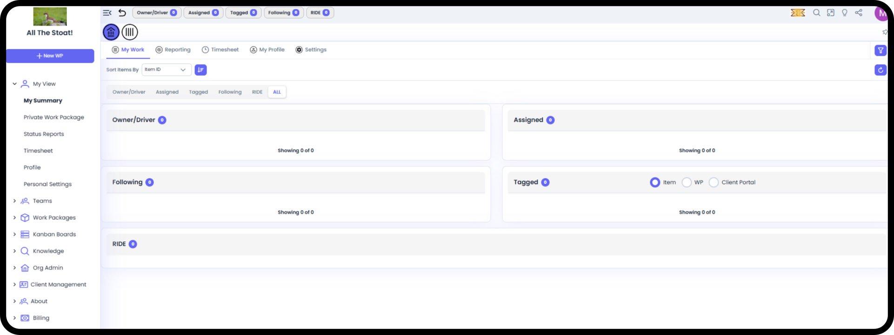

*September 18, 2026 • Section 2: Setting up your Org • For: New users
setting up a brand-new organization*

# Who This Guide Is For

This guide walks you through creating a brand-new Agilic account and
setting up your organization for the first time. Follow this guide if
you're the very first person from your company to sign up for Agilic.

If you were invited to join an organization that already exists in
Agilic, this guide isn't for you --- look for the "Joining an Existing
Organization" guide instead, since your setup steps are different.

# Before You Start

Have the following required information ready:

-   Primary Contact: Your name, Phone Number and email address

-   Your organization's basic info: name, mailing address, and phone number

-   A logo image for your organization, if you have one (optional --- you can add this later)

# Overview: What Happens in This Process

Creating your organization happens in two parts, one right after the
other:

-   First, you create your personal Agilic account (Register)

-   Then, because you're the first person from your company, Agilic will automatically ask you to set up your organization before you can do anything else (Organization Creation)

Once both steps are done, you'll land in Agilic ready to go.

**Step 1: Create Your Account**

Go to the Agilic sign-in page at https://agilicsoftware.com/ and select
"Sign Up".

This will bring up the Registration page. Fill in the registration form:

-   First name and last name

-   Email address

-   Password (at least 8 characters) --- you'll enter it twice to confirm

Alternatively, you can select Sign up with Google to skip typing a
password.

**Tip:** If you're not sure whether your company already has an Agilic
organization, check with your team before registering --- signing up
fresh will start a brand-new organization, even if your coworkers are
already using Agilic.

**Step 2: Verify Your Email**

Right after registering, within 5 minutes, you will receive an email to
verify your account. If you do not see the email then check your spam
folder to see if it was caught by automated filters.

Click on the link in the email to verify your email address is valid

You should see a pop up similar to this

**Step 3: Sign In to Your Organization for the First Time**

Once your email is verified, go back to the initial login screen and
either sign in with Google or enter your email and password and click on
Sign In\

**Step 4: Complete Your Organization's Profile**

After Signing in, you'll see a pop-up window titled "Organization
Creation." This step is required --- you won't be able to use Agilic
until it's filled out.

Fill in the following:

-   Organization name

-   Organization logo (optional --- you can click the logo area to upload an image)

-   Address: street address, city, state, country, and zip code

-   Primary Contact Name and Information

    -   First Name, Last Name

    -   Phone number

    -   The email shown here is the one you registered with. It can not be changed.

**Before you continue:** Your primary phone number and backup phone
number need to be different from each other --- same for your primary
and backup email. If they match, Agilic will ask you to fix it before
you can continue.

When everything looks correct, select Save. You will then be taken to
the Terms and Conditions page to review and Agree.

You'll be taken straight into Agilic, landing on your My View
dashboard.

Note: As the 1st person in the Organization you are, by default, given
Org Admin and Billing credentials. These can be adjusted in the Org
Admin → People views.

***See also:** For the full permissions model, see [Permissions for
People (Section
2)](#/s2-setting-up-your-org/permissions-for-people).*

# 

# What If I Can't Finish Right Now?

This setup step doesn't have a "skip" or "do this later" option ---
Agilic needs your organization's basic information before it can show
you anything else. If you need to stop partway through, your only option
is Cancel, which signs you out and returns you to the sign-in screen.
You'll need to sign back in and complete this step from the beginning
next time.

# What's Next

Once your organization is set up, here's what to do first:

-   Invite your teammates --- head to Org Admin → People → Add New Person to bring your team into Agilic

-   [Configure your Org Settings (Section 2)](#/s2-setting-up-your-org/org-settings) --- set date/time preferences, labels, and templates before your team starts creating Work Packages

-   Explore My View --- your personal dashboard for anything assigned to you

-   Create your first Work Package --- the core unit of work in Agilic, whether it's a large project or a single task

***See also:** For inviting your team, see [Adding & Managing People
(Section
2)](#/s2-setting-up-your-org/adding-and-managing-people).
For org-wide configuration, see [Setting Up Your Organization's
Settings (Section
2](#/s2-setting-up-your-org/org-settings)). For
creating your first Work Package, see [Create a Work Package (Section
3)](#/s3-work-packages/create-a-work-package).*

# Quick Reference

  -----------------------------------------------------------------------
  **Screen**             **Purpose**
  ---------------------- ------------------------------------------------
  Register               Create your personal Agilic account

  Organization Creation  Set up your company's profile in Agilic
                         (required, one-time)

  My View                Where you land after setup --- your personal
                         dashboard
  -----------------------------------------------------------------------

# Questions or Issues?

If something on screen doesn't match this guide, or you run into an
error you can't resolve, contact your Agilic administrator or Agilic
support.
