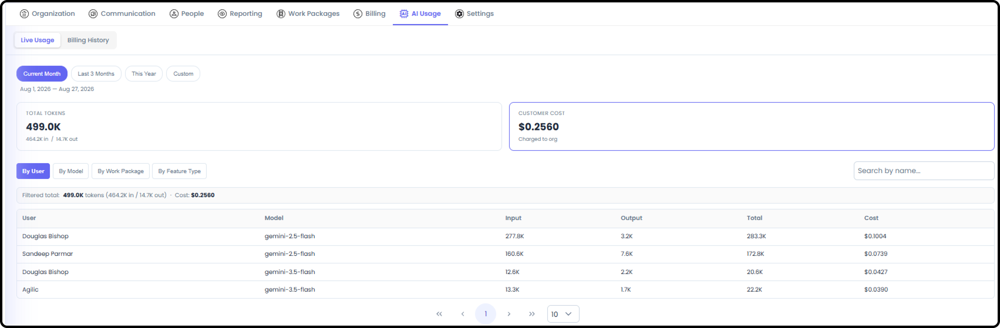
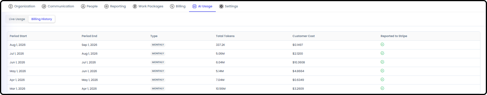

# Managing Billing

*September 19, 2026 - Section 2*

This guide covers your organization's subscription and AI usage tracking. Only the person flagged as Billing Admin can see this area - a narrower permission than general Org Admin access.

Billing Admin is a single-user role, and that person must already have Org Admin access. Anyone with Org Admin access can update who holds it

### Getting There

Go to Org Admin. If you're the Billing Admin, you'll see two additional tabs: Billing and AI Usage.

### Managing Your Subscription

Step 1: Check Subscription Status

The Billing tab shows whether your subscription is currently active, along with its start and end dates.

Step 2: Update Subscription and Payment Details

Select Manage Billing. This hands you off to a secure, Stripe-hosted billing portal - Agilic itself doesn't store or process your card details.

- Update your subscription

- Update your payment methods

- Cancel your subscription

Note: Because this is a Stripe-hosted portal, invoice history and payment method management happen outside the main Agilic interface. Confirm whether historical invoices are also viewable directly in-app.

### Reviewing AI Usage

Step 3: Check Token Usage

The AI Usage tab's Token Usage view shows both current and historical token usage for your organization.

- Reports total tokens, input tokens, output tokens, provider cost, and customer cost

- Break usage down by User, AI Model, Work Package, or Record Type using the tabs

- Results are sortable and searchable

Step 4: Review Billing History

The Billing History view shows the cost of tokens for past periods, with token counts and costs formatted for readability.

Tip: Use Token Usage to keep an eye on current-period costs, and Billing History when you need to look back at a specific past period.
