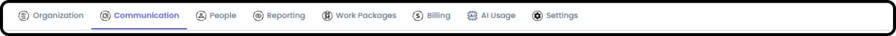
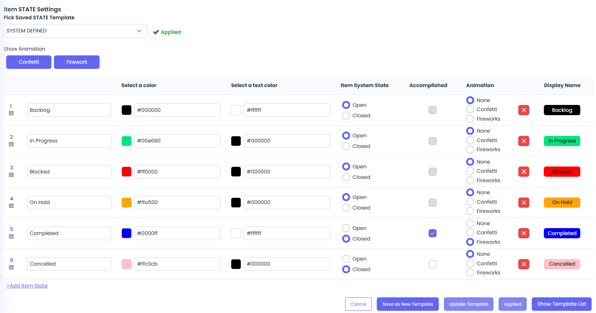

*September 18, 2026 • Section 2: New User Orientation*

Org Admin is the management console for your organization --- separate
from the everyday work areas covered in "How to Navigate as a User."
This is a quick tour of what each tab is for. Give this about 5--10
minutes.

***See also:** The persistent top toolbar (Home, quick-access pills, AI
Agent, Search, Feedback, and more) is covered in [How to Navigate as a
User (Section
1)](/s1-agilic-fundamentals/navigate-as-a-user.md).*

# Getting There

Org Admin is available if you have admin access for your organization.

**Organization**

Your organization's profile --- name, logo, license number, address,
time zone, and primary contact. This is the same form used when your
organization was first created.

**Communication**

Create organization-wide announcement banners that appear to everyone in
your org for a scheduled window of time.

**People**

Manage everyone in your organization.

1.  Org People List --- the full roster

    -   Give people permissions

    -   Access User Profiles that need updated

    -   Add / Remove Users

2.  Org Role List - where you can define what roles your people perform

    -   You can also define Role Placeholders available for Pre-Planning across the Org

3.  Standard Permission Types --- set here, per person: WP Creator, Team Creator, Org Reporting, and Admin (full Org Admin access)

4.  Billing Admin --- Only 1 User can be the Billing Admin and they must already have Org Admin permissions

    -   Note: Anyone with Org Admin Permissions can update who the Billing Admin is

5.  Teams --- manage standing teams and their membership

    -   Add New Teams

**Reporting**

Organization-wide views that roll up data across every Work Package

-   Kanban (Items) - unlimited Boards

-   Kanban (Work Packages) - unlimited Boards

***See also:** For how Org Kanban compares to My, Team, and WP Kanban
boards, see [Kanban Boards (Section
8)](/s8-reporting/kanban-boards.md).*

**Work Packages**

A list of every Work Package in the organization --- not just the ones
you personally belong to.

-   Here you can Close or Archive old Projects

**Settings**

Organization-wide configuration, in its own set of sub-tabs.

1.  Date/Time --- date format, timestamp format, business days, calendar start day

2.  Work Package Header Settings --- defaults applied across all Work Packages

3.  Labels --- customized labels / Categories used throughout the system

    -   Simple Labels - Single field, simple labels. Can assign any number of these labels.

    -   UnBound Labels - 2 part labels. Can assign any number of these labels

    -   Bound Labels - 2 part labels. Can only assign 1 of each type (Priority:High or Priority:Low - can't be both)

4.  Global Work Package Templates --- reusable starting points for new Work Packages

    -   Work Package State - defaults to System Defined unless changed

    -   Work Package Health - defaults to System Defined unless changed

    -   Work Package Phase - defaults to System Defined unless changed

    -   Item State - defaults to System Defined unless changed

5.  Module Access --- turn optional features (like Client Portal) on or off for the org

**Billing and AI Usage**

Only visible if you're specifically flagged as a Billing Admin --- a
narrower permission than general org-admin access.

6.  Billing --- your organization's subscription information and access to a Stripe-hosted billing portal

    -   You can Update your subscription and Payment methods here or Cancel your Subscription

**AI Usage**

Only visible if you're specifically flagged as a Billing Admin --- a
narrower permission than general org-admin access.

1.  Token Usage - both Current and Historical

2.  Billing History (Cost of Tokens)

# Where to Learn More

This tour only covers what each tab is for. For step-by-step
instructions on inviting people, managing teams, and configuring
settings, see the dedicated guides: [Adding & Managing People (Section
2)](/s2-setting-up-your-org/adding-and-managing-people.md),
[Create a Team (Section
4)](/s4-teams/create-a-team.md), [Managing
Billing & Subscription (Section
2)](/s2-setting-up-your-org/managing-billing.md), and
[Setting Up Your Organization's Settings (Section
2)](/s2-setting-up-your-org/org-settings.md).

**Tip:** If you don't see the Org Admin area at all, you don't
currently have admin access --- check with an existing admin in your
organization (visible under About → Org Admin Users).