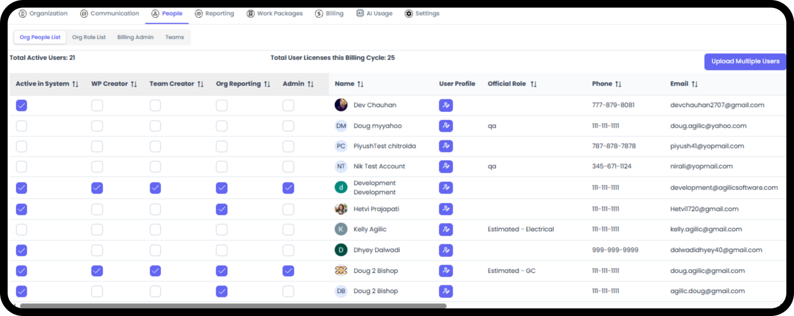
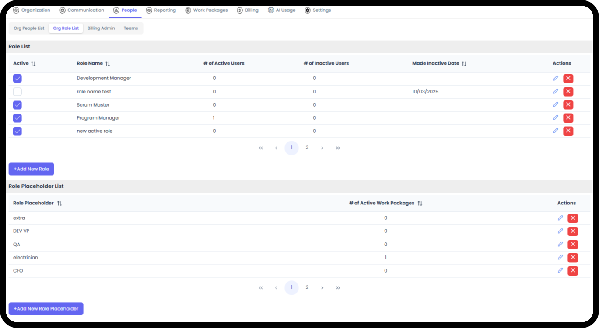
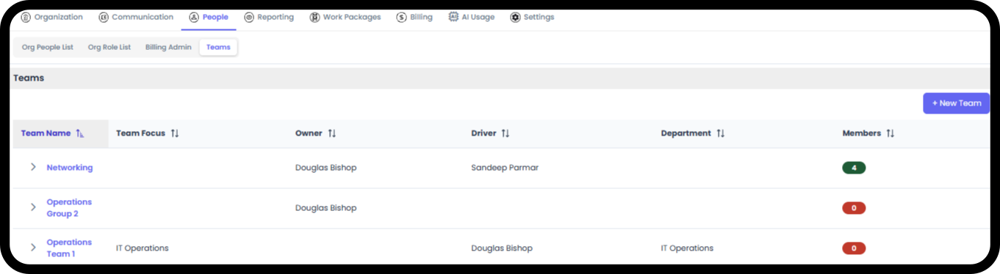
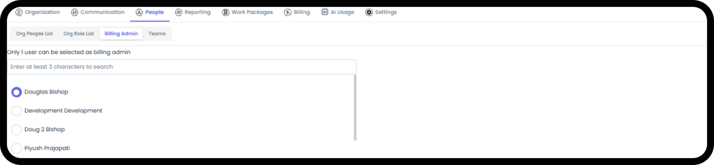
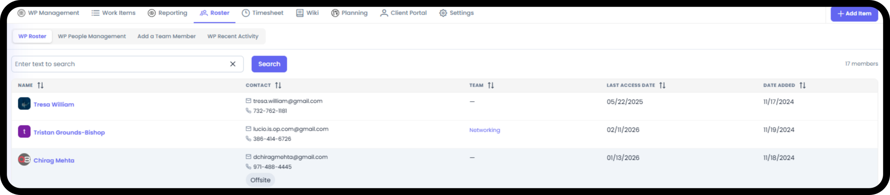

*September 18, 2026 • Section 2: Setting up your Org • For: Org Admins*

This guide covers the different levels of access a person can have in
Agilic, and where each one is controlled. Permissions in Agilic aren't
a single on/off switch --- they're a combination of several separate
flags and roles, each covering a different part of the app.

# The Layers of Access

**Organization Membership**

The most basic layer. Anyone added to your organization can sign in and
use Agilic, scoped to whatever Work Packages and Teams they're added
to. Managed from Org Admin → People.

-   Org People List --- the full roster of everyone in your organization

-   Give people permissions

-   Access User Profiles that need updated

-   Add / Remove Users

**Standard Permission Types**

To access the Org Admin area where permissions are set, you must have Org Admin-level access.

**Note:** When an organization is first created, the Primary Contact is automatically given Org Admin access. The system will never let an organization drop below 1 person with Org Admin access.

***See also:** For creating an organization for the first time, see
[Creating Your Organization (Section
2)](https://agilic-wiki.local/s2-create-your-organization).*

Standard permissions are set in Org Admin → Org People List. Here you can grant:

-   WP Creator --- the ability to create Work Packages

-   Team Creator --- the ability to create Teams

-   Org Reporting --- the ability to access org-level reporting

-   Admin --- full Org Admin access, which includes all other levels of access

**Note:** Org Admin users can access everything in any Work Package or
Team as if they were its Owner/Driver.

**Role**

Every person can be assigned a Role when they're added to the
organization, defined under the Org Role List --- where you define what
roles your people perform.

-   You can also define Role Placeholders, available for Pre-Planning across the org --- a role that exists in the system but isn't yet filled by a real person, useful when planning ahead for a hire

-   Individual Work Packages can use the org-level Role Placeholders, or create their own for unique circumstances

**Teams**

After adding someone to your organization, you can then add them to a
Team. People without a Team can still be added to Work Packages and
everything else --- a Team isn't a prerequisite for anything.

Being on a Team gives you access to that Team's dedicated views.

**Billing Admin**

A narrower flag than general Org Admin access. Only the person flagged
as Billing Admin can see the Billing and AI Usage tabs inside Org Admin.

**Work Package Permissions**

A baseline level of access applies to everyone in the organization,
regardless of Roster membership:

-   Everyone in the organization can be tagged on any item in the organization

-   Everyone can follow any item in any Work Package

-   Everyone can comment anywhere there's a comment field (items, WP Objective, etc.)

-   Everyone can see any item or Work Package in the organization --- with the exception of Secure Items and Secure Work Packages

Being added to a specific Work Package's Roster grants additional
access. Anyone on the Roster can:

-   Edit an item

-   Be Assigned or Responsible for an item

-   Add planned hours or log time to an item (must be Assigned or Responsible on it first)

-   Access the Work Package Timesheet

Having access to a WP Timesheet is also how your personal Timesheet and
your Team Timesheet get populated.

The Owner/Driver of a Work Package has additional permissions on top of
the above:

-   Can update all updatable fields across the Work Package, including Settings, Objective, WP Status, and more

**Note:** Org Admin users can access everything in any Work Package or
Team as if they were its Owner/Driver.

**Client Portal Permissions**

-   Anyone on the Work Package's Roster can access and edit the Client Portal information for that WP

-   Anyone in the organization can view the Client Portal and add comments

-   Client users are added within the Client Portal itself --- they can be given comment ability and the ability to upload attachments, and can always download attachments posted to the portal

**Client Portal Access**

A completely separate access model for external client users, managed
through Client Management (Client Companies and Client Contacts) and
Work Package Client Portal Management. Client users never see the
internal application --- only their own simplified Client Portal
experience.\
***See also:** For adding and managing Client Contacts, see* [Managing
Client Companies & Contacts (Section 9)](https://agilic-wiki.local/s9-managing-client-companies-and-contacts)*.
For granting a specific Work Package's Client Portal Access, see*
[Work Package Client Portal Management (Section 3)](https://agilic-wiki.local/s3-work-package-client-portal-management)*.*

# Quick Reference

  ------------------------------------------------------------------------
  **Access Layer**         **Controlled Where**    **Governs**
  ------------------------ ----------------------- -----------------------
  Organization Membership  Org Admin → Org People  Whether someone can
                           List                    sign in at all

  Role                     Org Admin → Org Role    Job title/skillset ---
                           List                    not a permission

  Standard Permission      Org Admin → Org People  Specific org-level
  Types (WP Creator, Team  List                    capabilities
  Creator, Org Reporting,                          
  Admin)                                           

  Billing Admin            Org Admin → Billing     Access to Billing / AI
                           Admin (1 user only,     Usage tabs
                           must already be Org     
                           Admin)                  

  WP Roster Membership     Inside a Work Package → Edit/Assign/Timesheet
                           Roster                  access within that WP

  Owner/Driver             Set on the Work Package Full field-level
                                                   control of that WP

  Secure WP / Secure Item  Set by Owner/Driver or  Restricts visibility to
  (Planned, not yet        Org Admin               specific people
  implemented)                                     

  Client Portal Access     Customer Management /   External client
                           WP Client Portal Mgmt   visibility
  ------------------------------------------------------------------------
