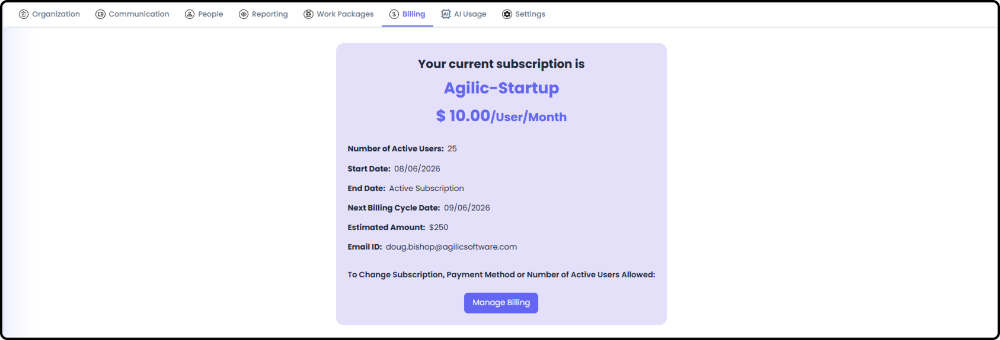

# Permissions for People

*September 19, 2026 - Section 2*

This guide covers the different levels of access a person can have in Agilic, and where each one is controlled. Permissions in Agilic aren't a single on/off switch - they're a combination of several separate flags and roles, each covering a different part of the app.

To access the Org Admin area where permissions are set, you must have Org Admin-level access.

Note: When an organization is first created, the Primary Contact is automatically given Org Admin access. The system will never let an organization drop below 1 person with Org Admin access.

See also: For creating an organization for the first time, see [Creating Your Organization (Section 2)](/s2-setting-up-your-org/create-your-organization.md).

### Organization Membership

#### Org People List

- the full roster of everyone in your organization

- Give people permissions

- Access User Profiles that need updated

- Add / Remove Users

#### Standard Permission Types

- WP Creator - the ability to create Work Packages

- Team Creator - the ability to create Teams

- Org Reporting - the ability to access org-level reporting

- Admin - full Org Admin access, which includes all other levels of access

Note: Org Admin users can access everything in any Work Package or Team as if they were its Owner/Driver.

### Role

Every person can be assigned a Role when they're added to the organization, defined under the Org Role List - where you define what roles your people perform.

- You can also define Role Placeholders, available for Pre-Planning across the org - a role that exists in the system but isn't yet filled by a real person, useful when planning ahead for a hire or you don’t know who will be Assigned to an Effort from an existing Team

- Individual Work Packages can use the org-level Role Placeholders, or create their own for unique circumstances

### Teams

After adding someone to your organization, you can then add them to a Team. People without a Team can still be added to Work Packages and everything else.

- Note: A Team isn't a prerequisite for anything, but being on a Team gives you access to that Team's dedicated views.

### Billing Admin

A narrower flag than general Org Admin access. Only the person flagged as Billing Admin can see the Billing and AI Usage tabs inside Org Admin.

## Work Package Permissions

A baseline level of access applies to everyone in the organization, regardless of Roster membership:

- Everyone in the organization can be tagged on any item in the organization

- Everyone can follow any item in any Work Package

- Everyone can comment anywhere there's a comment field (items, WP Objective, etc.)

- Everyone can see any item or Work Package in the organization - with the exception of Secure Items and Secure Work Packages

### Work Package Roster

Being added to a specific Work Package's Roster grants additional access. Anyone on the Roster can:

- Edit an item

- Be Assigned or Responsible for an item

- Add planned hours or log time to an item (must be Assigned or Responsible on it first)

- Access the Work Package Timesheet

Note: Being on the WP Roster is also how your personal Timesheet and your Team Timesheet get populated.

### Work Package Owner / Driver

The Owner/Driver of a Work Package has additional permissions on top of the above:

- Can update all updatable fields across the Work Package, including Settings, Objective, WP Status, and more

Note: Org Admin users can access everything in any Work Package or Team as if they were its Owner/Driver.

#### Client Portal Permissions

- Anyone on the Work Package's Roster can access and edit the Client Portal information for that WP

- Anyone in the organization can view the Client Portal and add comments

- Client users are added within the Client Portal itself - they can be given comment ability and the ability to upload attachments, and can always download attachments posted to the portal

#### Client Portal Access

A completely separate access model for external client users, managed through Client Management (Client Companies and Client Contacts) and Work Package Client Portal Management. Client users never see the internal application - only their own simplified Client Portal experience.

See also: For adding and managing Client Contacts, see [Managing Client Companies & Contacts (Section 9)](/s9-client-management/managing-client-companies-and-contacts.md). For granting a specific Work Package's Client Portal Access, see [Work Package Client Portal Management (Section 3)](/s3-work-packages/work-package-client-portal-management.md).

### Quick Reference

| Access Layer | Governs |
| --- | --- |
| Organization Membership | Whether someone can sign in at all |
| Role | Job title/skillset - not a permission |
| Standard Permission Types (WP Creator, Team Creator, Org Reporting, Admin) | Specific org-level capabilities |
| Billing Admin | Access to Billing / AI Usage tabs |
| WP Roster Membership | Edit/Assign/Timesheet access within that WP |
| Owner/Driver | Full field-level control of that WP |
| Secure WP / Secure Item (Planned, not yet implemented) | Restricts visibility to specific people |
| Client Portal Access | External client visibility |

