**Setting Up Org Templates --- Item States, WP Phases & Labels**

*September 18, 2026 • Section 2: Setting Up Your Organization • For: Org
Admins*

A hands-on, click-by-click walkthrough for entering the Item States, WP
Phases, and Labels you've already decided on into Agilic. This is the
"how" --- for the "what" and "why" behind these decisions, read
the companion guide first.

*See also: For guidance on what to actually write for your States,
Phases, and Labels --- and the mistakes to avoid --- see [Things to
Consider when Setting Up Your Organization (Section
2)](things-to-consider-when-setting-up-your-org.md).*

# **Getting There**

From any screen, expand Org Admin in the left-hand navigation, then
select Global Settings.

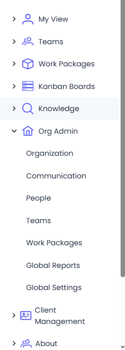

# **Part 1 --- WP Phases and Item States**

**Step 1: Open Global WP Templates**

Select Global WP Templates.

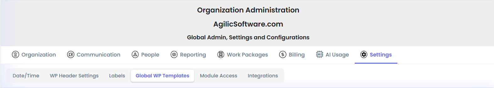

**Step 2: Set Your Work Package Phase Settings**

Scroll down to Work Package Phase Settings and begin editing the
existing Template

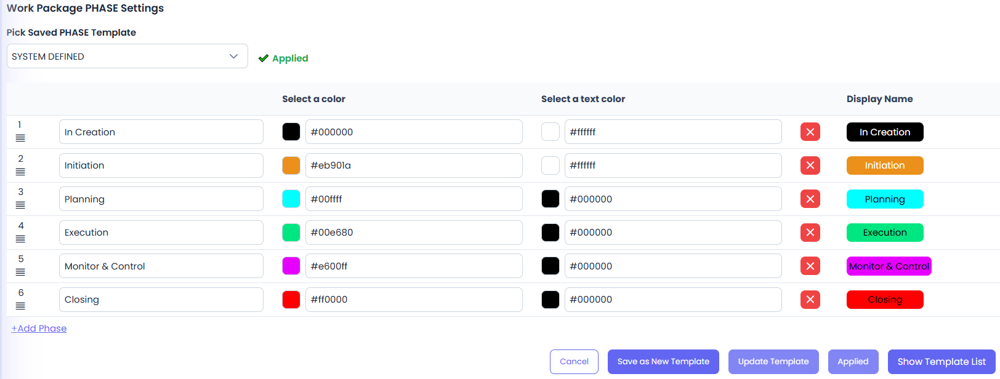

This is where the WP Phases you wrote down in the companion guide get
entered --- once Applied, these become available to every Work Package
in your organization by default. *See also: For guidance on designing
your Phases properly, see Appendix B of [Things to Consider when
Setting Up Your Organization (Section
2)](things-to-consider-when-setting-up-your-org.md).*

-   You can

    -   Rename, change the background color and text color, or delete a Phase

    -   Add a Phase

    -   Re-order the Phases

Once you have your Phases how you like them:

-   Select Save As New Template

-   Enter your Template Name and select Create & Apply

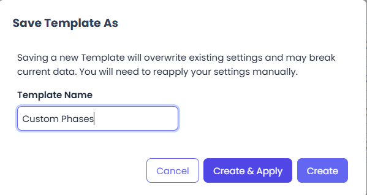

-   In the Pick Saved Phase Template drop-down - select your Custom Template you made

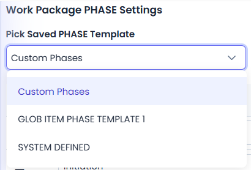

-   Select Apply

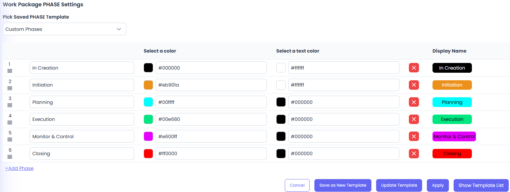

**Step 3: Set Your Item State Settings**

Scroll down to Item State Settings and begin editing the existing
Template

This is where your Item States list you wrote down in the companion
guide gets entered --- once Applied, these become available to every
Work Package in your organization by default. *See also: For why Item
State and Status are kept as two separate fields, see Appendix A of
[Things to Consider when Setting Up Your Organization (Section
2)](things-to-consider-when-setting-up-your-org.md).*

-   You can

    -   Rename, change the background color and text color, or delete an Item

    -   Mark an Item as System State: Open or Closed

    -   Mark a Closed Item as Accomplished - for instance, if you Cancel an Item it was not Accomplished

    -   Select an Animation that gets displayed when moved into this Item State

    -   Add another Item State

    -   Re-order the Items

Once you have your Item States how you like them:

-   Select Save As New Template

-   Enter your Template Name and select Create & Apply

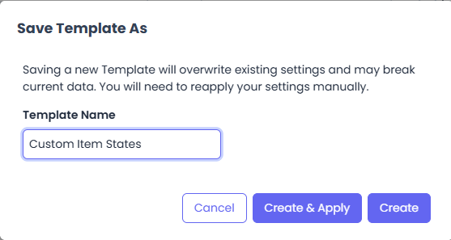

-   In the Pick Saved State Template drop-down - select your Custom Template you made

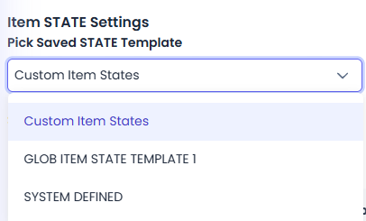

-   Select Apply

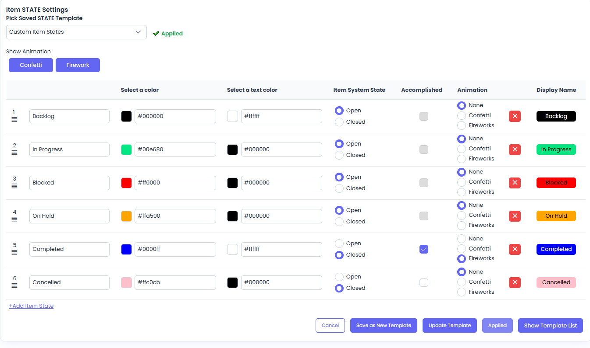

# **Part 2 --- Labels**

**Step 4: Open the Labels Tab**

Go to Org Admin → Settings → Labels.

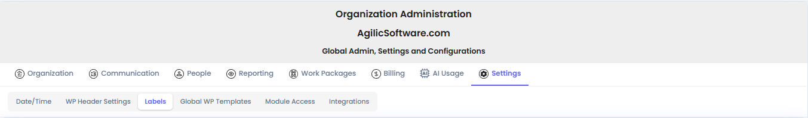

**Step 5: Confirm You're on Items**

Labels can be configured for more than one context --- make sure the
Items sub-tab is selected before continuing.

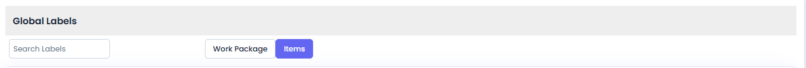

**Step 6: Find the Right Label Type**

Scroll to the Label Type section that matches what you're adding:
Simple, UnBound, or Bound.

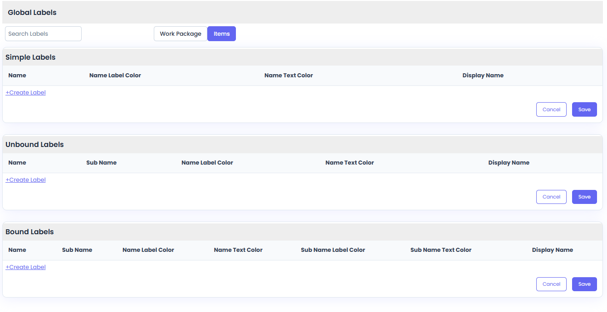

*See also: If you're not sure which Label Type fits what you're
adding, Appendix C of [Things to Consider when Setting Up Your
Organization (Section
2)](things-to-consider-when-setting-up-your-org.md)
covers the difference.*

**Step 7: Create the Label**

Select Create Label under the correct Label Type, and enter the label
exactly as you wrote it down in your planning.

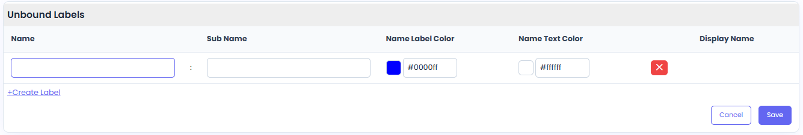

You can:

-   Edit the Name (and Sub Name if a two-part label)

-   Edit the Label (background) color

-   Edit the Label Text Color

When you have each Label Type (Simple, Unbound, Bound) - Select Save\
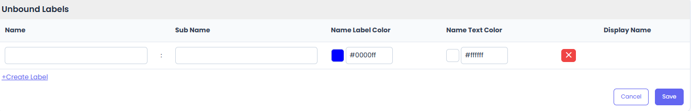
