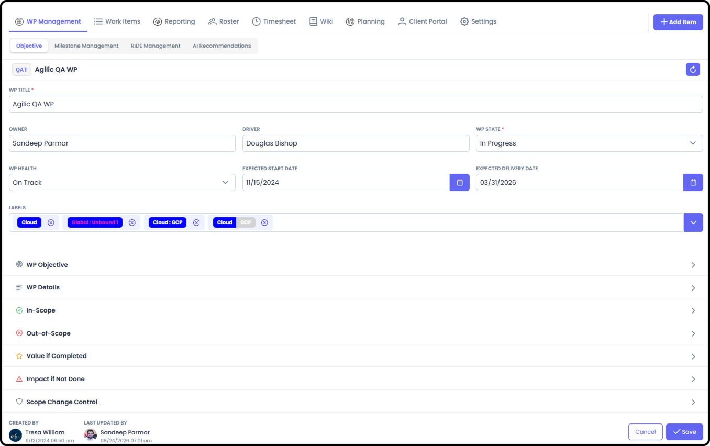
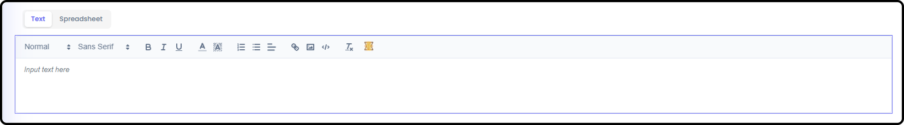
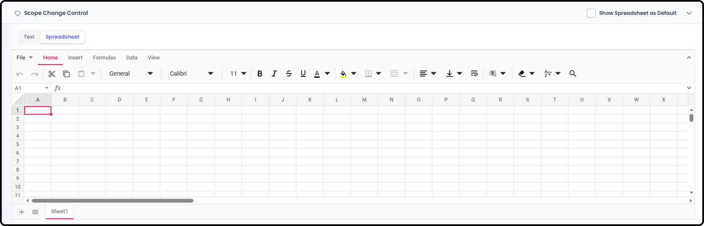
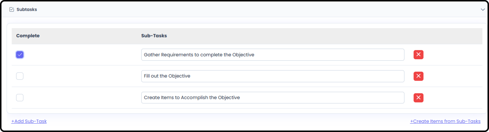
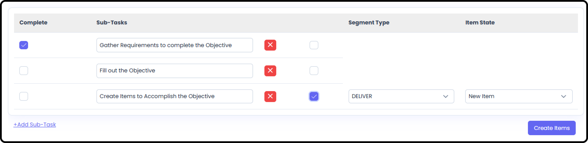
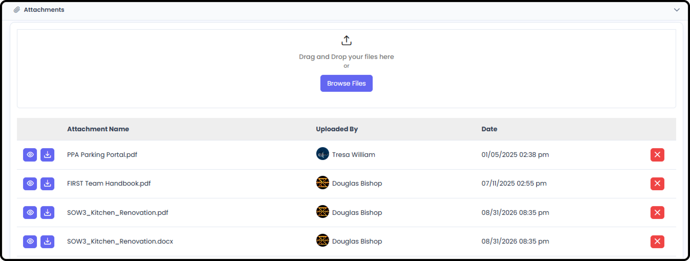
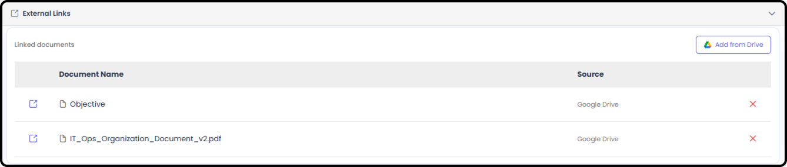
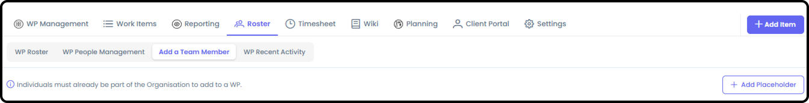
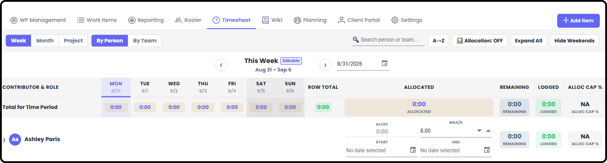

*September 18, 2026 • Section 3: Inside a Work Package • For: WP
Owner/Driver*

Pre-Planning covers everything you set up before you have your full team
or are ready to plan out the schedule: defining the Work Package itself,
preparing your roster, and setting resource allocations.

# Defining the Work Package

Work Package Management includes several fields specifically for
defining what the Work Package is meant to achieve, and what happens
depending on whether it succeeds.

**Objective ---** what this Work Package needs to achieve.

**In Scope ---** what's explicitly included in this Work Package's
work.

**Out of Scope ---** what's explicitly excluded --- just as important
as what's in scope, since it sets expectations up front about what this
WP will not cover.

**Value if Completed ---** the value delivered if this Work Package is
successfully completed.

**Impact if Not Done ---** what happens if this Work Package doesn't
get done --- the cost of not doing this work.

# Scope Change Control

A dedicated section for tracking changes to scope after the Work Package
is underway --- so scope creep (or intentional scope changes) gets
documented rather than just happening quietly.

-   You have both a free form text box available:

-   And a Spreadsheet available:

# WP Sub-Tasks

Sub-tasks are a way to capture brainstorming-session to-do lists.

-   Similar to item sub-tasks, you can use them as a checklist.

-   You can also turn specific WP sub-tasks into full items within the Work Package.

# Attachments

Documentation useful for guidance across the entire WP can be uploaded
or linked directly to the WP Management tab.

Note: Documents uploaded to the Attachments are accessible by the AI
Agent in Agilic.

***See also:** This is distinct from the Wiki tab, which is general
file/document storage for the whole Work Package --- see [Work Package
Management (Section
3)](work-package-management.md).*

# External Links

Similar to External Links for Items, you must first connect your
external Drive through My Profile → Connectors

# Preparing Your Roster

Before work starts, it helps to know not just who's doing the work, but
what skillsets you'll need --- even before you know exactly who will
fill them.

**Role Placeholders ---** Role Placeholders --- from Roster → Add a Team
Member, you can add a Role Placeholder instead of a specific person, for
when you know what skillset you need but not yet who will be doing the
work.

-   Role Placeholders can be defined at the org level, available for any Work Package to use

-   Each Work Package can also add its own role placeholders as needed, for unique circumstances specific to that WP

***See also:** Org-level Role Placeholders are managed in [Adding &
Managing People (Section
2)](../s2-setting-up-your-org/adding-and-managing-people.md).
The underlying concept is also covered in [Permissions for People
(Section
2)](../s2-setting-up-your-org/permissions-for-people.md).*

**Tip:** Using Role Placeholders early lets you build out your WBS and
schedule around the roles you'll need, even before recruiting or
reassigning the actual people.

# Allocations

Reserve resource capacity ahead of time by adding an overall Allocation
to a Roster member --- before any actual hours are logged.

***See also:** Full detail on setting and adjusting Allocations is in
[Timesheets (Section
7)](../s7-timesheets/timesheets.md).*
