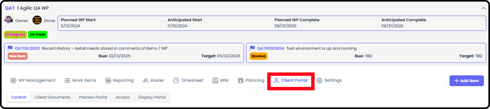
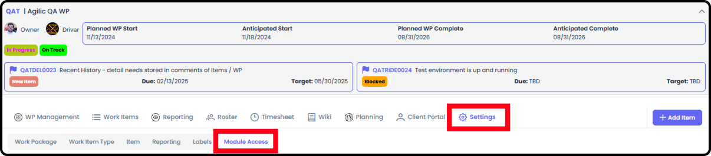
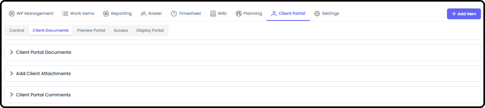
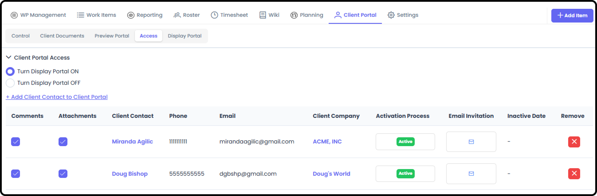

*September 18, 2026 • Section 3*

Only relevant if this Work Package has external clients. Controls
exactly what a client can see --- which milestones, RIDE items, and
status updates get shared with them.

***See also:** For what the client actually experiences, see [Client
Portal External User Guide (Section
10)](https://agilic-wiki.local/s10-client-portal-external-user-guide).
For the internal user side, see [Client Portal Module (Section
10)](https://agilic-wiki.local/s10-client-portal-module).
For the admin side of managing client companies and contacts, see
[Managing Client Companies & Contacts (Section
9)](https://agilic-wiki.local/s9-managing-client-companies-and-contacts).*

# Getting There

Inside a Work Package, go to the Client Portal Management tab.\

If you are unable to see the Client Portal Tab then it is not currently
turned on for this Work Package. To Turn on the Client Portal - go to
the WP Settings → Module Access

Only the Owner/Driver or an Org Admin can turn on the Client Portal.

# Control

Input the client's effort status, and manage Client Milestone
Management and Client RIDE Management --- this is where you decide which
milestones and RIDE items actually get shared with the client.

# Client Documents

A history of all documents uploaded to the Client Portal --- including
documents that have since been deleted.

# Preview Portal

Input your client's name to see exactly what they'll see when they log
in.

# Access

The list of clients who can see this Client Portal, and their assigned
permission levels.

# Display Portal

A maximized view of the Client Portal, designed for screen sharing.

