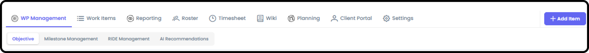
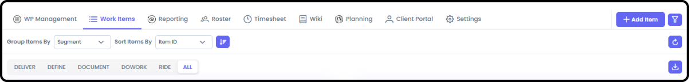
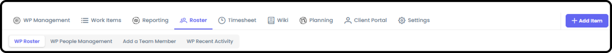
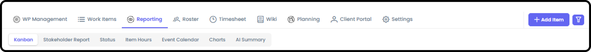
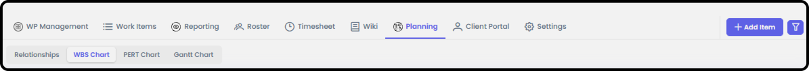
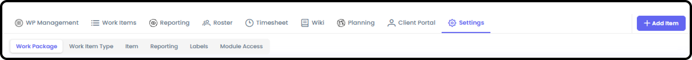
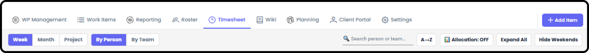
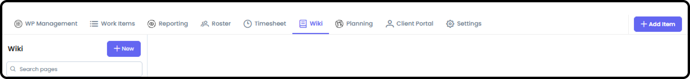
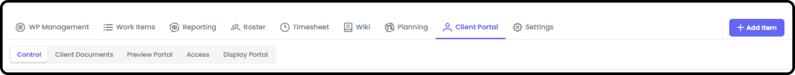

*September 18, 2026 • Section 3*

This is the connector document for everything inside a Work Package (WP)
--- the core unit of work in Agilic. Several areas already have their
own deep-dive guides; this document ties them together and covers what
doesn't have a dedicated home yet.

***See also:** For a first-day tour of every tab, see [How to Navigate
a Work Package (Section
3)](navigate-a-work-package.md).
For creating a WP and managing its roster, see [Create a Work Package
(Section
3)](create-a-work-package.md) and
Work Package Roster / Add People to Work Package (Section 3)*

# Work Package Management

The WP's landing page starts you on the Objective and gives you access
to Milestone Management, RIDE Management, and AI Recommendations.

# Pre-Planning

Defining the Work Package's objective and scope, preparing your roster,
and setting resource allocations --- everything that happens before
you're ready to plan out the schedule.

***See also:** Full deep-dive coverage in [Things to Consider when
Pre-Planning a Work Package (Section
3)](things-to-consider-when-pre-planning-a-work-package.md).*

# Work Items and RIDE

Define, Do Work, Document, and Deliver are the four standard Work Item
Types; RIDE is a related fifth type for Risks, Issues, Dependencies, and
Escalations.

***See also:** Fully covered in [Work Item Types (Section
6)](../s6-working-standard-items/work-item-types.md),
[Working Standard Items (Section
6)](../s6-working-standard-items/working-standard-items.md),
and [Working RIDE Items (Section
6)](../s6-working-standard-items/working-ride-items.md).*

# Roster

Who's on this specific Work Package, and how to add, remove, or manage
their access.

***See also:** Fully covered in Work Package Roster / Add People to WP
(Section 3).*

# Reporting

Kanban, Stakeholder Report, Status, Item Hours, Event Calendar, Charts,
and AI Summary --- the reporting views scoped to this Work Package.

***See also:** Full detail on every report type is in Section 8
(Reporting).*

# Planning

Relationships, Work Breakdown Structure (WBS), PERT Chart, and Gantt
Chart --- the scheduling and breakdown tools for this Work Package.

***See also:** Full deep-dive coverage in [Work Package Planning
(Section
3)](work-package-planning.md).*

# Settings

WP-level configuration --- Work Package, Work Item Type, Item,
Reporting, Labels, and Module Access sub-tabs.

***See also:** Full deep-dive coverage in [Work Package Settings
(Section
3)](work-package-settings.md).*

# Timesheet

Time-tracking for this Work Package. Only people who are on the Roster
of the Work Package can access the Timesheet.

Only the WP Owner/Driver (and Org Admin) can see everyone's Allocations
and Time Logging. Individuals can see Allocations and log time for
themselves.

**Note:** Only the Owner/Driver of the WP (or Org Admin) can update
Allocations for a person.

***See also:** Item-level Hours Summary (Planned vs. Logged) is covered
in [Working Standard Items (Section
6)](../s6-working-standard-items/working-standard-items.md).
The full Timesheet guide is [Timesheets (Section
7)](../s7-timesheets/timesheets.md).*

# Wiki

File/document storage for the Work Package.

# Client Portal Management

Only relevant if this WP has external clients. Controls exactly what a
client can see --- which milestones, RIDE items, and status updates get
shared with them.

***See also:** Full deep-dive coverage in [Work Package Client Portal
Management (Section
3)](work-package-client-portal-management.md).*
