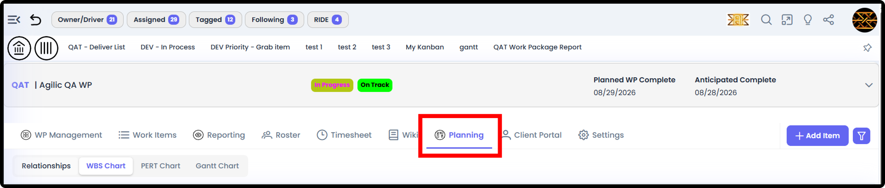
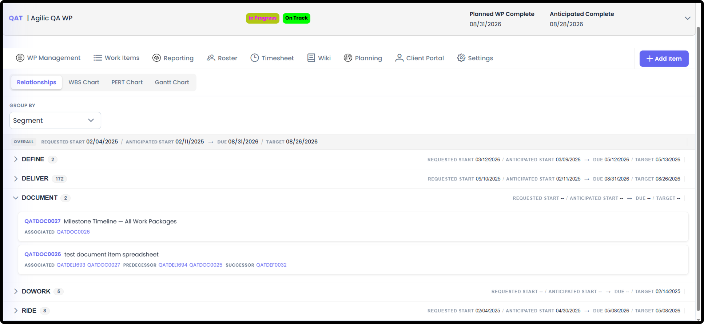
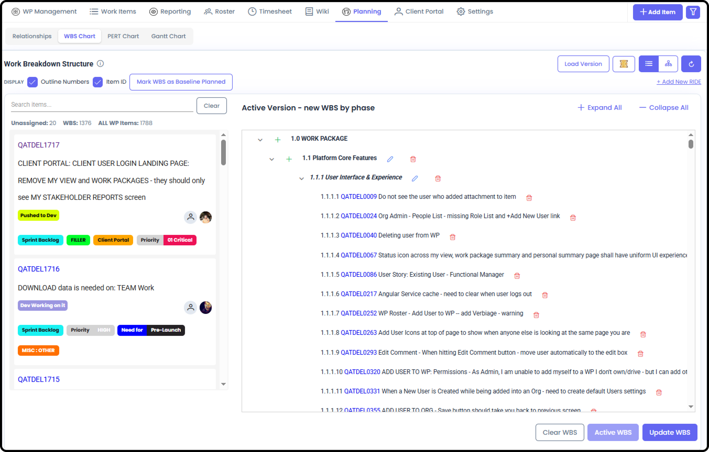
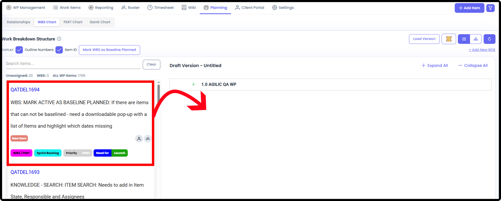
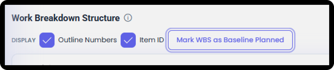
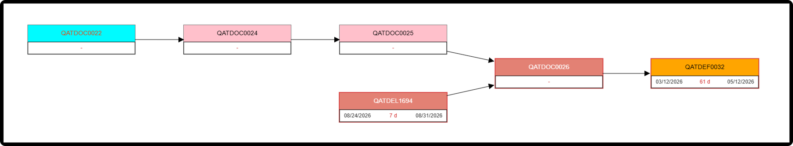
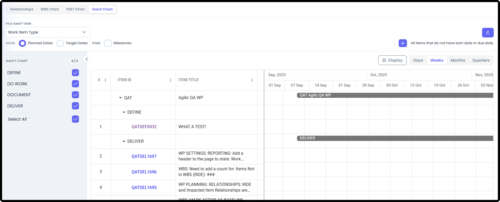
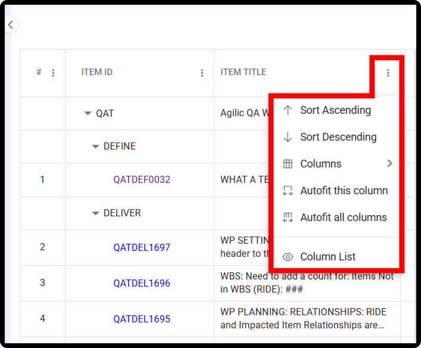

*September 18, 2026 • Section 3: Planning & Scheduling • For: WP Roster
members*

This guide covers every Planning tool available for organizing your
schedule, in depth --- standard project Planning, used once you have
your team assembled: Task Relationships, PERT Chart, Gantt Chart, Work
Breakdown Structure (WBS), and Baseline Planned.

***See also:** For everything that comes before this stage --- defining
the Work Package itself, and preparing your roster --- see [Things to
Consider when Pre-Planning a Work Package (Section
3)](#/s3-work-packages/things-to-consider-when-pre-planning-a-work-package).*

# Getting There

Inside a Work Package, go to the Planning tab.

# Relationships

Shows relationships between items --- a list of items and which other
items each one relates to.

# Work Breakdown Structure (WBS)

Customize how you want to organize the work --- organize the WBS in
whatever structure makes sense for this Work Package, rather than being
locked into one fixed hierarchy.

-   Create Your WBS Structure by adding Layers on the right-hand WBS side and Editing those layer names

    -   Move the Layers around by drag and drop

    -   Manually Search for and move Items from the Left hand column to the WBS

-   OR use the dedicated AI Agent button on the page to automatically create a draft WBS for you, flavored by what you tell it

-   Make multiple WBS versions, and mark the one you want to use as 'Active'

    -   Once Active - you can Bulk mark those WBS items as Baseline Planned

**Draft Versions**

Create a WBS by drag and dropping Items from the left over to where you
want them in the WBS.

-   You can re-order WBS elements by drag and drop.

-   You can edit the different WBS Layer Names. Note the very top layer is defaulted to your WP Name and can not be renamed.

-   You can Save multiple draft versions of the WBS

-   Once you have a version you like:

    -   Save it and mark it as Active - this will allow some reports to reference your active WBS version

    -   An Active WBS can also Mark the WBS as Baseline Planned which will take every item on the WBS and check the Baseline Planned Box on each one.

**Baseline Planned (from the WBS)**

An Active WBS can be marked as Baseline Planned. This takes every item
on that WBS and automatically marks it Baseline Planned --- visible
afterward on each item's detail view.

**Note:** Items not on the Active WBS at the time it's marked Baseline
Planned will not be marked Baseline Planned.

**AI WBS**

A dedicated AI feature on the WBS page lets the AI Agent organize the
work for you, based on what you tell it - or don't tell it anything and
it will organize it in the manner it feels most appropriate based on the
items you have listed.

# PERT Chart

A flow chart of all items, showing the Critical Path.

The PERT (Program Evaluation and Review Technique) chart shows task
relationships and timelines so you can see the critical path and plan
more accurately. Agilic displays the Activity-on-Node variation of the
chart.

**Forward Pass and Backward Pass**

The system can automatically adjust your schedule based on either end of
a task:

-   Forward Pass --- recalculates the schedule based on Start Dates

-   Backward Pass --- recalculates the schedule based on End Dates

*(Screenshot pending — 03c-011: PERT Chart view showing the Critical Path and the Forward Pass / Backward Pass controls.)*

**Tip:** Use Forward Pass when you know when work can begin and want to
see how far out it pushes your finish date. Use Backward Pass when you
have a fixed deadline and need to see how far back your start dates need
to move.

# Gantt Chart

A timeline view of the schedule --- but Agilic's Gantt is more flexible
than a typical one. You can reorganize how it's grouped:

-   By Phase, Item State, Responsible Resource, or other fields

-   Show just Milestones

-   Show just RIDE items

-   Gantt Columns can be sorted, adjusted and the order changed\ 
