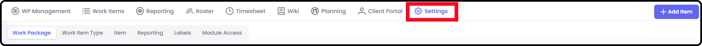
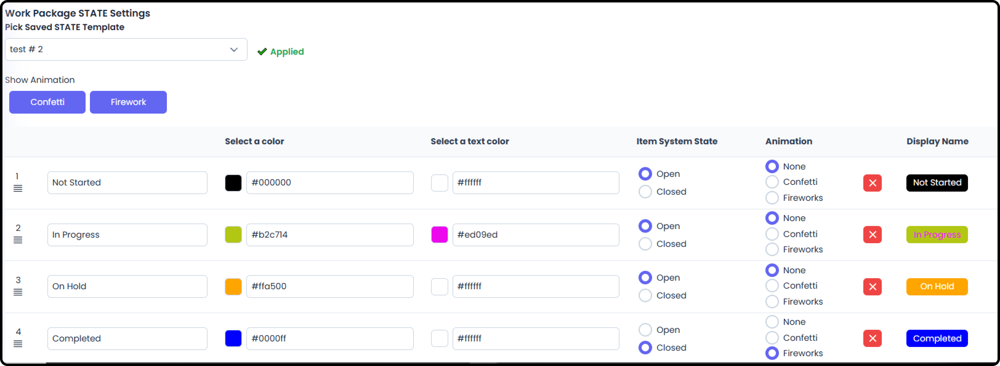
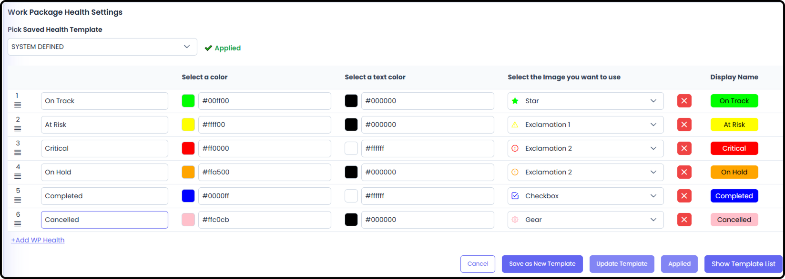
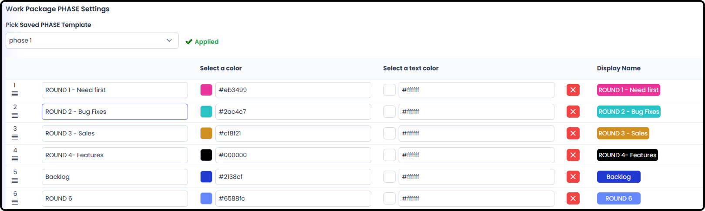
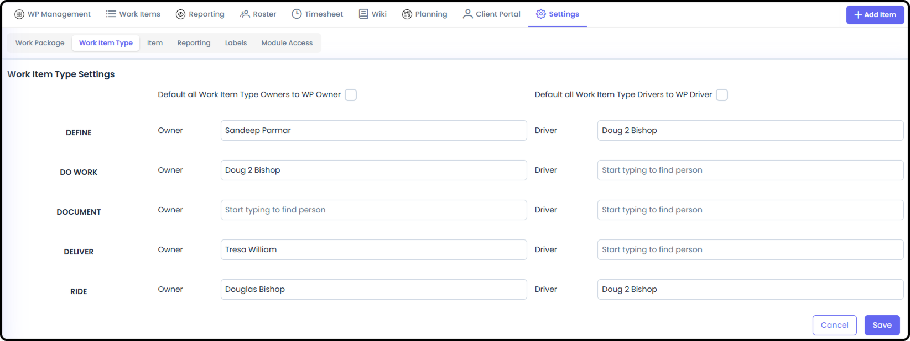
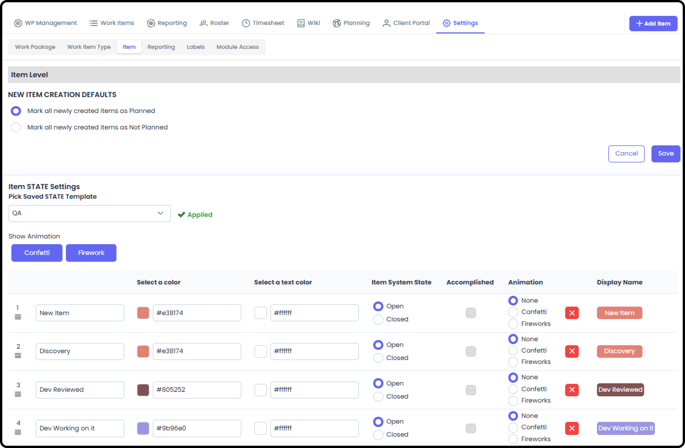
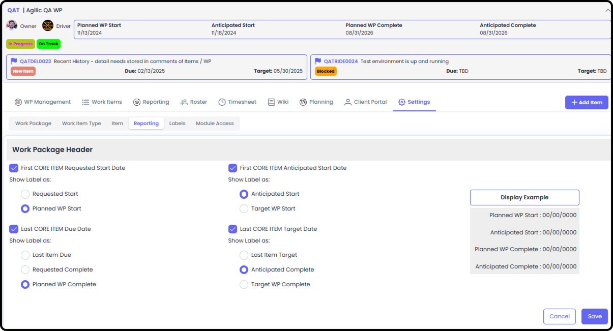
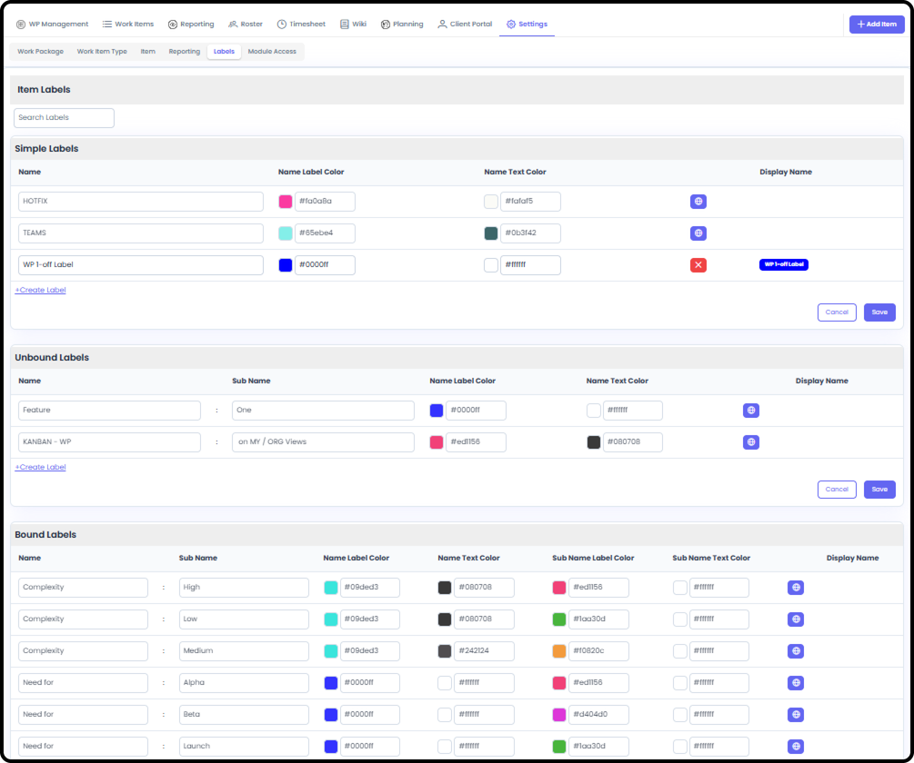
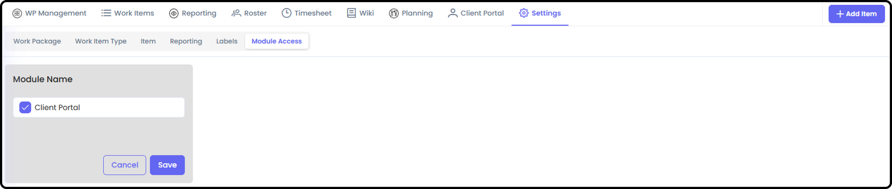

*September 18, 2026 • Section 3: Inside a Work Package • For: WP
Owner/Driver, Org Admin*

WP-level configurations for the Work Package, Work Item Type, Item,
Reporting, Labels, and Module Access sub-tabs.

***See also:** For org-wide defaults that feed these settings, see
[Setting Up Your Organization's Settings (Section
2)](../s2-setting-up-your-org/org-settings.md).*

# Getting There

Inside a Work Package, go to the Settings tab.

# Work Package

WP State, WP Health, and WP Phase settings for this specific Work
Package.

-   WP State --- the Work Package's current lifecycle state (e.g. Active, On Hold, Closed).

    -   You can adjust the color of the Background and the color of the text

    -   You can define if a WP State is in a System State of Open or Closed

    -   Upon Saving the WP into this State, you can determine if there is an Animation or not.

    -   You can Save as a New Template or Update the current Template

-   WP Health --- a manually-set indicator (e.g. On Track, At Risk, Off Track) shown wherever this Work Package is referenced.

    -   You can adjust the color of the Background and the color of the text

    -   You can select the image that is used for WP Health on some reports

    -   You can Save as a New Template or Update the current Template

-   WP Phase --- customize which Phases are available on this Work Package. Phases operate independently from the Gantt, PERT, and WBS --- a Phase is a field on each item, so multiple Phases can run simultaneously (e.g. Control Phase alongside Execution).

***Note:** Phases are a field assigned to individual Items. As a result,
WP Phases are available on Kanban boards as columns and can be Grouped
By in various reports.*

# Work Item Type

Select who is Owner/Driver of a specific Work Item Type within this Work
Package. These Work Item Types for this WP will then show up on the
Owner/Driver's My Work → Owner/Driver section.

# Item

Item creation defaults and item state settings.

-   New Item Creation Defaults --- you can set all Items, when they are created, to be marked as Planned (useful for before the Effort officially begins) or Not Planned (useful for after the Effort has officially kicked off and anything 'new' is in addition to what was originally Planned. Note: Planned or Not Planned is a checkbox on each individual Standard Item. RIDE Items do not have this option.

-   Item State --- customize the list of states an item can move through in this Work Package, and each state's Background and Text color, used throughout Kanban boards, reports, and item detail views.

    -   You can define if an Item State is in a System State of Open or Closed

    -   You can define if an Item State is 'Accomplished'(this is especially important for the Agile Scrum Module if you are using it). Note: for an Item to be 'Accomplished' requires it to be in a Closed System State.

    -   Upon Saving the WP into this State, you can determine if there is an Animation or not.

# Reporting

Options for how certain fields are displayed in the WP Header.

-   Work Package Header --- controls which fields display in the header shown at the top of this Work Package, wherever it's referenced.

    -   The Default Settings are to use:

        -   Planned WP Start, Planned WP Complete

        -   Anticipated Start, Anticipated Complete

# Labels

This Work Package can see and use all global labels, and can add
labels/categories dedicated to just this WP.

-   Simple Labels --- a single field. You can assign any number of these.

-   UnBound Labels --- a two-part label. You can assign any number of these.

-   Bound Labels --- also two-part, but you can only assign one of each type (e.g. Priority:High or Priority:Low, not both).

-   All Labels are available as Columns in the Kanban Boards.

-   All Work Package Level Labels can be modified here. You can adjust the Names, Label Color and Text Color

Note: If there is a globe next to the Display Name, these were created
at the Org Level and can not be modified here. You also can not
duplicate Org Level Labels.

Note: If you change a label after it has been added to Items, you may
need to go back and re-apply those labels to the items.

***See also:** These are the same three label types configured org-wide
in [Setting Up Your Organization's Settings (Section
2)](../s2-setting-up-your-org/org-settings.md).*

# Module Access

Turn optional features on or off for this Work Package, if they're
available and turned on within your organization --- for example, Client
Portal.

***See also:** Turning on Client Portal here is the Work-Package-level
step; it must also be enabled org-wide first --- see [Client Portal
Module (Section
10)](../s10-client-portal/client-portal-module.md)
and [Setting Up Your Organization's Settings (Section
2)](../s2-setting-up-your-org/org-settings.md). Once on,
manage it in [Work Package Client Portal Management (Section
3)](work-package-client-portal-management.md).*
