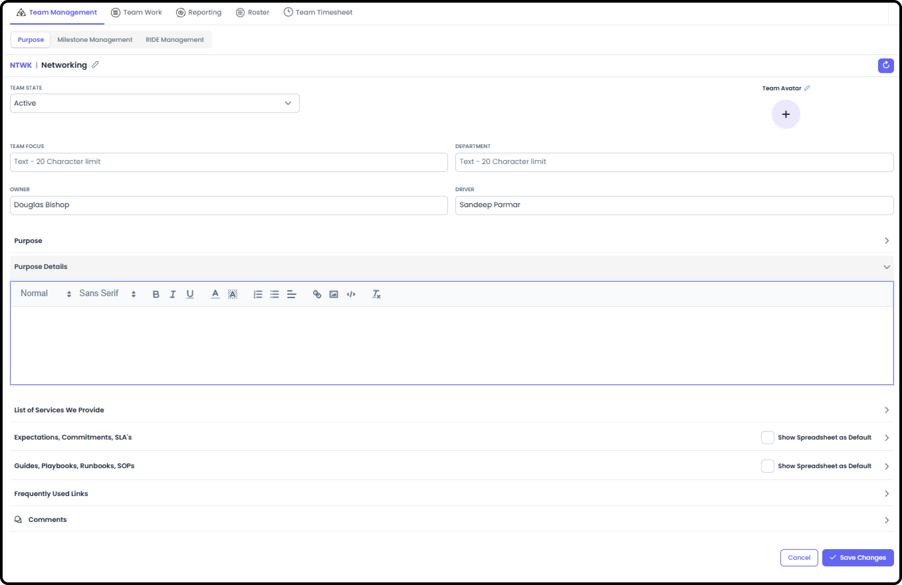
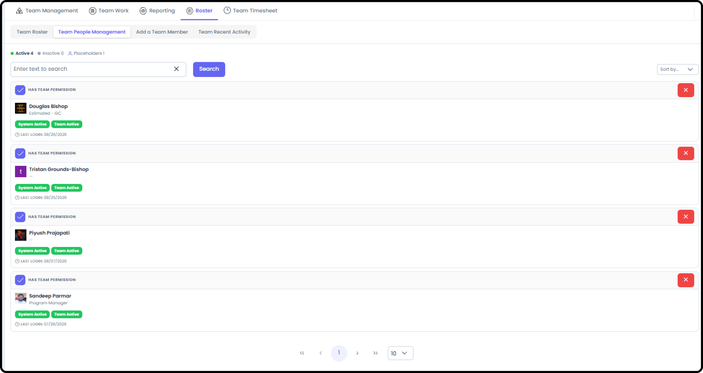
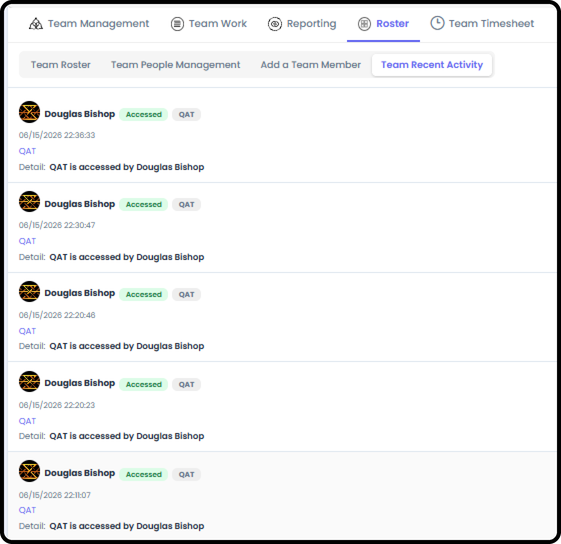
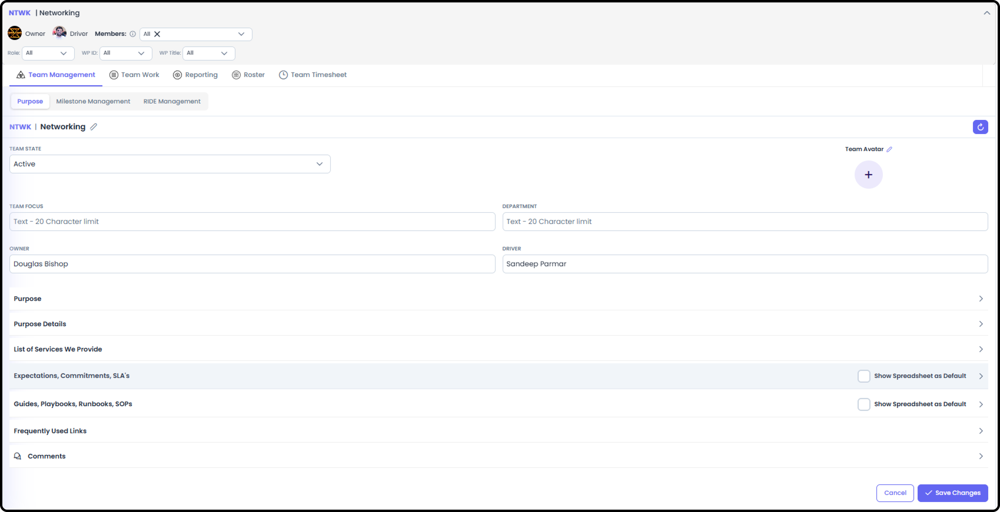
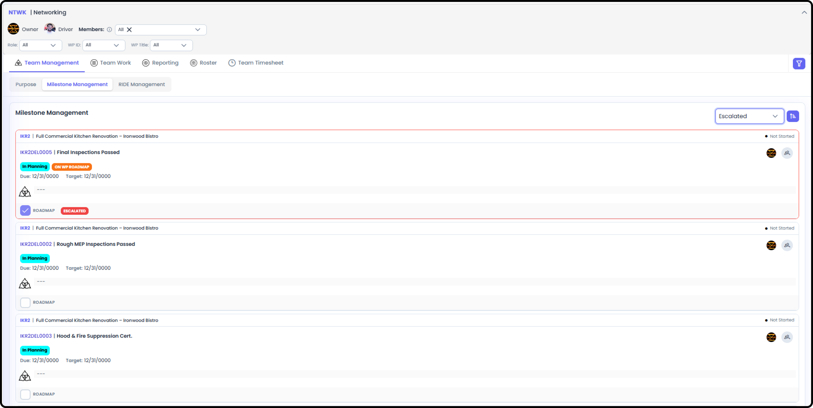
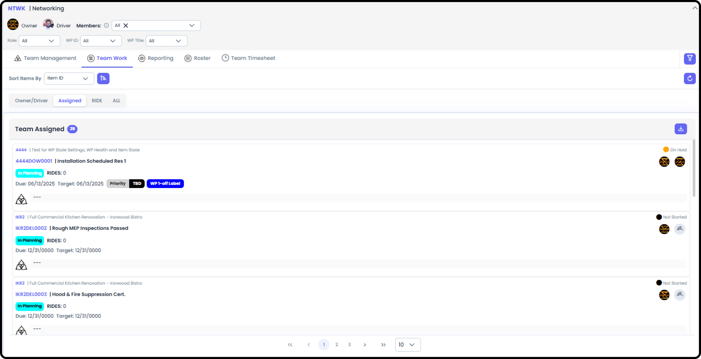
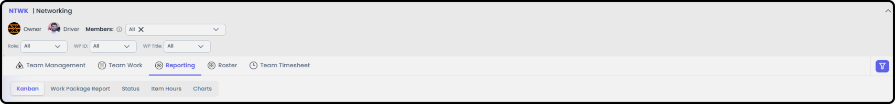

# Create a Team

A Team in Agilic is a standing group --- separate from any single Work
Package --- with its own purpose and roster. This guide covers creating
a new team and keeping its membership current. You can do this from Org
Admin, or from within My Team if you are that team's Owner or Driver.

***See also:** For a full tour of every My Team screen, see [How to
Navigate a Team (Section
4)](/s4-teams/navigate-a-team.md).*

# Creating a New Team

**Step 1: Add a New Team**

If you have the ability to Create a New Team (permission set in Org
Admin → People) then in the Left-Hand Menu you should see the Create
Team link under Teams

In Org Admin → People → Teams view, there is also a button to Create a
New Team

**Step 2: Fill In Team Details**

Most Fields in the Team Purpose are available when filling out the New
Team Details. However, only a few fields are required to actually create
the new Team

-   Team Code --- exactly 4 characters, and must be unique

-   Team Name

-   Team State

-   Owner or Driver - you must assign at least one of these two fields to someone within your Organization

Everything else is optional

**Tip:** Pick a team code convention early (e.g. first letters of the
team's function) --- it's only 4 characters, so it's worth being
consistent across teams.

**Step 3: Update the Team's Purpose and other fields**

After creating the Team, you can go to the Team Management → Purpose
view. Here you can edit any of the fields except the Team ID

# Adding People to a Team

**Step 4: Add a Team Member**

From the team's Add a Team Member screen, select people from your
organization who aren't already on the team.

-   Choose from the list of available organization members (name, role, avatar shown)

-   Once added, the member gets a join date and an Active/Inactive status

**Step 5: Manage the Roster**

Use Team Roster to review current membership and contact information ---
anyone can see this.

Use Team People Management for administrative tasks: basic admin info
for the team, and removing a team member.

Use Team Recent Activity to review audit information --- who accessed
what, and when.

# Related Tasks

Adding someone to a Team doesn't automatically add them to a specific
Work Package --- those rosters are managed separately. See [Create a
Work Package (Section
3)](/s3-work-packages/create-a-work-package.md).

# Managing the Team

**Team Management**

Displays the Purpose, Milestone Management and RIDE Management for the
Team

-   Purpose - is the Team's Who We Are, What We Do and basic links and details useful for the Team and others needing information from the Team

-   Milestone Management - displays all the Milestones the Team Member's names are associated with from all the Work Packages they are on

-   RIDE Management - displays all the RIDE Items the Team Member's names are associated with from all the Work Packages they are on

**Team Work**

Team Work is similar to My View → My Work, only geared towards everyone
on the Team. It displays:

-   Owner / Driver - All the efforts the members of the Team either Own or Drive

-   Assigned - All the Items the Team Members are Assigned and/or Responsible for

-   RIDE - All the RIDE Items the Team Members are associated with

**Reporting**

Reporting for Teams is similar to My View → Reporting and WP View →
Reporting.

You have access to:

-   Kanban - This pulls in all the Items the Team Members are Assigned / Responsible for.

-   Stakeholder Report - This provides links to all the Stakeholder Reports of the Work Packages that the Team Members are on the WP Roster of.

-   Status - This shows a Time-based Referenced List of the Items and Work Packages the Team Members are Assigned to.

-   Item Hours - A Detailed listing of all Items the Team Members are on with hours Estimated, Recorded and Remaining (if the Members are entering that detail directly on the Items)

-   Charts - Similar to WP Reporting → Charts but pulls from across all Items the Team Members are Assigned to

    -   RIDE Charts - RIDE Heat Map, Decision Chart, Mitigation Management

    -   Item Charts - Items by State, Items by Responsible, Items by Assignee
