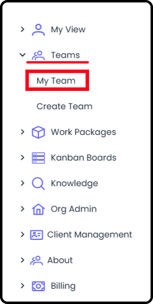
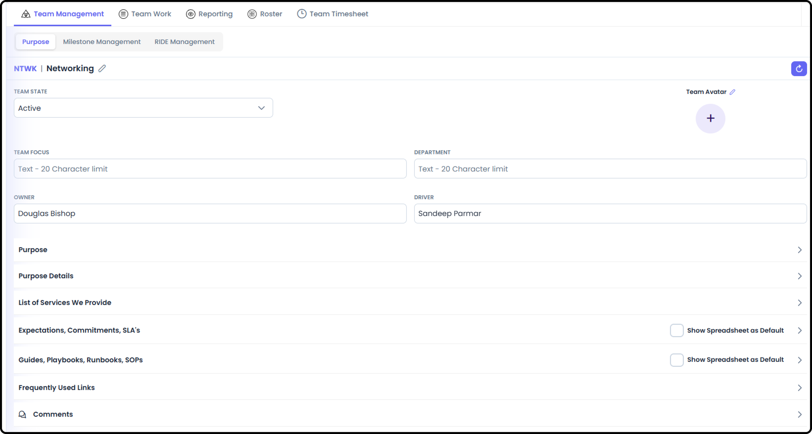
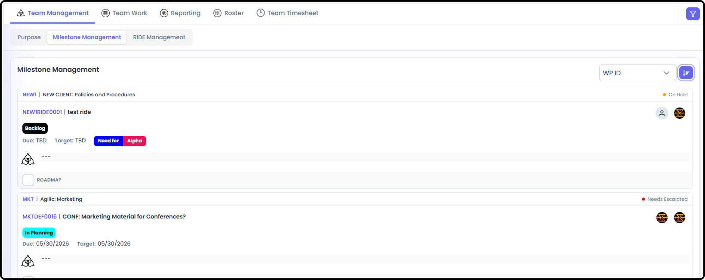
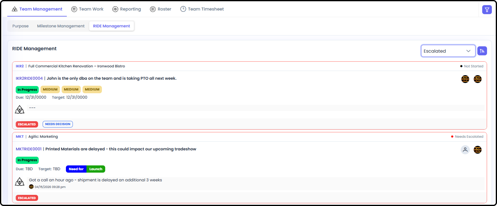
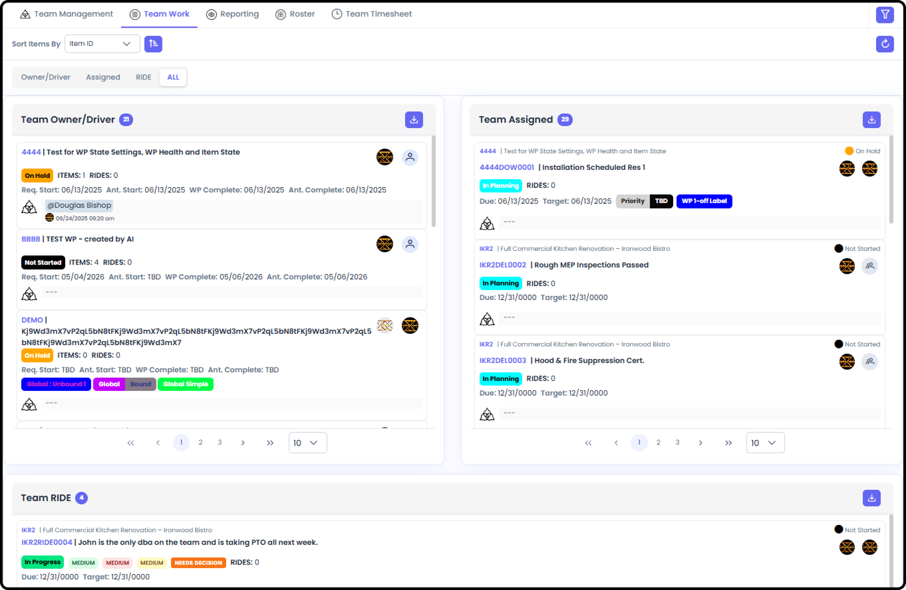
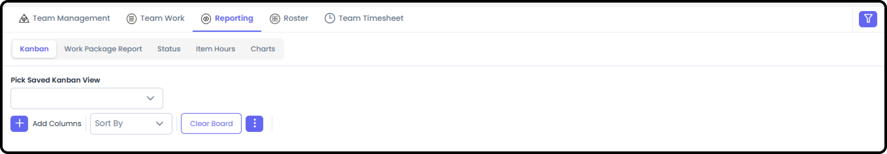
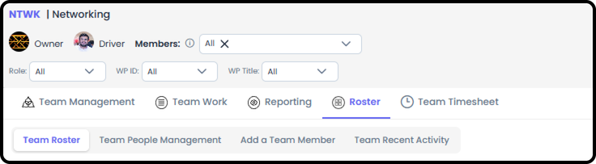
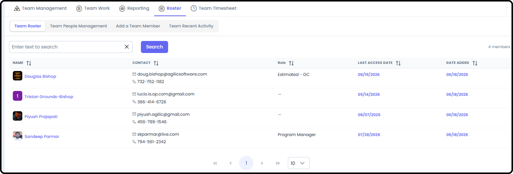
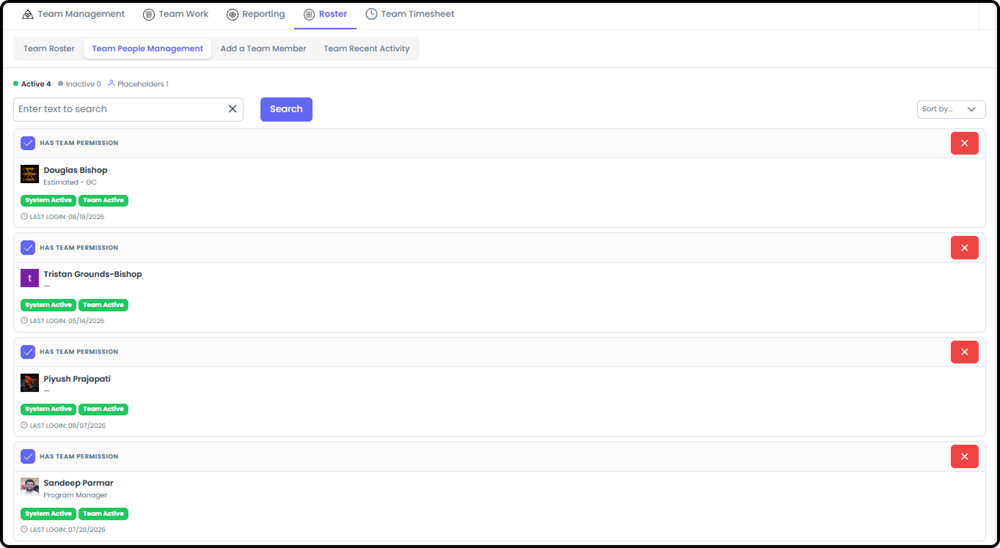
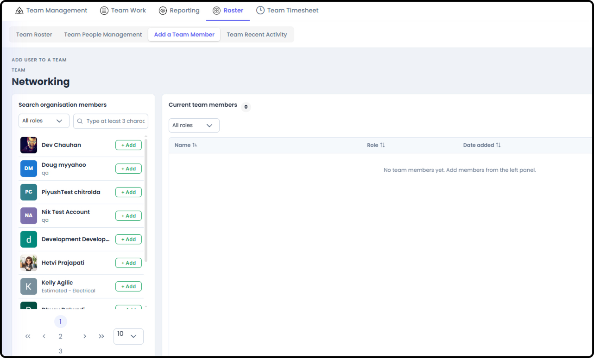

# Team Management

A Team --- is a functional group of people who do a similar type of work
or work collectively across an Organization and have the same
Owner/Driver. It is separate from any single Work Package.

My Team closely mirrors My View, scoped to your team instead of just
you.

***See also:** For a first-day tour, see [How to Navigate a Team
(Section
4)](/s4-teams/navigate-a-team.md).*

# Getting There

Select Team Summary from your main navigation. Only visible if you're a
member, Owner, or Driver of a team --- if you don't belong to one, you
won't have a My Team area to open.

# Team Management

The landing view for your team, defaulting to Team Purpose.

**Team Purpose**

Displays various information about the team --- its stated purpose, List
of Services, Commitments (SLA's), Guides (Playbooks, Runbooks, SOPs),
and Frequently Used Links (either for your Team or your internal
Customers),

**Milestone Management**

Shows all milestones the members of the team are involved in, across
every Work Package they're part of.

**RIDE Management**

Shows all RIDE items the members of the team are involved in.

# Team Work

Tabs that show the different effort that Team members are officially
part of.

-   Team Owner / Driver: Work Packages or Work Item Types within a Work Package that Team members are the Owner/Driver of

-   Team Assigned (and/or Responsible) for items your team is officially on

-   Team RIDE items your team is involved in (this includes as named in Decision Making)

# Reporting

Team Reports are similar to what is available in WP Reporting and My
View Reporting. All reports on Team Reporting are scoped to the items
your team's members Items they are Assigned to / Responsible for,
across every Work Package they're part of.

***See also:** Full detail on every report type --- Kanban, Stakeholder
Report, Status, Item Hours, and Charts --- now lives in Section 8:
Reporting Detail. Everything there applies here, scoped to your team.
Note: at the Team level, Item Hours can show Estimated, Recorded, and
Remaining instead of Planned/Logged, when members enter that detail
directly on the item.*

# Roster

People management for the team.

**Team Roster**

Shows the team members and their contact information.

-   Anyone can see this information

**Team People Management**

Basic administrative information for the team, and team member removal.

**Add a Team Member**

Where you add a team member who is already in the organization.

**Team Recent Activity**

Basic audit information of who accessed what, and when.

***See also:** Full step-by-step instructions for managing the roster
are in Team Roster / Add a Person to the Team (Section 4).*

# Team Timesheet

The entire team's allocations and logged hours.

-   Only the Owner, Driver, and Org Admin can see everyone's information

-   Remaining team members can see only what their teammates are Assigned to

***See also:** Compare to My Timesheet in [My View Overview (Section
5)](/s5-my-view/my-view-overview.md), which
is scoped to just you.*
