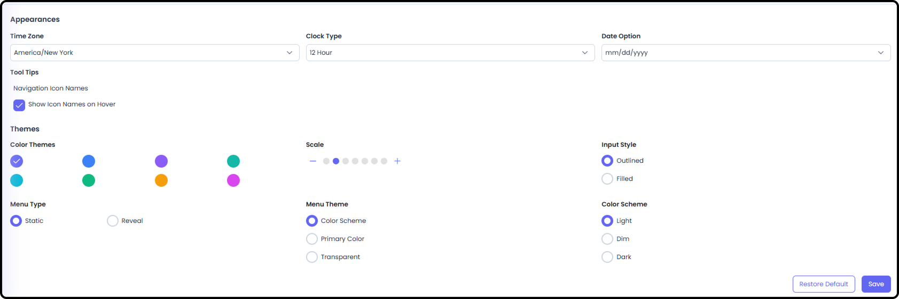

*September 18, 2026 • Section 5*

Your personal account area.

# Profile Detail

Your account details and additional personal information.

# Personal Settings

Custom link toolbar and UI options --- this is where you manage the
Custom Links pinned to your persistent top toolbar.

*See also: Pinning a Custom Link from the toolbar itself is covered in [How to Navigate as a User (Section 1)](../s1-agilic-fundamentals/navigate-as-a-user.md).*

# Personal Connectors

Connect external data sources to your own account. Currently supports
Google Drive.

