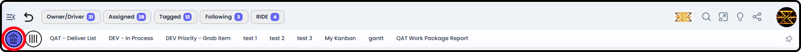

*September 18, 2026 • Section 5*

This is the connector document for My View --- your personal dashboard,
pulling together everything relevant to you across every Work Package
you're part of. It ties together the first-day tour and points to the
dedicated pages for each area.

*See also: For a quick first-day tour, see [How to Navigate as a User (Section 1)](../s1-agilic-fundamentals/navigate-as-a-user.md).*

# Getting There

My View is where you land immediately after logging in, and is also
reachable at any time via the Home button in the persistent top toolbar.

# What's in My View

-   **[My Work](my-work.md)** --- a tabbed view of items relevant to you, pulled from across all your Work Packages.

-   **[My View Reporting](my-view-reporting.md)** --- personalized versions of the reports you'll also see inside individual Work Packages, but scoped across everything you're part of.

-   **[My Timesheet](my-timesheet.md)** --- all your allocations and logged hours across every Work Package you're part of.

-   **[My Profile](my-profile.md)** --- your personal account area: profile details, personal settings, and personal connectors.

-   **[My Private Work Package](my-private-work-package.md)** --- your own dedicated Work Package for personal, non-project work that no one else in the organization can see.
