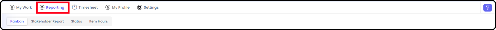
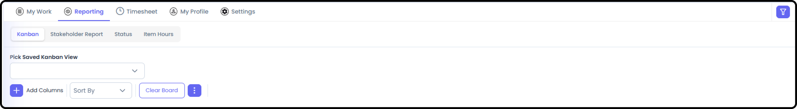
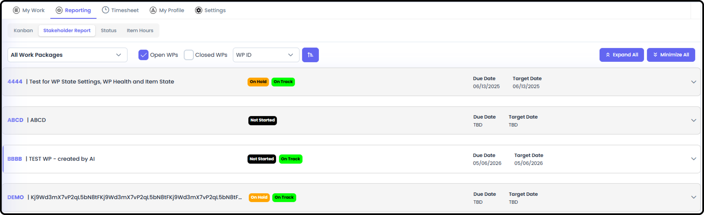
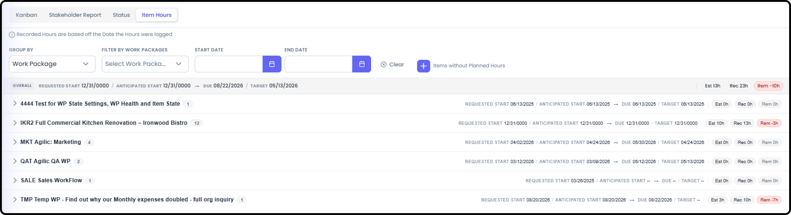

**My View Reporting**

*September 18, 2026 • Section 5*

Everything under My View's Reporting tab works exactly like the Work
Package-level reports, except every view here pulls data across every
Work Package you're part of, rather than just one. Full detail on every
report type now lives in Section 15: Reporting Detail --- this page
covers only what's different at the My View level.

*See also: For the full write-up of every report type below, see the
corresponding document in Section 8 --- Reporting. For the personal
dashboard this tab lives inside, see [My View Overview (Section
5)](my-view-overview.md).*

# **Getting There**

From My View, go to the Reporting tab.

# **Kanban**

Same as Work Package Kanban, except cards are pulled from every Work
Package you're part of, not just one.

*See also: [Kanban Boards (Section
8)](../s8-reporting/kanban-boards.md).*

# **Stakeholder Report**

A personalized version of the Stakeholder Report --- your status and
escalated RIDE items and milestones, pulled across every Work Package
you're on.

Select the Work Package you want to view the Stakeholder Report of and
it will take you directly to the report.

*See also: [Stakeholder Report (Section
8)](../s8-reporting/stakeholder-report.md).*

# **Status**

Same date-oriented list view as the Work Package version, scoped to
items relevant to you across every Work Package.

*See also: [Status Report (Section
8)](../s8-reporting/status-report.md).*

# **Item Hours**

Your own logged hours, broken down by item, across every Work Package
you're part of.

*See also: [Item Hours (Section
8)](../s8-reporting/item-hours.md).*

# **Charts**

The same RIDE Charts and Item Charts available at the Work Package
level, scoped to you across every Work Package.

*See also: [Charts (Section
8)](../s8-reporting/charts.md).*
