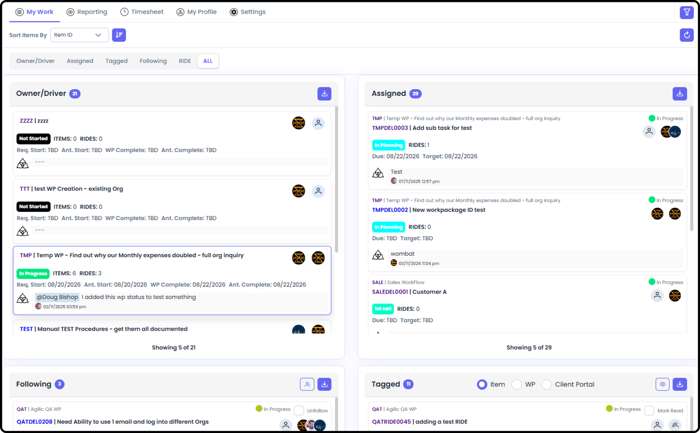

*September 18, 2026 • Section 5*

A tabbed view of items relevant to you, pulled from across all your Work
Packages.

# Getting There

From My View, go to the My Work tab.

-   Owner/Driver --- Work Packages where you're the Owner or Driver

-   Assigned --- items assigned to you and/or are Responsible for

-   Tagged --- items you've been tagged/mentioned on

-   Following --- items you're following

-   RIDE --- Risks, Issues, Dependencies, and Escalations relevant to you, across all your Work Packages

-   All --- a combined view of everything above

*See also: Each of these tabs is also reachable directly from the persistent top toolbar's quick-access pills --- see [How to Navigate as a User (Section 1)](/s1-agilic-fundamentals/navigate-as-a-user.md).*
