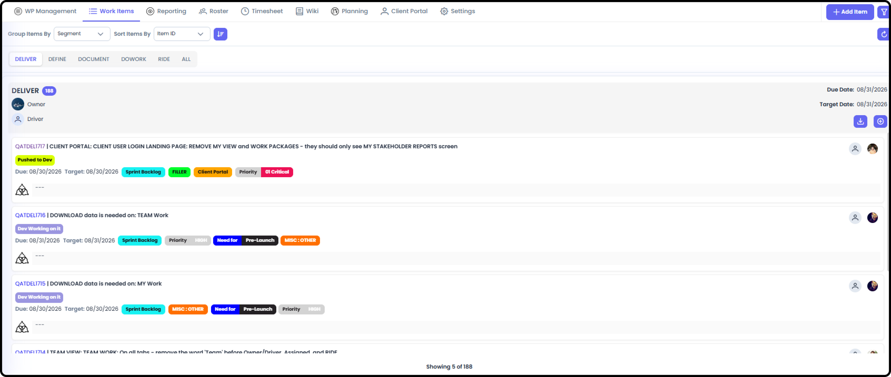
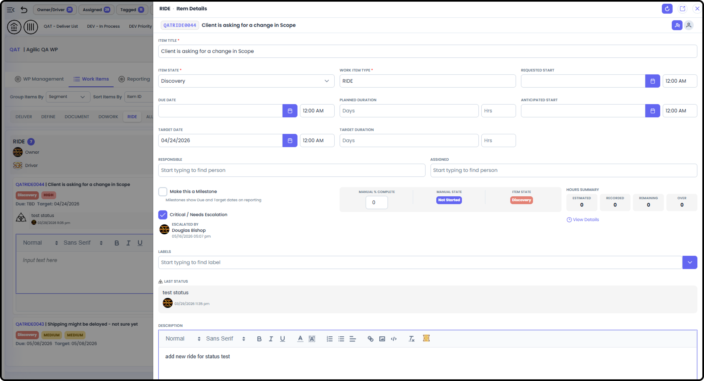

*September 18, 2026 • Section 6: Core Day-to-Day Work • For: WP Roster
members*

Define, Do Work, Document, and Deliver are the four working tabs of
Agilic's 4D Framework --- where most of your daily work inside a Work
Package actually happens. RIDE is a related fifth tab, covered
separately in Working RIDE Items.

# Getting There

Inside a Work Package, go to the Work Items tab row. The ALL is the
default/landing tab.

# Define

What's needed to make sure the deliverables are correct ---
requirements, acceptance criteria, or specifications that Deliver items
should be measured against.

**Tip:** Linking a Define item to its related Deliver item (via
Associated) makes it easy to check a deliverable against what was
actually required.

# Do Work

The actual task/execution tracking --- who's doing the work, day to
day.

# Document

Supporting reference material --- the things worth writing down for
later, even if they're not a formal deliverable.

***See also:** This is a different area from the Work Package's Wiki
tab, which is general file/document storage for the whole WP rather than
an item-level work type.*

# Deliver

What needs to be delivered to achieve the Work Package's objective.
This helps you Define Done for this Work Package.

-   Tip: Use Associated Relationship links to show the bread crumbs to other related items across the Work Package. This is especially useful if there are Requirements (Define) that need to be mapped to this Deliverable.

# RIDE

RIDE Items handle all Risks, Issues, Dependencies and Escalations that
pop up in a project. While RIDE Items are unique, they are all still
managed in a similar way within your Workflow. As such, you are able to
see them as part of the Work Item Types.

-   NOTE: RIDE Items have Risk, Mitigation and Decision Making Processes built into them. See Working RIDE Items (Section 6) for more detail.

-   Tip: Use Relationship links to directly relate RIDE items with IMPACTED ITEMS. This allows you to easily see how many items are directly impacted by a specific RIDE Item.

# ALL

Use the All tab for a combined view across every work item type, when
you need the full picture rather than one tab at a time. It places all
four Work Item Types plus the RIDE onto the same view so you can quickly
scan all Item Types.

# Working Across Work Item Types

Each Item Type has a dedicated list of Items within the Work Package.
Every Item being displayed shows you:

-   ITEM ID - Which is a clickable Link - opens the right hand side panel for additional Item Detail

-   Item Title

-   Who is Responsible and who is Assigned to the Item

-   Item State

-   Due and Target Dates

-   Any Labels that have been added

-   Most recent Status with who made it and the timestamp. If no Status has been made it will show '---'

-   The Comment Triskele - clicking this will open the Comment / Status box where you can directly add a Comment, New Status or add a RIDE directly associated with this Item... without having to fully open the item to make those updates.

-   Clicking on the Item ID will open a right-hand slide out where you can edit the entire Item, Relationships, etc and you can fully open the Item in its own tab from here as well.

***See also:** Predecessor/Successor relationships feed directly into
the PERT Chart and Gantt Chart under Planning --- see [Work Package
Planning (Section
3)](https://agilic-wiki.local/s3-work-package-planning).*

# Related Tasks

-   For Risks, Issues, Dependencies, and Escalations, see [Working RIDE Items (Section 6)](https://agilic-wiki.local/s6-working-ride-items)

-   For everything captured in an item's detail view, see [Working Standard Items (Section 6)](https://agilic-wiki.local/s6-working-standard-items)
