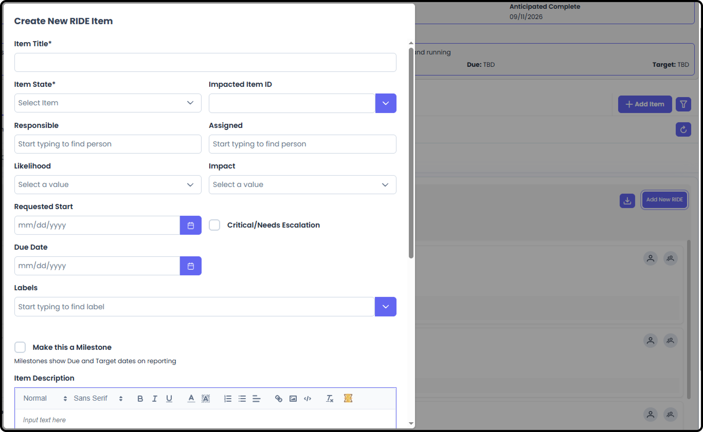
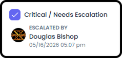
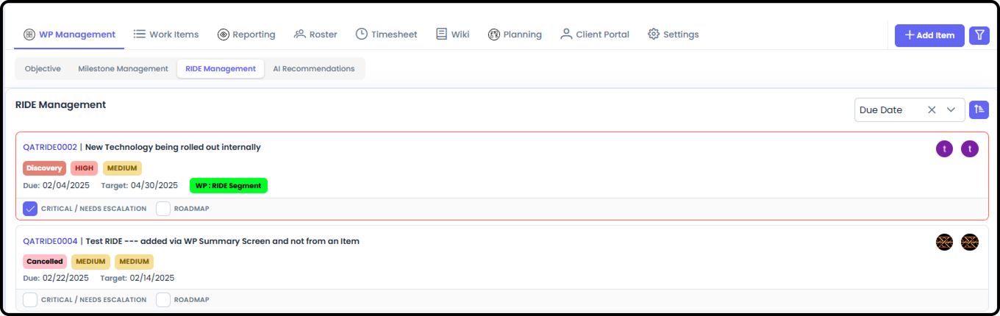
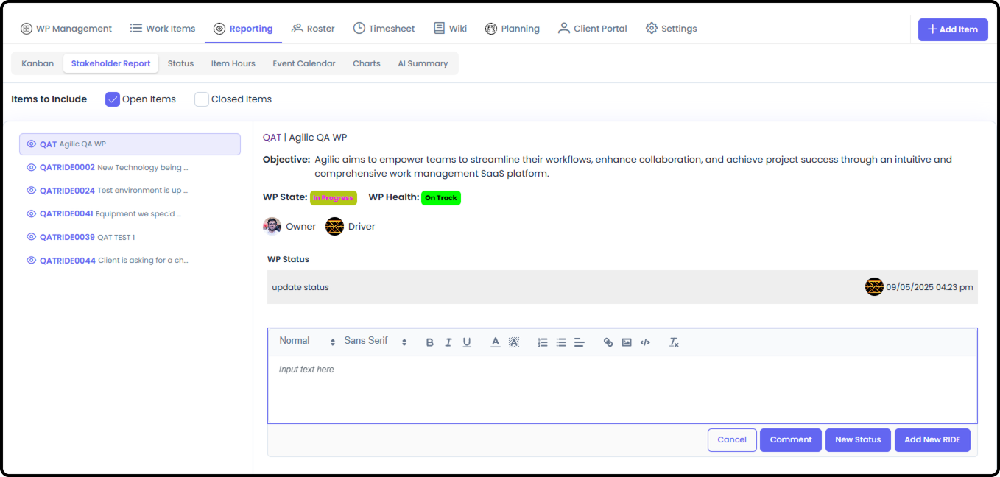
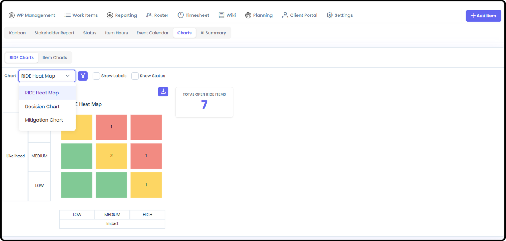
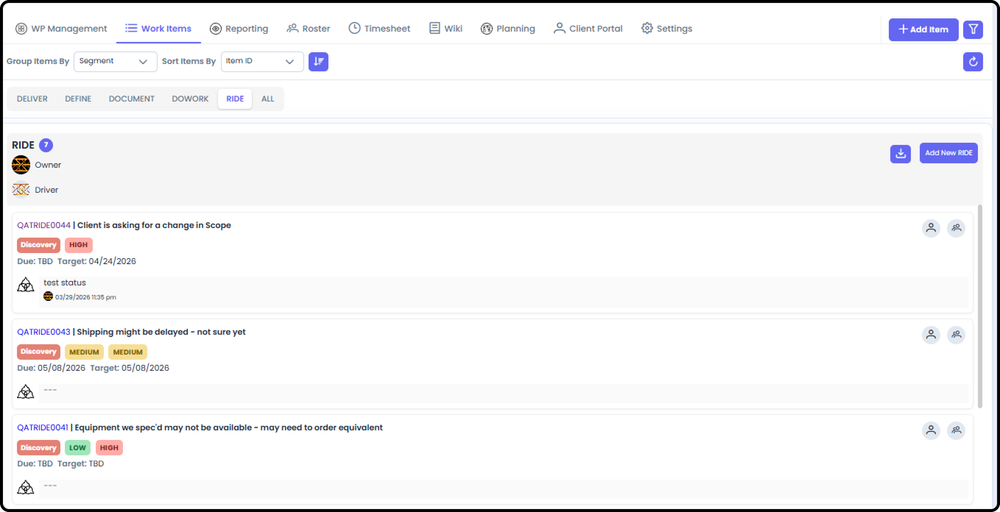

*September 18, 2026 • Section 6: Core Day-to-Day Work • For: WP Roster
members*

RIDE stands for Risks, Issues, Dependencies, and Escalations --- the
unforeseen work that comes up through a project's lifecycle. RIDE items
are one of the Work Item Types, and their item detail includes
everything a standard item has, plus RIDE-specific processes for
managing risk and decision making.

RIDE's work primarily like Standard Items, but have a few differences.

***See also:** RIDE items include everything covered in [Working
Standard Items (Section
6)](#/s6-working-standard-items/working-standard-items)
(Basic Information, Hours Summary, State vs. Status, Subtasks,
Attachments, Relationships, Comments) --- this guide only covers what's
different.*

# Getting There

Inside a Work Package, go to the RIDE tab --- one of the Work Item Type
tabs, alongside Define, Do Work, Document, and Deliver.

# Creating a RIDE Item

It does not matter what you are dealing with - Risk, Issue, Dependency
or Escalation - You typically need to follow the same process:

-   Document the Item

-   Link it to relevant information using Relationships

-   If you use RISK processes - add Likelihood and Impact and Impact Date as needed. These are both located in the Mitigation Management Section and show up on many different screens that show RIDE Items.

-   Request a Decision when needed. This is found in the Decision Management Section of the RIDE.

**Step 1: Create the RIDE Item**

Adding a new RIDE Item is similar to adding a Standard item. Add a New
RIDE and enter the initial information of what this is and why it's
important. Create and go to Detail in order to see all the sections of
the RIDE.

**Step 2: Assign Responsibility**

Set who's Responsible for the item and who it's Assigned to, so it
doesn't sit unowned.

# What's Different About a RIDE Item

**Note:** RIDE items have Risk, Mitigation, and Decision Making
processes built in --- on top of everything a standard item has.

# Working an Existing RIDE Item

**Step 3: Link to Impacted Items**

Use Relationship links to directly relate a RIDE item to other items:

-   Impacted Items are items directly impacted by this RIDE Item.

-   Associated Items are bread crumbs to help see what other items may have relevant information but are not directly impacted by this RIDE.

**TIP:** Using Relationships makes it easy to find related information
and to also see how many items are affected by a specific Risk, Issue,
Dependency, or Escalation.

Note: The Items in Impacted Items show you which items are all Impacted
by this specific RIDE

**Step 4: Mitigation**

The Mitigation section of the RIDE gives you a place to document what
the Mitigation Plan is as well as a section for Completion Notes.

Likelihood: Can be None, Low, Medium or High

Impact: Can be None, Low, Medium or High

Impact Date: is the Expected Date the Impact could occur

**Step 5: Track the Decision**

Use Decision Management to formally track what Decision(s) are needed
and how those Decision Requests were resolved --- especially useful for
Escalations, where leadership needs a clear record of what was decided,
when, by whom and why.

-   You can Add a Decision Request specifying what the Decision needed is.

-   Once the Decision Request is created - you can manage the Decision within the RIDE and set up auto-notifications for those people Involved in the Decision as well as Stakeholders to notify when the Decision Request is Resolved

-   There could be multiple decisions needed from a single RIDE. Therefore, you can add multiple Decision Requests so the entire history can be seen in one location.

# Escalating Internally without using Decision Management

Every RIDE Item can be marked for Escalation.

This data field is pulled into all relevant Kanban Boards and makes the
RIDE visible on the Stakeholder Report.

***See also:** For the different Kanban boards across Agilic, see
[Kanban Boards (Section
8)](#/s8-reporting/kanban-boards).*

# Escalating to a Client

If this Work Package has an external Client Portal, an admin can
escalate specific RIDE items so the client sees them --- without
exposing your full internal RIDE list. This is managed from Client
Portal Management → Control → Client RIDE Management, not from the RIDE
tab itself.

On the Client Portal → Control → RIDE Management, find the RIDE you want
to share with your Client and mark it as 'Show On Client Portal'. It
does NOT have to be marked as Critical / Needs Escalation.

# Keeping an Eye on RIDE Items

-   The Work Package Management landing page has a dedicated RIDE Management section showing what needs attention

-   The Stakeholder Report shows the WP's escalated RIDE items and milestones alongside overall state and status

-   WP Reporting → Charts → RIDE Charts includes the RIDE Heat Map, Decision Chart, and Mitigation Chart

-   Work Items → RIDE shows all RIDE Items for this Work Package

-   My View and Team Views have similar capabilities filtered by who is Assigned / Reporting on the RIDE Items
