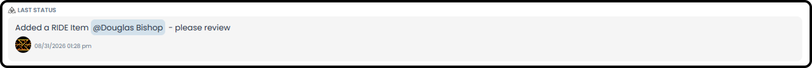
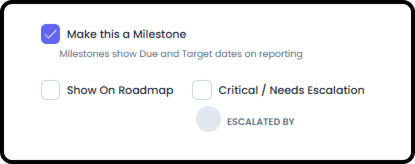
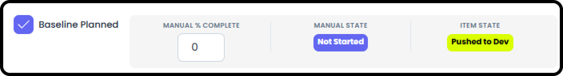
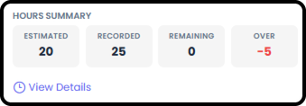
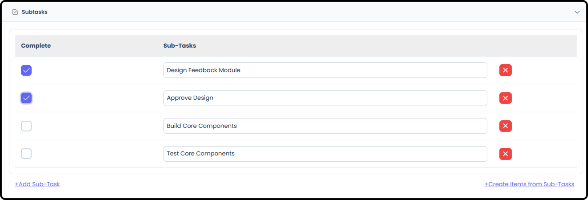
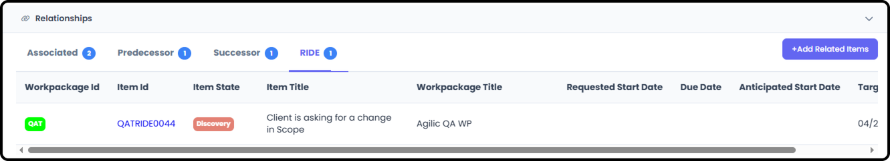

*September 18, 2026 • Section 6: Core Day-to-Day Work • For: WP Roster
members*

This guide covers everything you can capture on a single item, whether
it lives in Define, Document, Do Work, or Deliver. All four Work Item
Types share the same item detail structure --- learn it once, and it
applies everywhere.

***See also:** For an overview of what each Work Item Type tab is for,
see [Work Item Types (Section
6)](#/s6-working-standard-items/work-item-types). For
what's different about RIDE items specifically, see [Working RIDE
Items (Section
6)](#/s6-working-standard-items/working-ride-items).*

# Getting There

From My Work, Team Work, or any Work Items tabs, select an item's ID (a
clickable link) to open its detail --- this opens a right-hand side
panel with everything below which also allows you to fully expand the
Item to a full page.

# What's in an Item's Detail View

**Basic Information**

The item's title, description, and core identifying details.

-   **A Note about State vs. Status**

    -   In Agilic we split what most tools call Status out into two distinct but related fields:

-   State --- the item's current stage in its workflow. The options for Item State are configurable in the Work Package Settings and can also be standardized for the Organization in Org Admin Settings

-   Status --- a point-in-time free-form update about the item, with a timestamp and who made it. Shows "---" if no status has been posted yet

    -   Note that Images are not allowed to be in a Status - only text.

    -   All Status are saved as Comments in the Comment section of the Item

    -   You are able to Tag people directly in any comment, including a status - this will make a link to the Item appear on the Users My View in the Tagged section

**Assignees and Responsible**

Set who is Assigned (can be multiple people) and who is Responsible
(only one person can be Responsible) for the item. This is how Items
show up on My View in the Assigned Section.

Note: Only people who are on the WP Roster can be Assigned or made
Responsible for an Item within that Work Package.

**Milestones**

Any Item (or RIDE) can be marked as a Milestone. A Milestone is a single
Moment in Time. Selecting this will:

-   Force the Item to ONLY recognize the Due Date and Target Date (it will ignore the Start Date)

-   It will add the options in to:

    -   Show On Roadmap - Impacts some reporting options.

    -   Mark as Critical / Needs Escalation - Only RIDEs and Milestones have this option. This option feeds the Stakeholder Report

**Baseline Planned and Manual Percent Complete / Manual State**

-   Baseline Planned is used to capture your Planned Target Dates and Durations in a secure field so you always can refer to what the original plan was, regardless of how many things changed or got added.

-   Manual Percent Complete has no bearing on any fields besides Manual Status. This is intended to be available for Earned Value Calculations. For visual ease we have placed the current Item State next to the Manual Status for easy comparison even though they have no technical dependency on each other. Manual Status is based entirely on Manual Percent Complete.

    -   0% = Not Started

    -   \>0% and \<100% = In Progress

    -   100% Complete = Complete

***Note:** When an item is marked Baseline Planned, the item will also
display its Baseline Start, Baseline Finish, and Baseline Duration*

**Hours Summary (Planned vs. Logged)**

A comparison of planned hours against hours actually logged against the
item, so you can see at a glance whether work is tracking to estimate.

-   Selecting 'View Details' will take you to Estimation / Recorded Hours editing screen.

-   **NOTE:** Only people Assigned to the Item can add Planned Hours or Log Hours to the Item

**Subtasks**

Break the item down into smaller subtasks without creating entirely
separate items.

-   You can Use Sub-Tasks as checklist of things to do

-   You can also take a Sub-Task and automatically create a New Item from the Sub-Task

**Attachments**

Files or links attached directly to this item.

Note: File size is limited to 95MB.

**External Links**

You must connect an external drive in order to make use of this field.
If you do not have an external drive connected then this is what you
will see:

To connect an external drive, go to My Profile → Connectors and log in
to your drive

***See also:** For connecting an external drive, see Personal Connectors
in [My View Overview (Section
5)](#/s5-my-view/my-view-overview).*

Once connected, you can then add links directly to your Drive by
clicking on the Add from Drive button

**Relationships**

How this item connects to others:

-   Associated --- a breadcrumb link to similar content, with no schedule dependency

-   Predecessor - items that come before this one, forming an actual schedule dependency that feeds into Project Timelines and reports like the PERT Chart, Gantt Chart and Critical Path.

-   Successor --- items that come after this one, forming an actual schedule dependency that feeds into Project Timelines and reports like the PERT Chart, Gantt Chart and Critical Path.

-   RIDE --- RIDE Items that specifically impact this Item can be added as a Relationship here. This makes following up on Blockers much easier.

**Comments**

A running discussion thread on the item.

**Tip:** The Comment Triskele icon on an item's row (in the list view,
without opening the full detail panel) lets you quickly add a Comment,
post a new Status, or add a RIDE item directly associated with this
item.

# Quick Reference

  -----------------------------------------------------------------------
  **Section**           **What it captures**
  --------------------- -------------------------------------------------
  Basic Information     Title, description, core details

  Hours Summary         Planned hours vs. logged hours

  State vs. Status      Workflow stage vs. point-in-time updates

  Subtasks              Smaller breakdowns of the item

  Attachments /         Files and links on this item
  External Links        

  Relationships         Associated, Predecessor, Successor links

  Comments              Discussion thread
  -----------------------------------------------------------------------

# Related Tasks

RIDE items include everything above, plus Risk, Mitigation, and Decision
Management processes specific to them --- see [Working RIDE Items
(Section
6)](#/s6-working-standard-items/working-ride-items).
