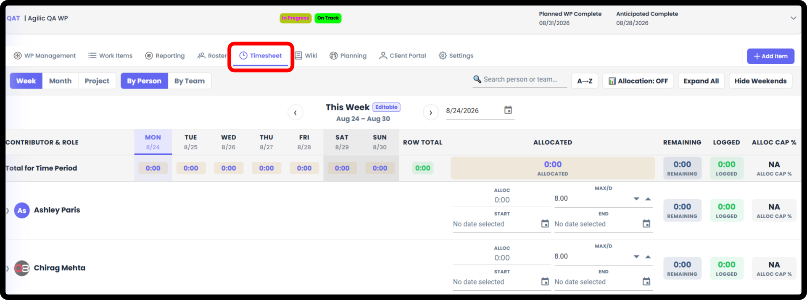
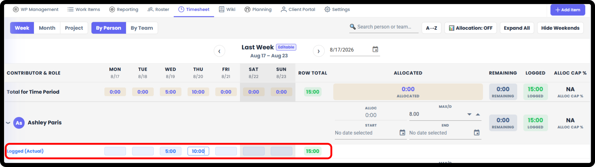
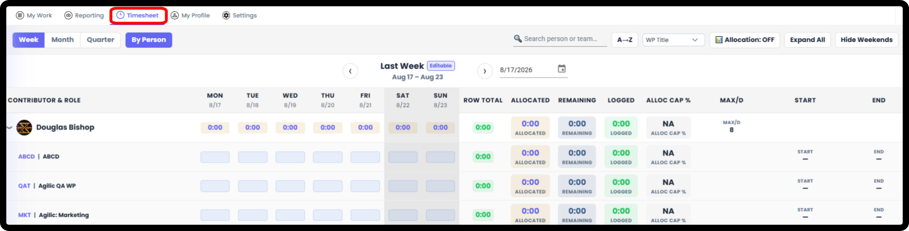
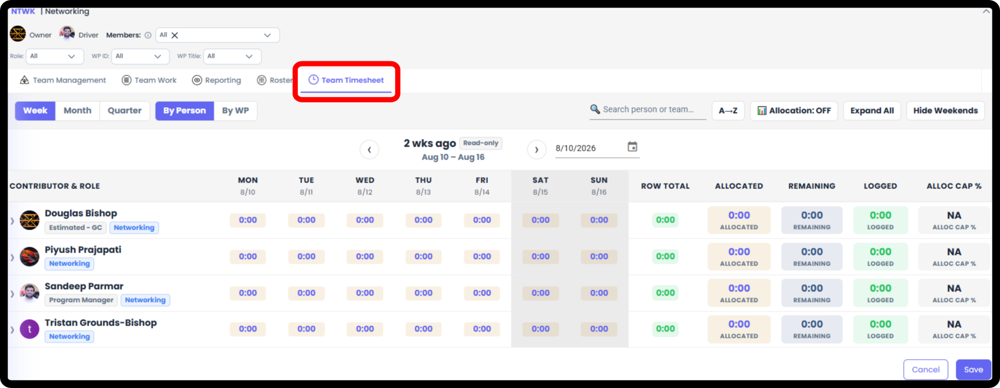

*September 18, 2026 • Section 7: Time Tracking • For: WP Roster members*

Agilic Timesheets have two different functions: Allocation Management,
to help with Pre-Planning by reserving capacity ahead of time, and
Logging Time, to record actual hours worked.

# Allocation Management

Before work begins, the Owner/Driver can add a Resource to the Roster
with an overall Allocation --- an Allocation Start, Allocation End, and
total hours --- to reserve capacity ahead of actual time logging.
Allocation Hours, Start, and End can only be adjusted on the Work
Package.

***See also:** Allocations are set up as part of Planning --- see [Work
Package Planning (Section
3)](https://agilic-wiki.local/s3-work-package-planning).*

Timesheets source of truth is located on individual Work Packages,
however Users can see (and Log Time) on My View and Team Views. The
Owner / Driver of the Team View can View and Edit Timesheet Logged Hours
on the Team View.

# Work Package Timesheet - Logging Time

Found inside a specific Work Package's Timesheet tab. This is where
time gets logged against the work happening in that WP.

**Note:** Not every user automatically has access to a Work Package's
Timesheet --- it depends on a permission check. If you don't see this
tab, check with your Work Package's Owner or Driver. You must be on the
WP Roster.

Only the WP Owner/Driver (and Org Admin) can see everyone's Allocations
and Time Logging. Individuals can see Allocations and log time for
themselves.

**Note:** Only the Owner/Driver of the WP (or Org Admin) can update
Allocations for a person.

**Step 1: Open the Timesheet**

From inside the Work Package, go to the Timesheet tab.

**Step 2: Log Your Time**

Record time against this Work Package.\
You can edit your Time Logged for this week and +/- 1 week. Beyond +/- 1
week you will need to ask the Owner/Driver of the WP or your Team
Owner/Driver to edit for you.

**Note:** The Owner / Driver of the WP (or Org Admin) can edit logged
time +/- 3 weeks

**Tip:** Log time as you go rather than trying to reconstruct a full
week at once --- it's easier to be accurate, and item-level hours feed
directly into that Work Package's Item Hours report.

# My Timesheet

From My View, go to the Timesheet. This is your personal timesheet ---
This will show you all the Work Package Timesheets you have access to.
You can see your Allocations (if used) and Log Time directly to those
Work Packages.\
You can edit your Time Logged for this week and +/- 1 week. Beyond +/- 1
week you will need to ask the Owner/Driver of the WP or your Team
Owner/Driver to edit for you.

Use My Timesheet when you want to see your own logged time across every
Work Package you're part of, rather than one WP at a time.

# Team Timesheet

From Team View, go to the Team Timesheet. This shows your personal
timesheets as well as will show you what your Team Members Work Packages
are. This will not show you your Team Member Allocations or Time Logging
information.\
If you are the Owner / Driver of the Team (or an Org Admin), you will
see all Team Member Allocations and you can see / Edit Logged Time for
each Team Member.

**Note:** The Owner / Driver of the Team (or Org Admin on the Team View)
can edit Logged Time +/- 2 weeks

# **Org Admin Timesheet View - ON ROADMAP / NOT AVAILABLE**

Org Admins can update Timesheets +/- 12 weeks. Every such update must be
captured in Recent Activity (audit trail).
