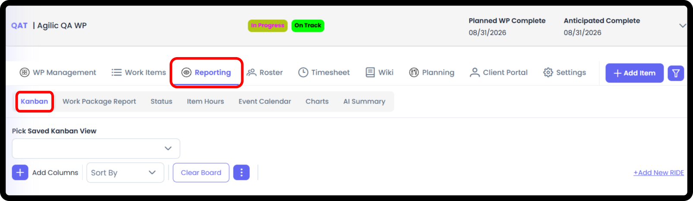
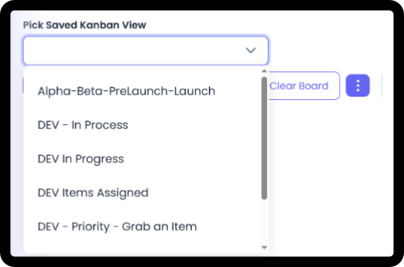
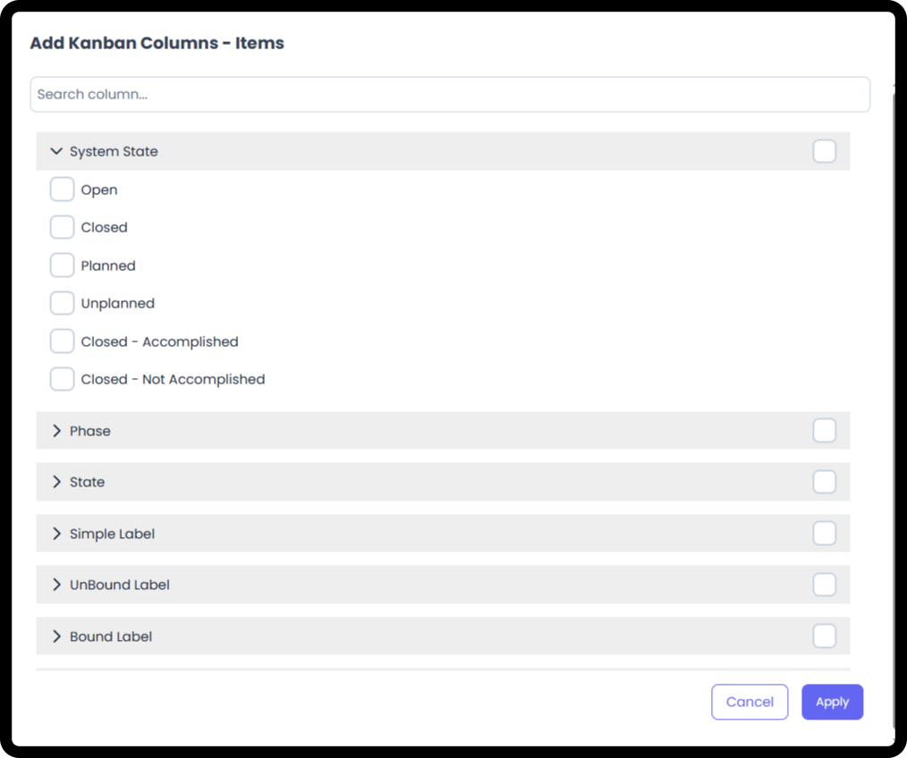
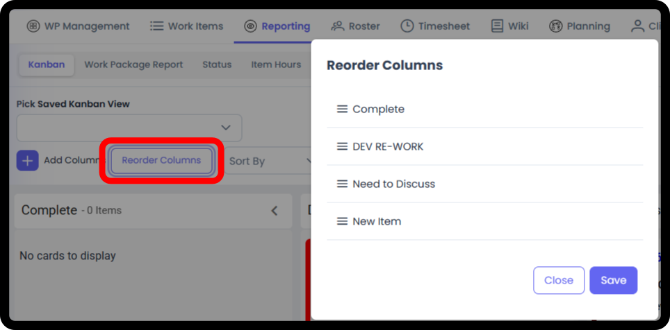
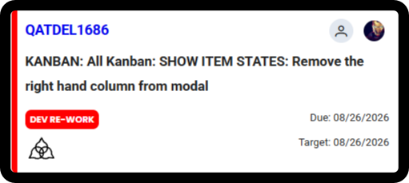
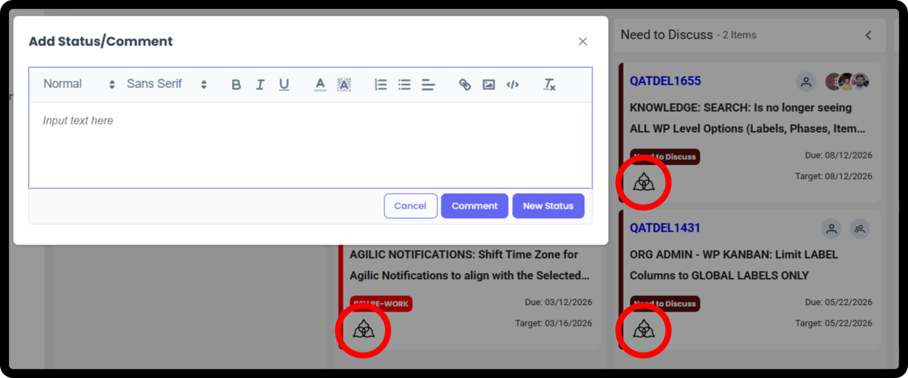
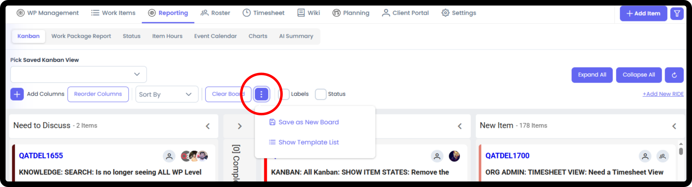
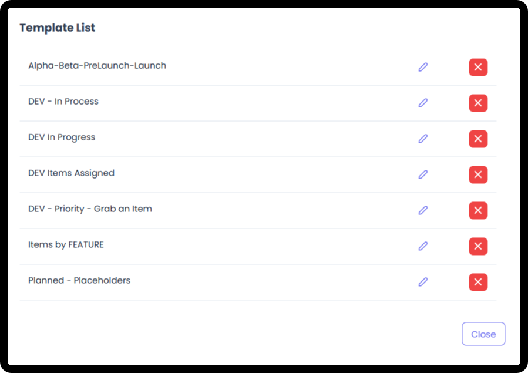

*September 18, 2026 • Section 8*

This guide covers general Kanban board usage --- the parts that work the
same way regardless of which of the five Kanban boards you're on.

# Getting There

Kanban is one of the sub-tabs under Reporting, alongside Stakeholder
Report, Status, Item Hours, Event Calendar, Charts, and AI Summary.

# Picking a Saved View

Use Pick Saved Kanban View to load a board you've saved before, instead
of building one from scratch each time.

# Adding Columns

Select Add Columns to choose what your board is organized by. You can
select multiple fields at once, each of the choices below have options
of what field(s) you want to add to the board. Each field selected will
become its own column:

-   System State

-   Phase

-   State

-   Simple Label

-   UnBound Label

-   Bound Label

-   Work Item Type

-   Assigned

-   Responsible

-   Milestone

-   RIDE Detail

**Tip:** Use the search box at the top of the Add Columns modal if
you're looking for a specific field rather than scrolling the full
list.

# Reordering Columns

Select Reorder Columns to drag columns into the order you want.

# Sorting and Clearing

-   Sort By --- choose how cards within each column are ordered

-   Clear Board --- resets the board

# Controlling What Shows on Cards

Two checkboxes let you toggle extra detail on every card:

-   Labels --- show/hide label badges on cards

-   Status --- show/hide status detail on cards

# Reading a Card

Each card shows:

-   Item ID --- a clickable link to open the full item

-   Item Title

-   Responsible / Assigned --- shown as avatar icons

-   A colored badge matching the item's current Item State

-   Due date and Target date

-   A Comment Triskele icon, for quickly adding a Comment or Status without opening the full item

***See also:** Everything captured on an item's full detail view is
covered in [Working Standard Items (Section
6)](/s6-working-standard-items/working-standard-items.md)
and [Working RIDE Items (Section
6)](/s6-working-standard-items/working-ride-items.md).*

# Adding a Comment or Status from a Card

Open a card's Comment Box by selecting the Triskele icon --- a quick
way to add a comment or post a new status without opening the full item.

The Add Status/Comment editor supports rich text --- bold, italic,
underline, color, highlighting, lists, alignment, links, images, and
code formatting.

# Expanding and Collapsing

-   Expand All / Collapse All --- apply to every column at once. When Collapsing All, the first column will always be Expanded.

-   Individual columns can also be collapsed to a narrow strip showing just the item count, using the arrow on that column

# Quick Actions

-   +Add New RIDE --- create a new RIDE item directly from the board

-   Show Item States --- opens a reference list of every available Item State and its background color. Every card is color-coded to match its item state, so this is the legend.

# Saving Your Board

Select the ⋮ (more options) menu for options:

-   Save as New Board --- save your current column/filter setup as a new named board

-   Update Current Board --- re-saves your current Board with any changes you have made

-   Show Template List --- open your list of saved board templates

# Working with Templates

Show Template List displays every board template you've saved, each
with edit and delete actions.

**Tip:** Templates are a good way to standardize how your team looks at
work --- e.g. a "Dev - Priority - Grab an Item" board everyone on the
team uses the same way.

# Drag and Drop Updates

You can move Cards from column to column and the Items will
automatically update. However, you need to keep in mind a few things:

-   Fields that can only have 1 choice (Bound Labels, Phases, Item States, Responsible, etc) will remove the old data and replace it with the new.

-   Fields that can have multiple choices (Assigned, Simple Labels, Unbound Labels, etc) will add the new data to the old data.

-   If you are on a Kanban that displays multiple Efforts together (My View, Team View, Org Admin) and you try to move a card to a field not available to that specific Item - then there will be an error message and you will not be able to move the card.
