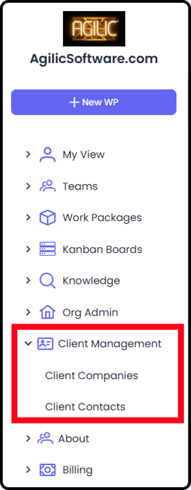
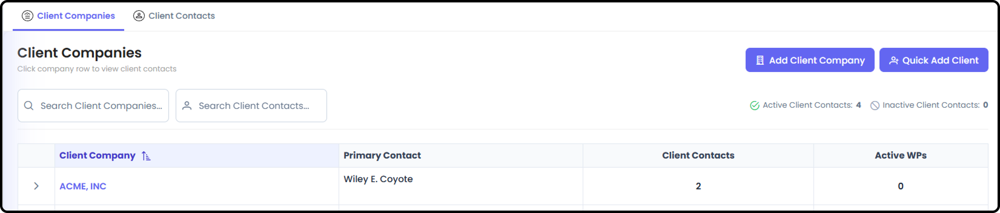
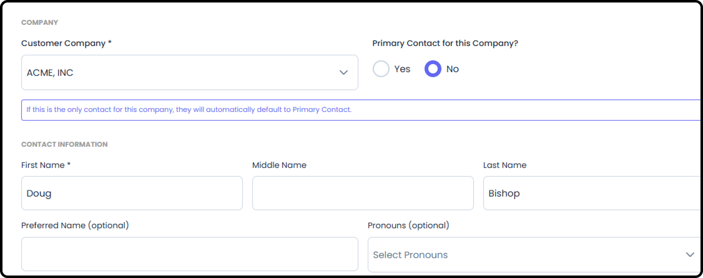
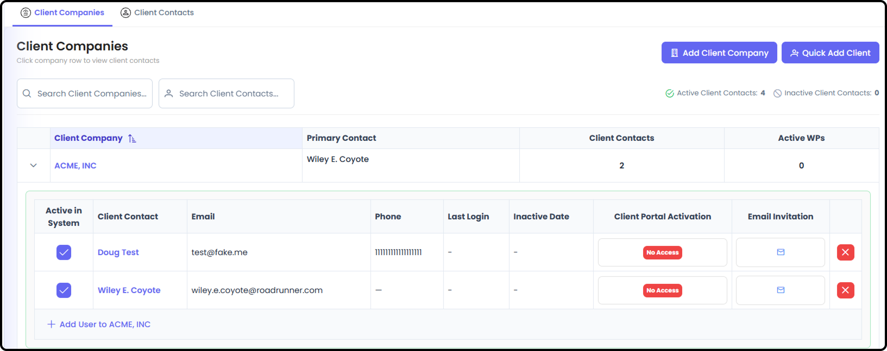
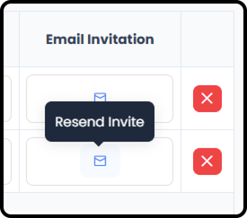
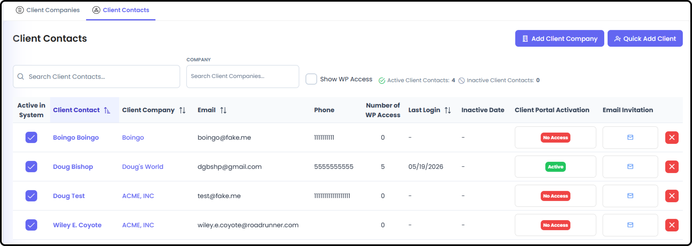
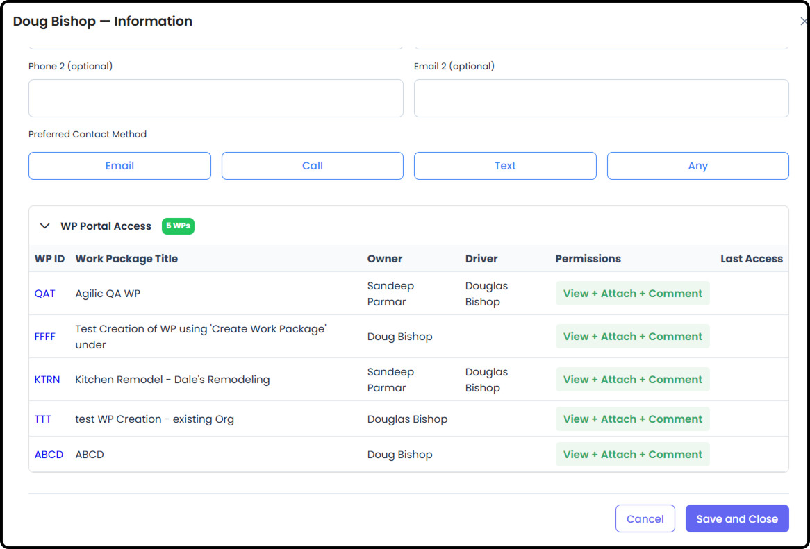

*September 18, 2026 • Section 9 • For: Org Admins*

This guide covers managing the external client companies and client
contacts who use your Client Portal --- the internal admin counterpart
to what clients themselves see. This area (labeled "Client Management"
in the app's navigation) only appears if the Client Portal feature is
enabled for your organization.

***See also:** For what your clients actually experience, see [Client
Portal External User Guide (Section
10)](https://agilic-wiki.local/s10-client-portal-external-user-guide).
To enable Client Portal in the first place, see [Setting Up Your
Organization's Settings (Section
2)](https://agilic-wiki.local/s2-org-settings).*

# Getting There

Go to Client Management in your left-hand navigation Menu. You'll see
two tabs: Client Companies and Client Contacts.

# Managing Client Companies

**Step 1: Review the Company List**

The Client Companies tab lists every external company your organization
works with. It's searchable, sortable, and paginated.

**Step 2: Set a Primary Contact**

Each company should have a primary contact. You can reassign this at any
time --- if reassigning would leave the company without one, Agilic will
warn you before you proceed.

**Step 3: Add a New Client User**

From a company's row, add a new client user directly.

**Step 4: Resend an Invitation**

If a client user hasn't accepted their invitation, you can resend it
from here.

**Tip:** If a client says they never received their invite, check spam
folders first --- but resending is quick and usually resolves it.

# Managing Client Contacts

**Step 5: Review All Client Contacts**

The Client Contacts tab lists every individual client-portal user across
all client companies --- not grouped by company, so it's useful when
you're looking for a specific person rather than a specific company.

-   Searchable and sortable by name, email, company name, or last login

-   Shows which company each contact belongs to

**Step 6: View Work Package Access for each Person**

In the Client Contacts View or by Expanding the Client Company - you can
see if Client Portal Access has been given to a specific Client.
Clicking on the Client's Name takes you to that Client's Profile which
shows you every Work Package the Client has Client Portal access to and
their permission levels in that Client Portal.

-   Adding Access to a WP's Client Portal must be done through that specific Work Package. This is to help ensure the appropriate Status, Milestones and RIDEs are displayed.

***See also:** Access managed from the Work Package side in the Access
tab of [Work Package Client Portal Management (Section
3)](https://agilic-wiki.local/s3-work-package-client-portal-management)*

**Step 7: Understand What Client Contacts Can Do**

-   Anyone in the organization can view a Work Package's Client Portal and add comments --- client access works alongside this, not instead of it

-   Client contacts are given comment ability and the ability to upload attachments, and can always download attachments posted to the portal

-   Anyone on a Work Package's Roster (or are Org Admin) can access and edit that WP's Client Portal information

***See also:** Full detail on Client Portal Permissions is in
[Permissions for People (Section
2)](https://agilic-wiki.local/s2-permissions-for-people).*

**Step 8: Remove a Client User or Company**

Both Client Companies and Client Contacts support deleting a user or
company, with a confirmation dialog to prevent accidental removal.

**Before you continue:** Removing a client company removes access for
everyone associated with it --- double check before confirming,
especially if the company has multiple contacts.

# Where Access Actually Comes From

A client company appearing here doesn't automatically mean its users
can see a specific Work Package --- that's controlled separately, from
within each Work Package's Client Portal Management screen.

***See also:** See [Work Package Client Portal Management (Section
3)](https://agilic-wiki.local/s3-work-package-client-portal-management)
for granting Work Package-level Client Portal access, including Control
(Client Milestone Management, Client RIDE Management), Client Documents,
Preview Portal, and Display Portal.*
