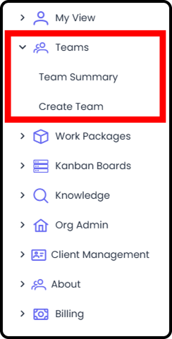
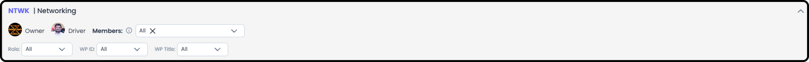
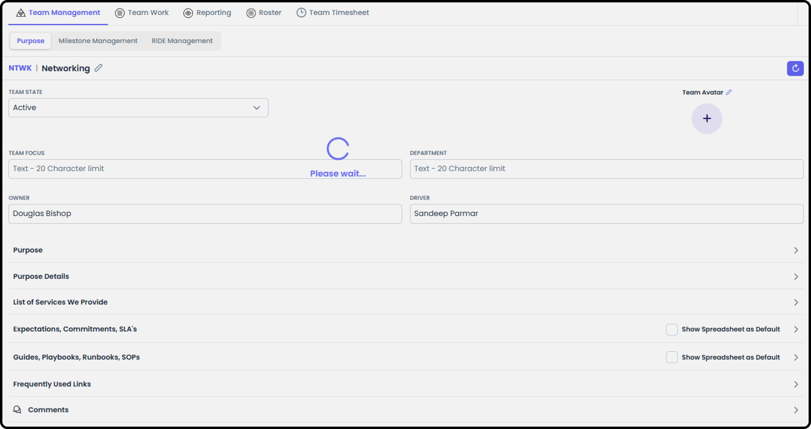
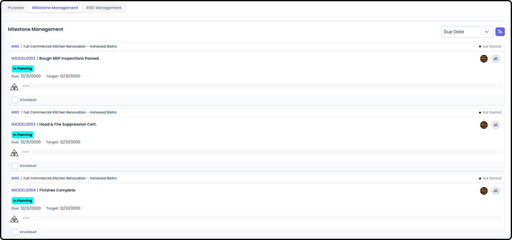
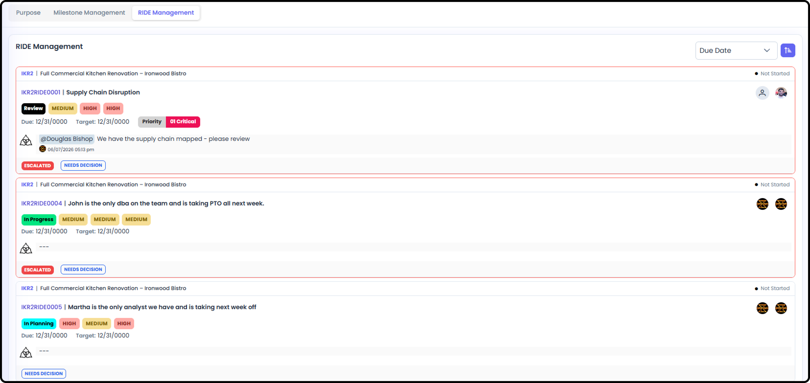
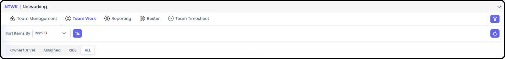
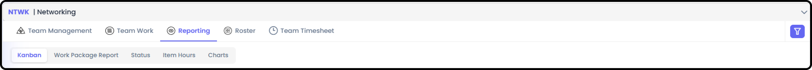
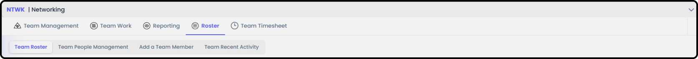
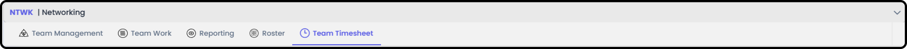

# How to Navigate a Team

*Version v20 • August 30, 2026 • Section 1: New User Orientation*

A Team in Agilic is a standing group you belong to — separate from any one Work Package — with its own purpose, roster, work, reporting, and timesheet. This is a full tour of every screen. Give this about 10 minutes.

> **See also:** The persistent top toolbar (Home, quick-access pills, AI Agent, Search, Feedback, and more) is covered in [How to Navigate as a User](/section-1-new-user-orientation/navigate-as-user.md) (Section 1).

## Getting There

Select My Team from your main navigation.

- Only visible if you're a member, Owner, or Driver of a team — if you don't belong to one, you won't have a My Team area to open.
- Team Management is the landing view, and defaults to Team Purpose.

## Team Management

**Team Header**

The Team Header is displayed on all Team views. It has filtering capabilities to help you find what you need within the Team. The Team Header can also be minimized to save space.

**Team Purpose**

Displays various information about the team — its stated purpose, useful links, and related context.

**Milestone Management**

Shows all milestones the members of the team are involved in, across every Work Package they're part of.

**RIDE Management**

Shows all RIDE items (Risks, Issues, Dependencies, Escalations) the members of the team are involved in.

## Team Work

Tabs for Work Packages team members are the Owner/Driver of, tabs for items your team is Assigned to, and a tab for RIDE items your team is involved in.

## Reporting

Team Reports and Charts, based on items team members are assigned to across all Work Packages.

1. **Kanban** — dedicated team Kanban boards.

   > **See also:** For how Team Kanban compares to My, WP, and Org Kanban boards, see [Kanban Boards](/section-13-kanban-boards/) (Section 13).

2. **Stakeholder Report** — shows all Stakeholder Reports from the Work Packages team members are on the roster of.
3. **Status** — date-oriented list view of item state and status.
4. **Item Hours** — detailed summary of item hours.
5. **Charts** — RIDE charts and item charts.
   - RIDE Charts: RIDE Heat Map, Decision Chart, Mitigation Chart
   - Item Charts: Items by State, Items by Assignee, Items by Responsible

## Roster

People management for the team.

1. **Team Roster** — shows the team members and their contact information.
   - Anyone can see this information
2. **Team People Management** — basic administrative information for the team, and team member removal.
3. **Add a Team Member** — where you add a team member who is already in the organization.
4. **Team Recent Activity** — basic audit information of who accessed what, and when.

## Team Timesheet

The entire team's allocations and logged hours.

- Only the Owner, Driver, and Org Admin can see everyone's information
- Remaining Team Members can see only what their teammates are Assigned to

## Where to Learn More

> **Tip:** For a shorter overview alongside the rest of your everyday navigation, see [How to Navigate as a User](/section-1-new-user-orientation/navigate-as-user.md).
