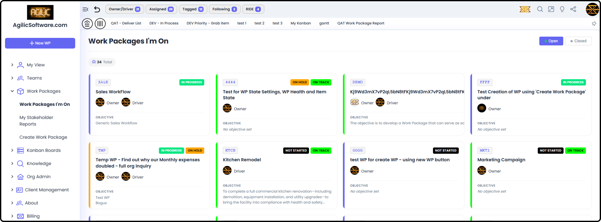
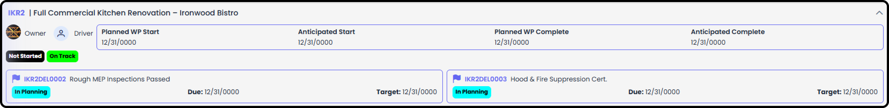
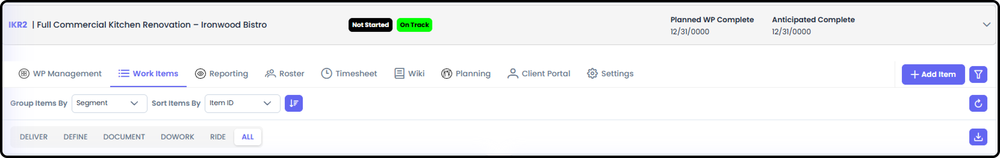
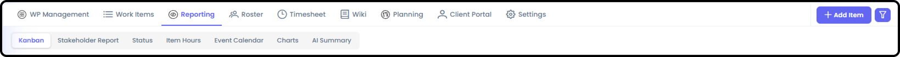
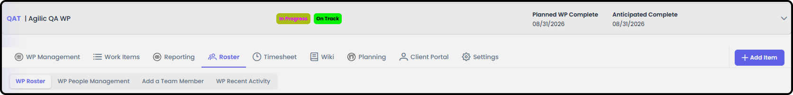
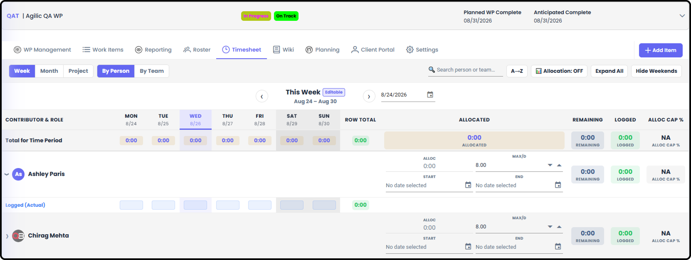
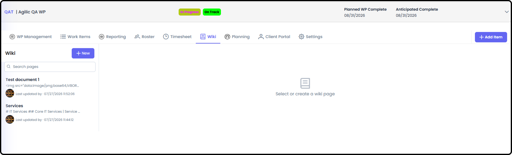
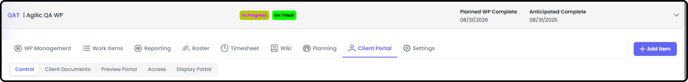
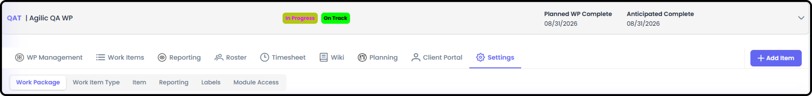

# How to Navigate a Work Package

*Version v20 • August 30, 2026 • Section 1: New User Orientation*

A Work Package (WP) is the core unit of work in Agilic — anything from a large multi-team project to a single task. This is a quick tour of everything you'll find once you open one. It won't teach you how to do every task — a deeper Work Package Overview guide covers that. Give this about 5–10 minutes.

> **See also:** The persistent top toolbar (Home, quick-access pills, AI Agent, Search, Feedback, and more) is covered in [How to Navigate as a User](/section-1-new-user-orientation/navigate-as-user.md) (Section 1).

## Getting There

From the main Work Packages list, select any Work Package you're part of to open it. Everything below lives inside that one Work Package. Alternatively, you can select from any My View Owner/Driver card and that link will take you to the main Work Package page.

**Work Package Management**

The WP's landing page — its Objective, Milestone Management, RIDE Management, and AI Recommendations.

**Work Package Header**

The Work Package Header shows on every WP view. It can be minimized if you don't need to see all the information.

**Work Items (the "4D" Tabs)**

The core working tabs, reflecting Agilic's 4D Framework — Define, Do Work, Document and Deliver — plus the RIDE.

1. Define — what's needed to make sure the deliverables are correct
2. Do Work — the actual task/execution tracking
3. Document — supporting reference material
4. Deliver — what needs to be delivered to hit the objective (Define Done)
5. RIDE — Risks, Issues, Dependencies, and Escalations that come up mid-project

**Reporting**

1. Kanban for this WP — unlimited boards

   > **See also:** For how WP Kanban compares to My, Team, and Org Kanban boards, see [Kanban Boards](/section-13-kanban-boards/) (Section 13).

2. Stakeholder Report — shows WP State and Status, and Escalated RIDEs and Milestones
3. Status — date-oriented list view of item state and status.
4. Item Hours — detailed summary of item hours.
5. Event Calendar — items displayed in calendar format
6. Charts
   - RIDE Charts: RIDE Heat Map, Decision Chart, Mitigation Chart
   - Item Charts: Items by State, Items by Assignee, Items by Responsible
7. AI Summary — extensive AI-powered summary of the WP, no querying needed. Can see history of all reports created with timestamps.

**Roster**

Who's on this specific Work Package — separate from your organization's full People list.

1. WP Roster — shows the team members and their contact information.
   - Anyone can see this information
2. WP People Management
   - Basic administrative information for the team, and team member removal.
3. Add a Team Member
   - Where you add a team member who is already in the organization.
4. WP Recent Activity
   - Basic audit information of who accessed what, and when.

**Timesheet**

Time-tracking for this Work Package. Not every user automatically has access — it depends on a permission check.

Everyone on this Work Package's allocations and logged hours.

- Only the Owner, Driver, and Org Admin can see everyone's information
- Remaining Team Members can see only what their teammates are Assigned to

**Wiki**

File/document storage for the Work Package.

**Planning**

Scheduling and breakdown tools: Work Breakdown Structure (WBS), Predecessor List, Success Matrix, PERT Chart, and Gantt Chart.

1. Relationships (between Items) — a list of Items that shows which Item has what relationships
   - Associated — a bread crumb to similar content. There is no schedule dependency.
   - Predecessor — the Item that comes before another item
   - Successor — the Item that comes after another item
2. Work Breakdown Structure (WBS) Chart
   - Organize your work in a WBS format
   - Bulk-mark WBS Items as Baseline Planned (see Pre-Planning)
   - AI WBS — use the dedicated AI Agent on the page to automatically create a draft WBS for you, flavored by what you tell it
   - Make multiple WBS versions — mark the WBS you want to use
3. PERT Chart
   - Visual flow chart showing Predecessors / Successors and Critical Path
4. Gantt Chart
   - Timeline diagram with the ability to show rows organized in different ways (by State, by Phase, etc.)

**Client Portal Management**

Only relevant if this WP has external clients. Controls exactly what a client can see — which milestones, RIDE items, and status updates get shared with them.

1. Control — input Client's Effort Status, Client Milestone Management, Client RIDE Management
2. Client Documents — history of all documents uploaded to the Client Portal (even after deleted)
3. Preview Portal — input your client's name to see what they will see when they log in
4. Access — see the list of clients that can see this Client Portal and assign permission levels
5. Display Portal — Client Portal maximized for screen sharing

**Settings**

WP-level configuration — Work Item Type settings, item settings, reporting settings, labels, private WP settings, and module access.

1. Work Package — WP State, WP Health, WP Phase Settings
2. Work Item Type — select who is Owner / Driver of a specific Work Item Type
3. Item — item creation defaults, Item State settings
4. Reporting — options for how certain fields are displayed
5. Labels — can see and use all Global Labels. Can add WP-dedicated Labels / Categories.
   - Simple Labels — single field, simple labels. Can assign any number of these labels.
   - UnBound Labels — 2-part labels. Can assign any number of these labels.
   - Bound Labels — 2-part labels. Can only assign 1 of each type (Priority: High or Priority: Low — can't be both).
6. Module Access — ability to turn Modules on and off if they are available and turned on within your Organization.

## Where to Learn More

> **Tip:** This tour only covers what each tab is for. For step-by-step instructions on using RIDE, Reports, Planning tools, and everything else, see the full Work Package Overview guide (Section 6).
