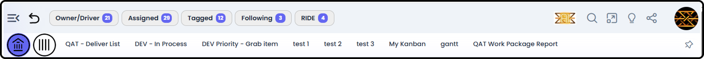
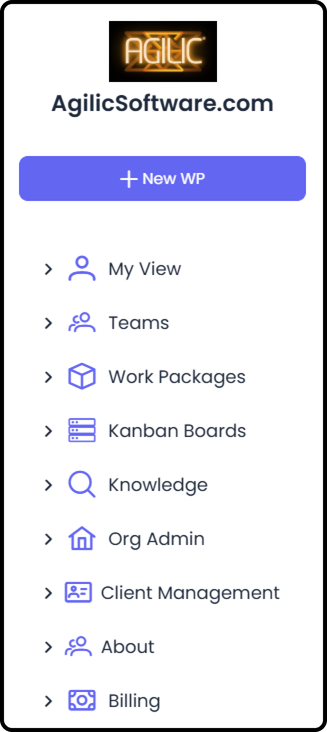
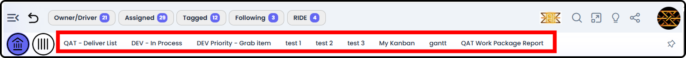
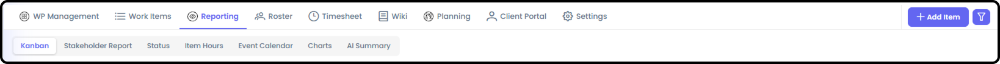
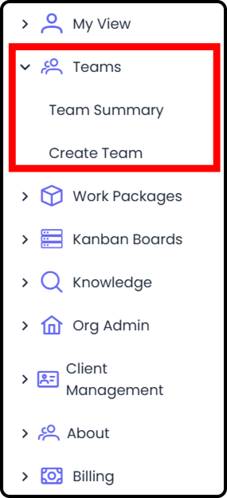
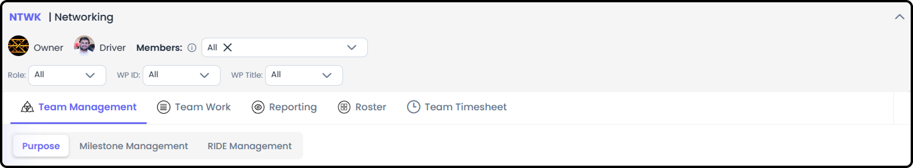
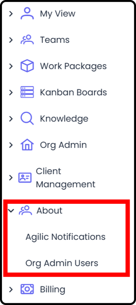
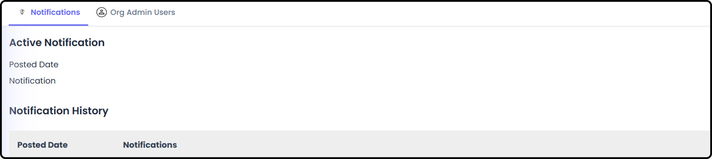
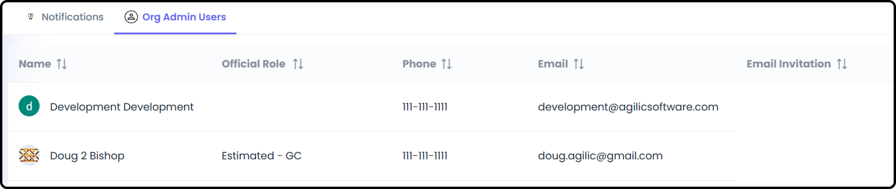

# How to Navigate as a User

*Version v20 • August 30, 2026 • Section 1: New User Orientation*

This is a quick tour of the main areas you'll use every day in Agilic as a regular team member. It won't teach you how to do every task — just what each screen is for, so you know where to go. Give this about 5 minutes.

## Persistent Top Navigation

A toolbar of navigation elements is visible from any screen in Agilic, regardless of which area you're currently in.

1. Hide / Expand Left Hand Menu
2. Back Button — takes you back to the previously loaded screen
3. Efforts I'm the Owner/Driver of (with count of open Efforts)
4. Items I'm Assigned to / Responsible for (with count of open Items)
5. Items I've been Tagged on (with count of open Items)
6. Items I'm Following (with count of open Items)
7. RIDE Items I'm involved in (with count of open RIDE Items)
8. AI Agent Access
9. Search
10. Expanded Screen
11. Feedback — bugs found / wishlist request directly to Agilic Software
12. Share — easy copy of the link to this page
13. My Profile Access
14. Home Button
15. Private Work Package Button
16. Custom Links Toolbar
17. Pin Button — to capture the page you're on as a Custom Link

**Left-Hand Side Menu**

A traditional navigation menu, toggled open or closed using the menu icon at the far left of the top toolbar. Hide it for more screen space, or show it when you want the familiar list-style navigation.

**Quick-Access Pill Buttons**

- Owner/Driver, Assigned, Tagged, Following, and RIDE — dedicated pill buttons that jump directly to that specific My Work tab, each showing a live count of items

**Home and Private Work Package Buttons**

The Home button is always visible and takes you straight to My View → My Work → All tab, no matter where you are.

The Private Work Package button is always visible and takes you straight to My Private Work Package → WP Management → Objective tab, no matter where you are.

**Right-Side Icons**

- AI Agent — opens the AI Assistant
- Search — opens global search
- Maximize — expands the current screen, handy when sharing your screen on a video call
- Feedback — submit a bug report or a wishlist item directly to Agilic
- Share — copy a link to the current page
- Profile — opens your Profile and Settings

**Custom Links**

Build your own shortcut buttons to pages you access often — useful for jumping straight to a specific Work Package view, report, or Kanban board without navigating there each time.

- Custom Links are added by clicking the Pin button on the top toolbar
- Once pinned, you can rename and re-order the links by going to My Profile → Settings and making adjustments in the Custom Link Toolbar section

## Your Main Navigation

When you log in, you'll land on My View — your personal home base. From there, a few areas are always available to you:

**My View**

Your personal dashboard. Everything here is about you specifically — items assigned to you, Work Packages you own, and your own reports — pulled together across every Work Package you're part of.

- My Work — tabs for Work Packages you're the Owner/Driver of, and tabs for items you are Assigned to, have Tagged, or are Following. RIDE (Risks, Issues, Dependencies, Escalations) items you're involved in are also displayed.

- Reporting — personalized versions of things you'll see in Work Packages and on Teams.

- Kanban — dedicated personal Kanban boards

  > **See also:** For how My Kanban compares to Team, WP, and Org Kanban boards, see [Kanban Boards](/section-13-kanban-boards/) (Section 13).

- Stakeholder Report — shows all Stakeholder Reports from the Work Packages you're on the roster of
- Status — date-oriented list view of item state and status
- Item Hours — detailed summary of item hours
- Timesheet — showing all your allocations and logged hours within every Work Package you're part of.

- My Profile — your account details and additional personal information

  - My Profile — account details
  - Personal Settings — custom link toolbar and UI options
  - Personal Connectors (like Google Drive)

- Settings — direct link to Personal Settings

**My Team**

If you belong to a team, this is where you'll find it. A team is a standing group — separate from any specific Work Package — with its own purpose, roster, work, reporting, and timesheets.

- Only visible if you're a member, Owner, or Driver of a team
- Team Management is the landing view, and defaults to Team Purpose
- From there you can see the Team's work, reporting (Kanban, Stakeholder Report, Status, Item Hours, Charts), and roster
- A dedicated Team Timesheet also lives here, with permissions that vary by role

> **See also:** This is only a summary — for the full breakdown of every My Team screen, see [How to Navigate a Team](/section-1-new-user-orientation/navigate-a-team.md).

**Knowledge - Search**

Organization-wide search, independent of any single Work Package.

- Global Search for Items — free-text search across Items
- Global Search for Work Packages — free-text search across Work Packages (Work Packages only, not Items)

> **See also:** For the full Knowledge - Search guide, see [Knowledge - Search](/section-14-knowledge-search/knowledge-search.md) (Section 14).

**About**

A small reference area, not an admin screen.

- Agilic Notifications — Agilic-wide notifications from Agilic Software, such as maintenance window announcements

- Org Admin Users — a read-only list of who the admins in your organization are, useful if you need help

## Work Packages: Where the Actual Work Lives

Where the items actually live is within Work Packages, even though you have access to them from My View. From the main Work Packages list, you can open any Work Package you're part of.

You can see all the Work Packages you are on the roster of by selecting **Work Packages I'm On**.

> **Tip:** Work Packages have their own dedicated navigation guide — see [How to Navigate a Work Package](/section-1-new-user-orientation/navigate-a-work-package.md) — since there's a lot inside each one.

## Quick Reference

| Screen | What it's for |
|---|---|
| My View | Your personal dashboard across all your Work Packages |
| My Team | Your standing team (if you belong to one) |
| Knowledge - Search | Find items or Work Packages org-wide |
| About | Announcements and a list of your org's admins |
| Work Packages | Where you do the actual work — see the dedicated guide |
