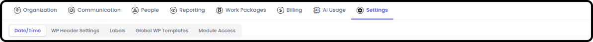
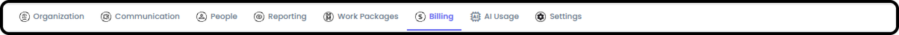
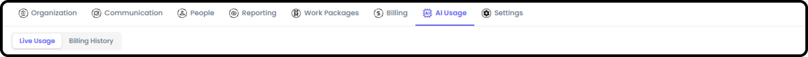

# How to Navigate Org Admin

*Version v20 • August 30, 2026 • Section 1: New User Orientation*

Org Admin is the management console for your organization — separate from the everyday work areas covered in [How to Navigate as a User](/section-1-new-user-orientation/navigate-as-user.md). This is a quick tour of what each tab is for. Give this about 5–10 minutes.

> **See also:** The persistent top toolbar (Home, quick-access pills, AI Agent, Search, Feedback, and more) is covered in [How to Navigate as a User](/section-1-new-user-orientation/navigate-as-user.md) (Section 1).

## Getting There

Org Admin is available if you have admin access for your organization.

**Organization**

Your organization's profile — name, logo, license number, address, time zone, and primary contact. This is the same form used when your organization was first created.

**Communication**

Create organization-wide announcement banners that appear to everyone in your org for a scheduled window of time.

**People**

Manage everyone in your organization.

1. Org People List — the full roster
   - Give people permissions
   - Access User Profiles that need updated
   - Add / Remove Users
2. Org Role List — where you can define what roles your people perform
   - You can also define Role Placeholders available for Pre-Planning across the Org
3. Standard Permission Types — set here, per person: WP Creator, Team Creator, Org Reporting, and Admin (full Org Admin access)
4. Billing Admin — only 1 user can be the Billing Admin and they must already have Org Admin permissions
   - Note: anyone with Org Admin permissions can update who the Billing Admin is
5. Teams — manage standing teams and their membership
   - Add new teams

**Reporting**

Organization-wide views that roll up data across every Work Package.

- Kanban (Items) — unlimited boards
- Kanban (Work Packages) — unlimited boards

> **See also:** For how Org Kanban compares to My, Team, and WP Kanban boards, see [Kanban Boards](/section-13-kanban-boards/) (Section 13).

**Work Packages**

A list of every Work Package in the organization — not just the ones you personally belong to.

- Here you can close or archive old projects

**Settings**

Organization-wide configuration, in its own set of sub-tabs.

1. Date/Time — date format, timestamp format, business days, calendar start day
2. Work Package Header Settings — defaults applied across all Work Packages
3. Labels — customized labels / categories used throughout the system
   - Simple Labels — single field, simple labels. Can assign any number of these labels.
   - UnBound Labels — 2-part labels. Can assign any number of these labels.
   - Bound Labels — 2-part labels. Can only assign 1 of each type (Priority: High or Priority: Low — can't be both).
4. Global Work Package Templates — reusable starting points for new Work Packages
   - Work Package State — defaults to System Defined unless changed
   - Work Package Health — defaults to System Defined unless changed
   - Work Package Phase — defaults to System Defined unless changed
   - Item State — defaults to System Defined unless changed
5. Module Access — turn optional features (like Client Portal) on or off for the org

**Billing and AI Usage**

Only visible if you're specifically flagged as a Billing Admin — a narrower permission than general org-admin access.

6. Billing — your organization's subscription information and access to a Stripe-hosted billing portal
   - You can update your subscription and payment methods here, or cancel your subscription

**AI Usage**

Only visible if you're specifically flagged as a Billing Admin — a narrower permission than general org-admin access.

1. Token Usage — both current and historical
2. Billing History (cost of tokens)

## Where to Learn More

This tour only covers what each tab is for. For step-by-step instructions on inviting people, managing teams, and configuring settings, see the dedicated guides: Adding & Managing People (Section 3), Creating & Managing Teams (Section 3), Managing Billing & Subscription (Section 3), and Setting Up Your Organization's Settings (Section 2).

> **Tip:** If you don't see the Org Admin area at all, you don't currently have admin access — check with an existing admin in your organization (visible under About → Org Admin Users).
