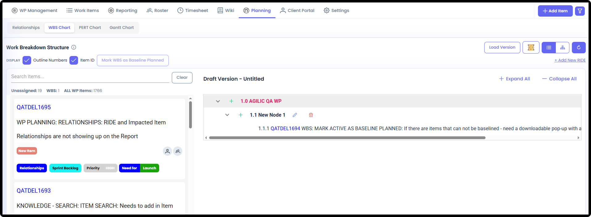
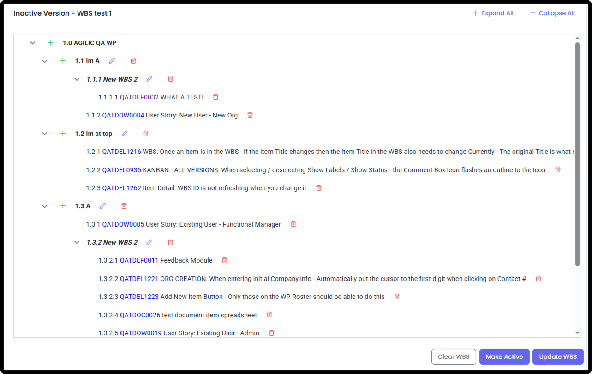
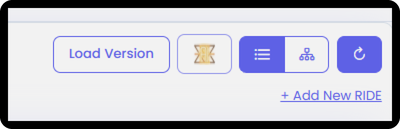
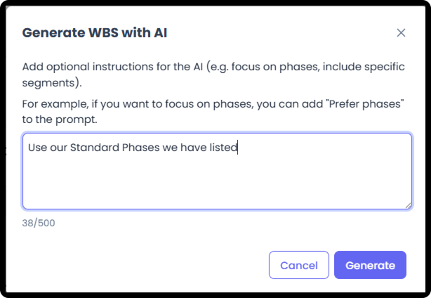

# Work Package Planning Tools

*Version v11 • August 30, 2026 • Section 11: Planning & Scheduling • For: WP Roster members*

This guide covers every Planning tool available for organizing your schedule, in depth — standard project planning, used once you have your team assembled: Task Relationships, PERT Chart, Gantt Chart, Work Breakdown Structure (WBS), and Baseline Planned.

> **See also:** For everything that comes before this stage — defining the Work Package itself, and preparing your roster — see [Pre-Planning Capabilities](/section-6-work-package-overview/pre-planning-capabilities.md) (Section 6). For a lighter first-day tour of the Planning tab, see [Work Package Planning](/section-6-work-package-overview/work-package-planning.md) (Section 6).

## Getting There

Inside a Work Package, go to the Planning tab.

## Relationships

Shows relationships between items — a list of items and which other items each one relates to.

> **See also:** The full breakdown of relationship types (Associated, Predecessor, Successor, RIDE/Impacted Items) is covered in [Work Package Planning](/section-6-work-package-overview/work-package-planning.md) (Section 6) and [Working Standard Items](/section-4-core-day-to-day-work/working-standard-items.md) (Section 4).

## PERT Chart

A flow chart of all items, showing the Critical Path.

The PERT (Program Evaluation and Review Technique) chart shows task relationships and timelines so you can see the critical path and plan more accurately. Agilic displays the Activity-on-Node variation of the chart.

**Forward Pass and Backward Pass**

The system can automatically adjust your schedule based on either end of a task:

- Forward Pass — recalculates the schedule based on Start Dates
- Backward Pass — recalculates the schedule based on End Dates

> **Coming soon:** Forward Pass and Backward Pass are still in development and not yet available in the live product.

> **Tip:** Use Forward Pass when you know when work can begin and want to see how far out it pushes your finish date. Use Backward Pass when you have a fixed deadline and need to see how far back your start dates need to move.

## Gantt Chart

A timeline view of the schedule — but Agilic's Gantt is more flexible than a typical one. You can reorganize how it's grouped:

- By Phase, Item State, Responsible Resource, or other fields
- Show just Milestones
- Show just RIDE items

- Gantt columns can be sorted, adjusted, and the order changed.

## Work Breakdown Structure (WBS)

Customize how you want to organize the work — organize the WBS in whatever structure makes sense for this Work Package, rather than being locked into one fixed hierarchy.

**Draft Versions**

Create a WBS by drag-and-dropping items from the left over to where you want them in the WBS.

- You can re-order WBS elements by drag and drop.
- You can edit the different WBS layer names. Note the very top layer is defaulted to your WP Name and can not be renamed.

- You can save multiple draft versions of the WBS.
- Once you have a version you like:
  - Save it and mark it as Active — this will allow some reports to reference your active WBS version.
  - An Active WBS can also mark the WBS as Baseline Planned, which will take every item on the WBS and check the Baseline Planned box on each one.

**Baseline Planned (from the WBS)**

An Active WBS can be marked as Baseline Planned. This takes every item on that WBS and automatically marks it Baseline Planned — visible afterward on each item's detail view.

> **Note:** Items not on the Active WBS at the time it's marked Baseline Planned will not be marked Baseline Planned.

**AI WBS**

A dedicated AI feature on the WBS page lets the AI Agent organize the work for you, based on what you tell it — or don't tell it anything and it will organize it in the manner it feels most appropriate based on the items you have listed.

## WP Phases

Phases operate independently from the Gantt, PERT, and WBS — a Phase is just a field on each item.

- Because it's a field, you can show Phases on Kanban boards, and reports can group by Phase as options allow.
- Depending on how you set up your schedule, multiple Phases can happen simultaneously — e.g. Control Phase running at the same time as Execution, or Implementation running alongside Operations Prep.

> **See also:** For the Baseline Planned definition, see the Terminology Index & Dictionary (Section 0). For full Work Package Settings detail (Work Package, Work Item Type, Item, Reporting, Labels, Module Access), see [Work Package Settings](/section-6-work-package-overview/work-package-settings.md) (Section 6).
