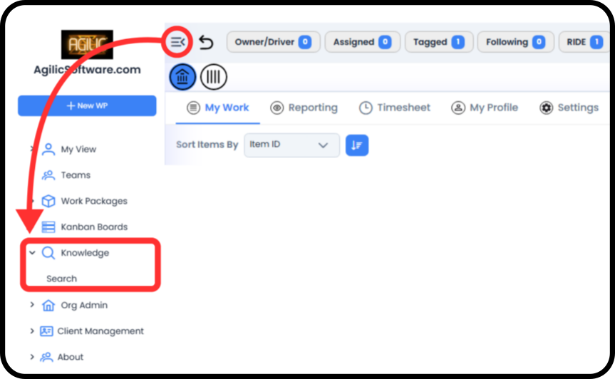
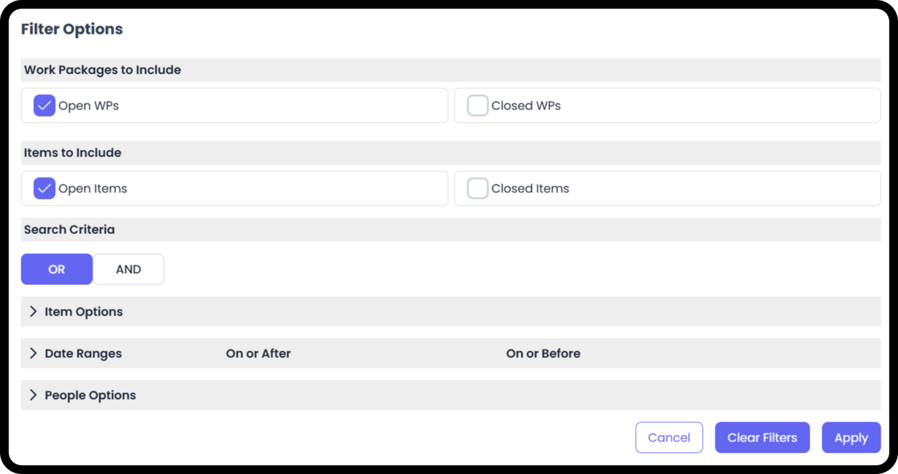
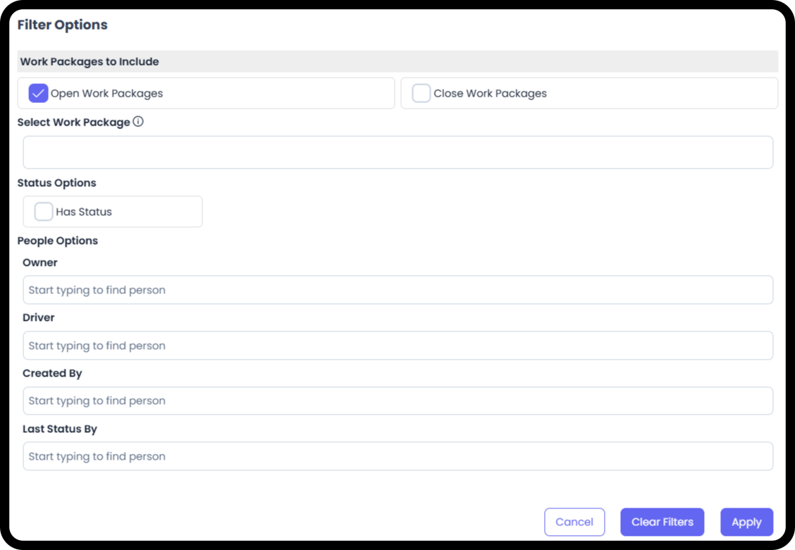
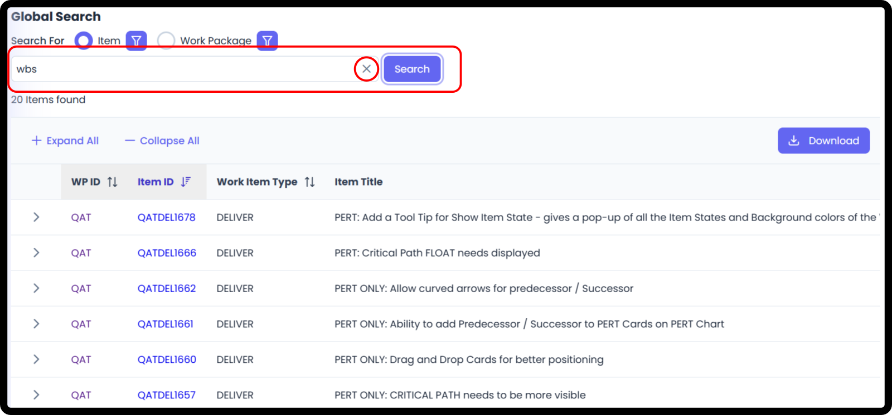
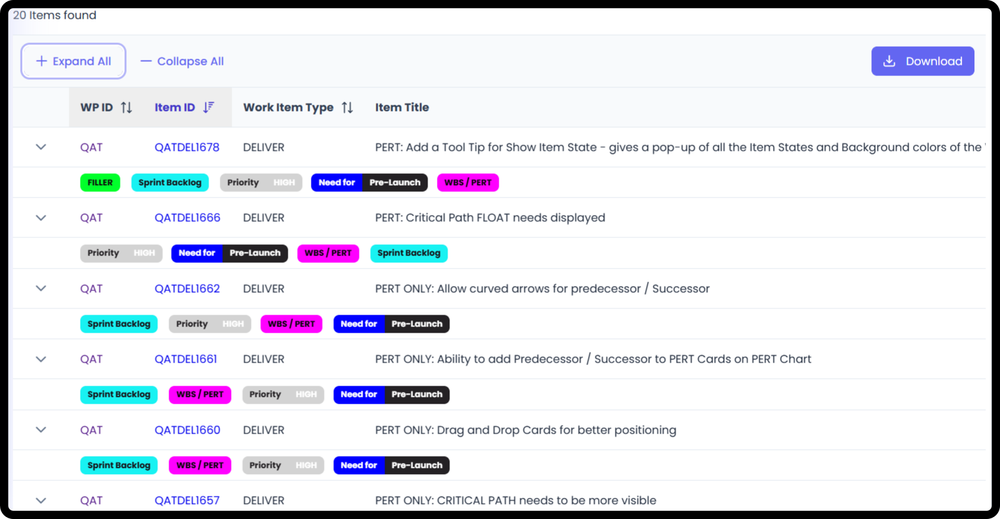

# Knowledge - Search

*Version v4 • August 18, 2026 • Section 14*

This guide covers using Agilic's Global Search — free-text search across your organization, independent of any single Work Package.

> **See also:** For a quick first-day overview, see [How to Navigate as a User](/section-1-new-user-orientation/navigate-as-user.md) (Section 1).

## Getting There

Select Knowledge from your main navigation → Search from the Left Hand Menu.

## Step-by-Step

**Step 1: Choose What to Search**

Under Search For, choose Item or Work Package. This determines both what the results table shows and which filters are available to you.

**Step 2: Add Your Filters**

Select the filter icon next to your chosen search type to open Filter Options. The available filters are different depending on whether you're searching Items or Work Packages.

**Item Filters**

- Work Packages to Include — Open WPs, Closed WPs
- Items to Include — Open Items, Closed Items
- Search Criteria — OR / AND, controlling how your search terms combine
- Item Options (expandable)
- Date Ranges (expandable) — On or After, On or Before
- People Options (expandable)

**Work Package Filters**

- Work Packages to Include — Open Work Packages, Closed Work Packages
- Select Work Package — search/select a specific Work Package directly
- Status Options — Has Status
- People Options — Owner, Driver, Created By, Last Status By (each a type-ahead person search)

Once your filters are set, select Apply. You can also select Clear Filters to reset, or Cancel to close without applying changes.

**Step 3: Enter Your Search Text**

Type into the search bar. Use the X to clear what you've typed.

**Step 4: Select Search**

Select the Search button to run your query.

## Reading Your Results

Results appear as a table below the search bar, with a total count shown above it (e.g. "463 Items found").

- Expand All / Collapse All — expand or collapse every result row at once
- Download — export your results

**Item Search Results Columns**

- WP ID — the Work Package the item belongs to
- Item ID — sortable
- Work Item Type — which Work Item Type the item belongs to (Deliver, Define, Do Work, Document, RIDE)
- Item Title
- Labels on the item

> **See also:** Segment is the older term for Work Item Type — see [Work Item Types](/section-4-core-day-to-day-work/work-item-types.md) (Section 4).

## Related Tasks

This guide covers the search process itself. For what each result type actually is once you open it, see [Work Item Types](/section-4-core-day-to-day-work/work-item-types.md) and [Working RIDE Items](/section-4-core-day-to-day-work/working-ride-items.md) (Section 4), or [Create Work Package / Add People to WP](/section-6-work-package-overview/create-work-package.md) (Section 6).
