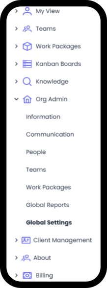
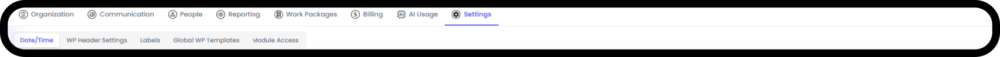
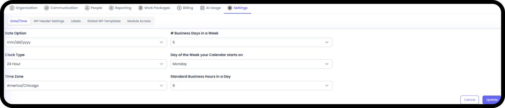
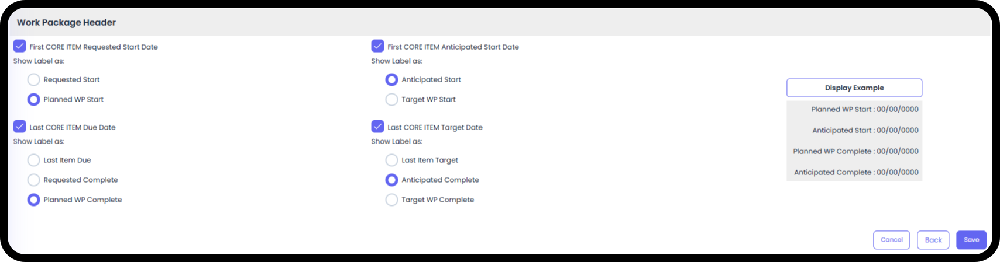
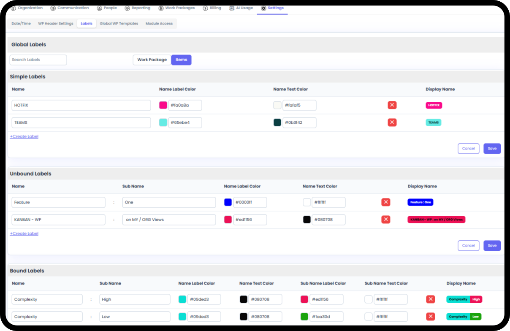
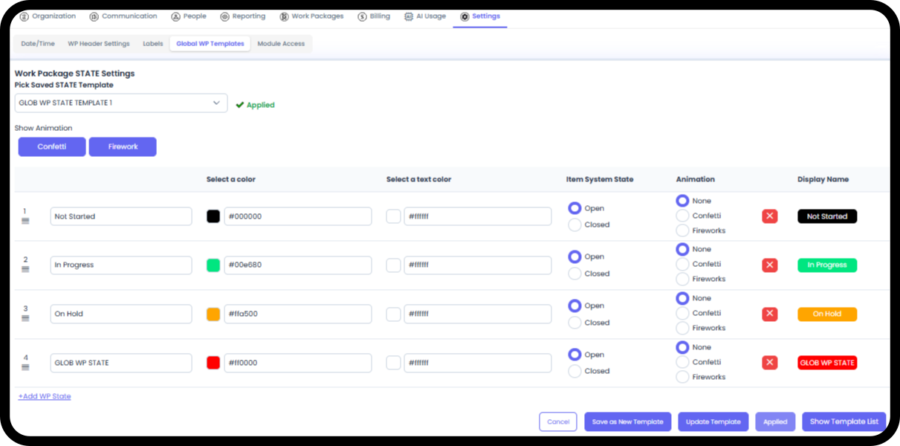
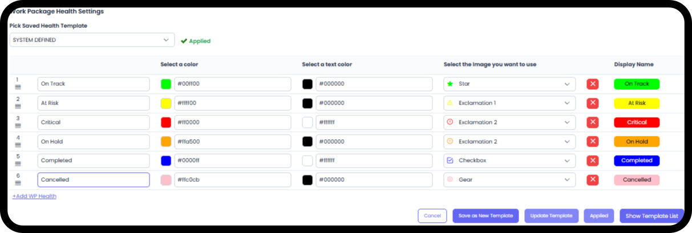
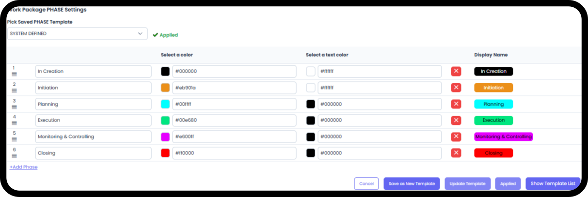
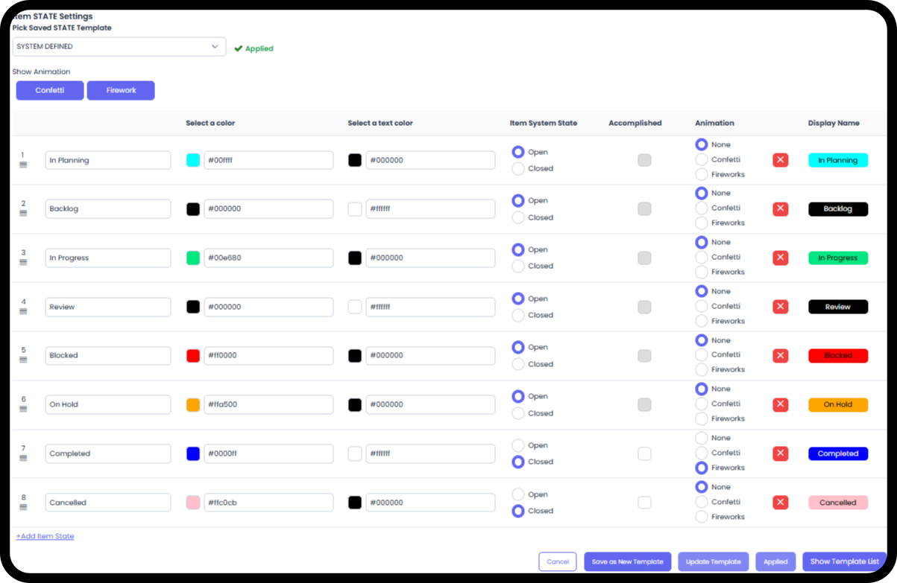
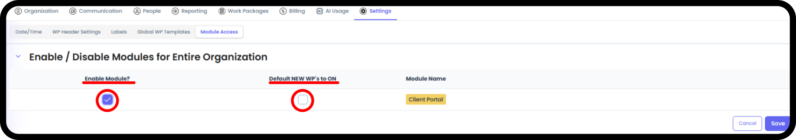

# Org Settings

*Version v16 • August 30, 2026 • Section 2: Setting up your Org • For: Org Admins*

Once your organization exists in Agilic, there are a handful of org-wide settings worth configuring early — before your team starts creating Work Packages. These live under Org Admin → Settings.

> **See also:** For creating your organization for the first time, see [Setting Up Your Organization](/section-2-setting-up-your-org/setting-up-your-organization.md) (Section 2).

## Getting There

Go to Org Admin, then select the Settings tab. You'll see a row of sub-tabs across the top.

**Step 1: Set Your Date/Time Preferences**

Under the Date/Time sub-tab, configure:

- Date format, Clock Type (12 hour or 24 hour), Time Zone (for the org)
- # of Business Days in a week, Day of the Week your calendar starts on
- The standard # of Business Hours in a Day (for planning purposes)

**Step 2: Set Work Package Header Defaults**

Under Work Package Header Settings, configure the defaults that will apply to every new Work Package in your organization, unless someone overrides them for a specific Work Package. This simply allows you to adjust the verbiage being used at the Work Package level.

> **Tip:** Set these before your team starts creating Work Packages — it saves everyone from having to configure the same options individually, every time.

**Step 3: Set Up Global Labels**

Under Labels, you can see and use all global labels, and add labels/categories specific to your organization. There are three types:

- Simple Labels — a single field. You can assign any number of these to an item.
- UnBound Labels — a two-part label (e.g. "Category: Value"). You can assign any number of these.
- Bound Labels — also two-part, but you can only assign one of each type — e.g. an item can be Priority: High or Priority: Low, but not both.

Items and Work Packages both have their own sets of labels. Having good, consistent labels across all Items and all Work Packages makes your reporting much more valuable. However, there are always unique needs in every project, so each Work Package can automatically use the Global Labels but can also set up their own.

> **Tip:** These same label types are also available at the individual Work Package level, in that WP's own Settings — see Work Package Settings (Section 6).

**Step 4: Create Work Package Templates (Optional)**

Under Global Work Package Templates, set up reusable starting templates so your team doesn't have to configure every new Work Package from scratch. Each of the following can have multiple templates created for any needs your organization may have:

- Work Package State — defaults to System Defined unless changed
- Work Package Health — defaults to System Defined unless changed
- Work Package Phase — defaults to System Defined unless changed
- Item State — defaults to System Defined unless changed

**Step 5: Turn On Optional Modules**

Under Module Access, turn on optional features for your organization. Currently, this is where you enable Client Portal — and optionally make it the default for new Work Packages.

> **Tip:** Only turn on Client Portal if your organization actually works with external clients — see Client Portal Module (Section 9) before enabling this.

## Quick Reference

| Sub-Tab | Purpose |
|---|---|
| Date/Time | Date/timestamp format, business days, week start |
| Work Package Header Settings | Defaults applied to every new Work Package |
| Labels | Simple, UnBound, and Bound labels/categories, org-wide |
| Global Work Package Templates | Reusable starting points for new Work Packages |
| Module Access | Turn optional features (like Client Portal) on or off |
