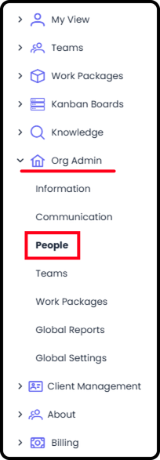
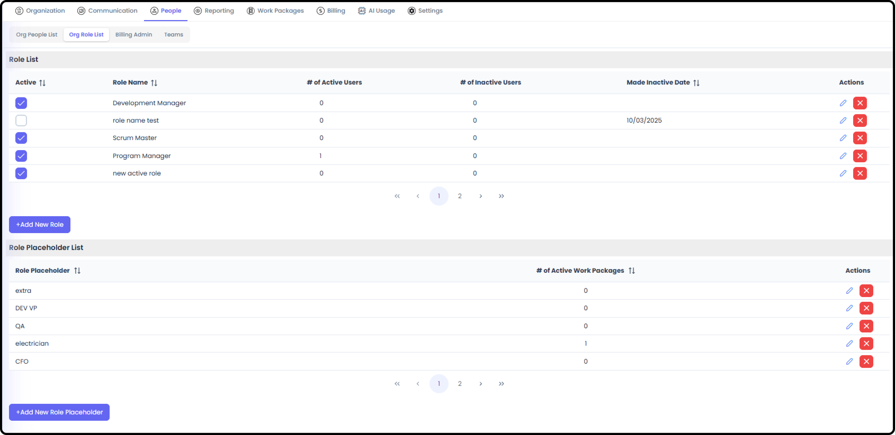
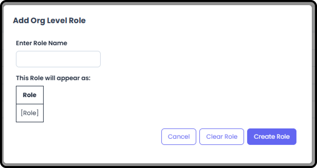
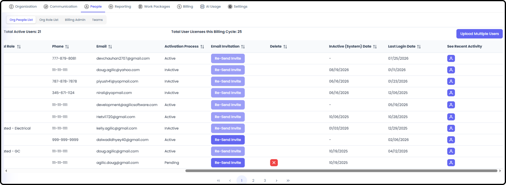

# Adding & Managing People

*Version v15 • August 31, 2026 • Section 3: Recurring Admin Tasks • For: Org Admins*

This guide covers the ongoing admin task of inviting new people into your organization, assigning them permissions, and keeping the People list current. Unlike Organization setup, this is something you'll come back to regularly as your team grows or changes.

> **See also:** For a full breakdown of every access layer, see [Permissions for People](/section-2-setting-up-your-org/permissions-for-people.md) (Section 2).

## Getting There

Go to Org Admin, then select the People tab.

**Step 1: Review the Org People List**

The Org People List shows everyone currently in your organization, along with their role, employment type, and activation/verification status.

> **Tip:** Check the verification/activation status column if someone says they can't log in — they may not have completed their invitation yet.

**Step 2: Set Up Org Roles (If Needed)**

Before adding people, make sure the Org Role List reflects your organization's actual job titles/functions — this is what you'll assign each new person to.

> **Tip:** Agilic also supports "Role Placeholders," available for pre-planning across the org — a role that exists in the system but isn't yet filled by a real person. Individual Work Packages can also use these org-level role placeholders, or create their own.

> **See also:** A Role is a job title/skillset label only — it carries no permissions of its own. See [Permissions for People](/section-2-setting-up-your-org/permissions-for-people.md) (Section 2).

**Step 3: Add a New Person**

From Org Admin → People → Org People List, select Add User.

Then fill in the relevant information. The required fields are:

- First name
- Last name
- Contact Number
- Email — note that the email listed here is where the invitation for access to Agilic will be sent.

Once saved, the new person receives an invitation to join your organization.

**Step 4: Grant Standard Permission Types (As Needed)**

A person's Role doesn't grant them any special access on its own. If they need to create Work Packages, create Teams, access org-level reporting, or manage the organization, grant the relevant Standard Permission Type from the Org People List:

- WP Creator — can create Work Packages
- Team Creator — can create Teams
- Org Reporting — can access org-level reporting
- Admin — full Org Admin access, which includes all other levels

> **Tip:** Every organization must always have at least 1 person with Org Admin access — the system won't let you remove the last one.

**Step 5: Grant Billing Admin (As Needed)**

Only one person can be Billing Admin at a time, and they must already have Org Admin access. Go to Org Admin → Billing Admin, then select the person to hold the role.

> **See also:** For the full Billing Admin rules, see [Permissions for People](/section-2-setting-up-your-org/permissions-for-people.md) (Section 2).

**Step 6: Track Invitation Status**

A newly added person won't be able to use Agilic until they accept their invitation and complete registration. Check back on the Org People List to see their verification status.

## Related Tasks

- To add someone to a Work Package, see Create Work Package / Add People to WP (Section 4)
- To add someone to a Team, see [Creating & Managing Teams](/section-3-recurring-admin-tasks/creating-managing-teams.md)
- To grant Billing Admin, see Step 5 above
- For details on what different access levels mean, see [Permissions for People](/section-2-setting-up-your-org/permissions-for-people.md) (Section 2)
