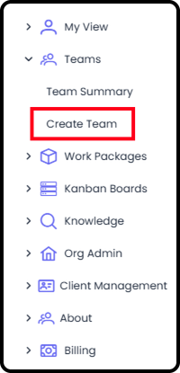
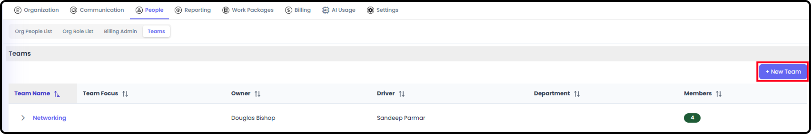
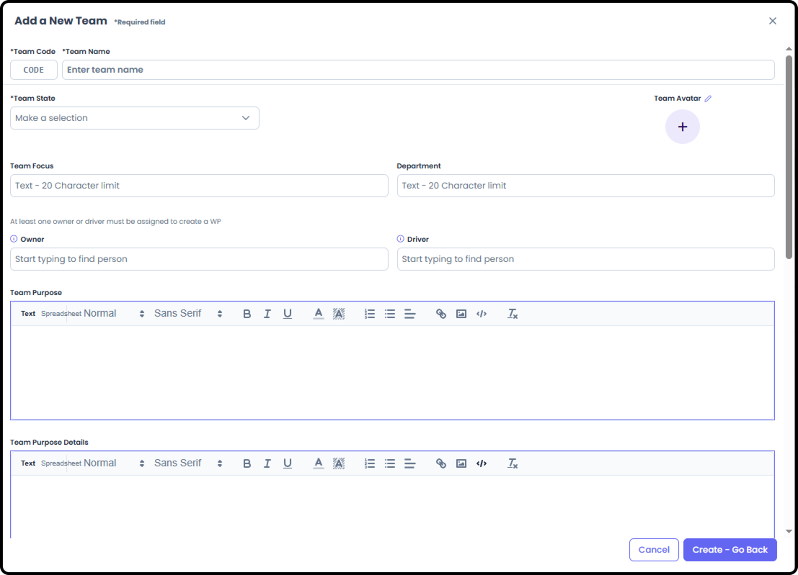
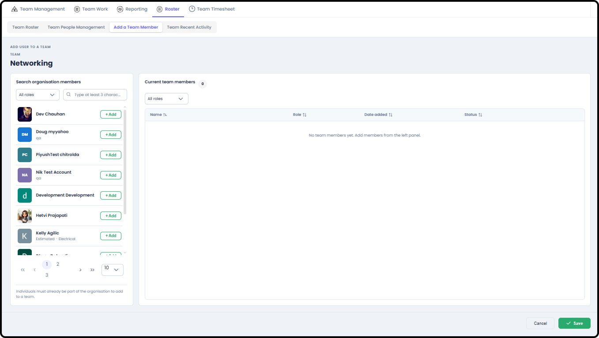
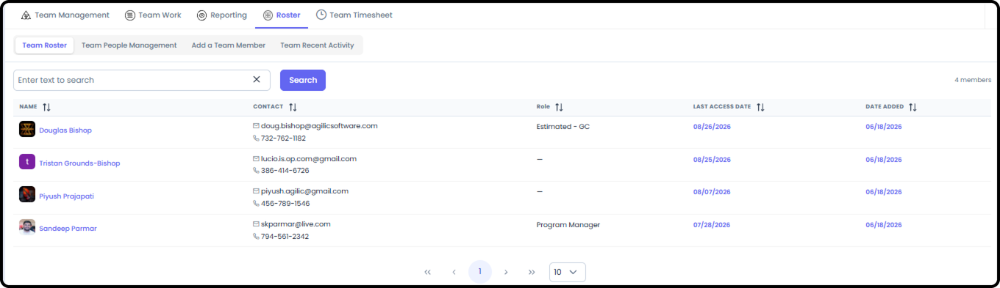
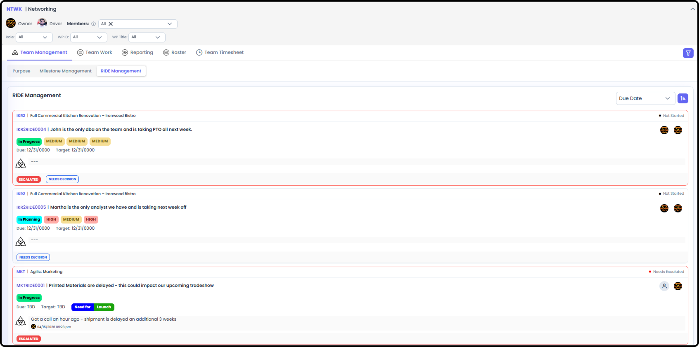
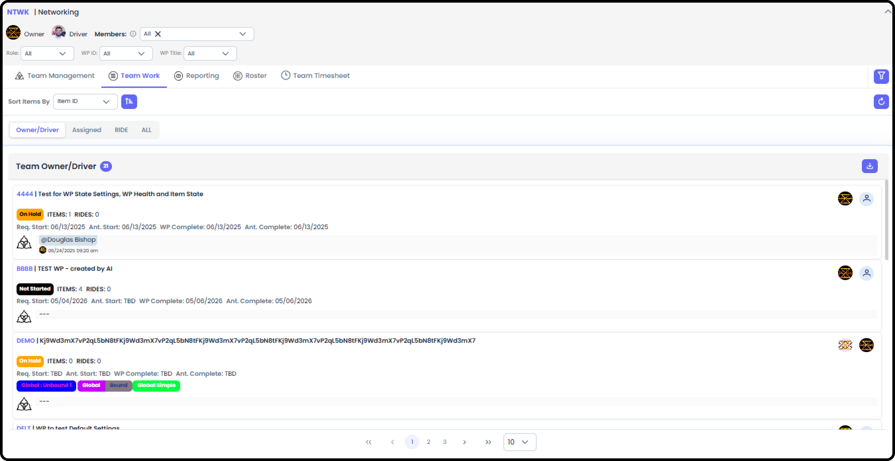
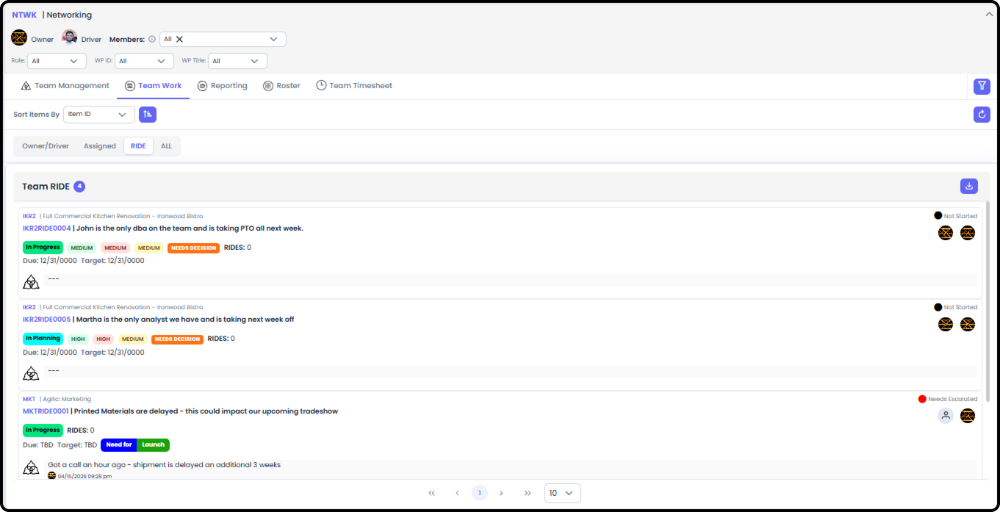

# Creating & Managing Teams

*Version v15 • August 31, 2026 • Section 3: Recurring Admin Tasks • For: Org Admins / Team Owners*

A Team in Agilic is a standing group — separate from any single Work Package — with its own purpose and roster. This guide covers creating a new team and keeping its membership current. You can do this from Org Admin, or from within My Team if you are that team's Owner or Driver.

> **See also:** For a full tour of every My Team screen, see [How to Navigate a Team](/section-1-new-user-orientation/navigate-a-team.md) (Section 1).

## Creating a New Team

**Step 1: Add a New Team**

If you have the ability to Create a New Team (permission set in Org Admin → People) then in the Left-Hand Menu you should see the Create Team link under Teams.

In Org Admin → People → Teams view, there is also a button to Create a New Team.

**Step 2: Fill In Team Details**

Most fields in the Team Purpose are available when filling out the New Team Details. However, only a few fields are required to actually create the new Team:

- Team Code — exactly 4 characters, and must be unique
- Team Name
- Team State
- Owner or Driver — you must assign at least one of these two fields to someone within your organization

Everything else is optional.

> **Tip:** Pick a team code convention early (e.g. first letters of the team's function) — it's only 4 characters, so it's worth being consistent across teams.

**Step 3: Update the Team's Purpose and Other Fields**

After creating the Team, you can go to the Team Management → Purpose view. Here you can edit any of the fields except the Team ID.

## Adding People to a Team

**Step 4: Add a Team Member**

From the team's Add a Team Member screen, select people from your organization who aren't already on the team.

- Choose from the list of available organization members (name, role, avatar shown)
- Once added, the member gets a join date and an Active/Inactive status

**Step 5: Manage the Roster**

Use Team Roster to review current membership and contact information — anyone can see this.

Use Team People Management for administrative tasks: basic admin info for the team, and removing a team member.

Use Team Recent Activity to review audit information — who accessed what, and when.

## Related Tasks

Adding someone to a Team doesn't automatically add them to a specific Work Package — those rosters are managed separately. See Create Work Package / Add People to WP (Section 4).

## Managing the Team

**Team Management**

Displays the Purpose, Milestone Management and RIDE Management for the Team.

- Purpose — is the Team's Who We Are, What We Do and basic links and details useful for the Team and others needing information from the Team.

- Milestone Management — displays all the milestones the Team Members' names are associated with, from all the Work Packages they are on.

- RIDE Management — displays all the RIDE Items the Team Members' names are associated with, from all the Work Packages they are on.

**Team Work**

Team Work is similar to My View → My Work, only geared towards everyone on the Team. It displays:

- Owner / Driver — all the efforts the members of the Team either own or drive.

- Assigned — all the Items the Team Members are Assigned and/or Responsible for.

- RIDE — all the RIDE Items the Team Members are associated with.

**Reporting**

Reporting for Teams is similar to My View → Reporting and WP View → Reporting.

You have access to:

- Kanban — this pulls in all the Items the Team Members are Assigned / Responsible for.
- Stakeholder Report — this provides links to all the Stakeholder Reports of the Work Packages that the Team Members are on the WP Roster of.
- Status — this shows a time-based referenced list of the Items and Work Packages the Team Members are assigned to.
- Item Hours — a detailed listing of all Items the Team Members are on, with hours estimated, recorded and remaining (if the members are entering that detail directly on the items).
- Charts — similar to WP Reporting → Charts but pulls from across all Items the Team Members are assigned to.
  - RIDE Charts — RIDE Heat Map, Decision Chart, Mitigation Management
  - Item Charts — Items by State, Items by Responsible, Items by Assignee
