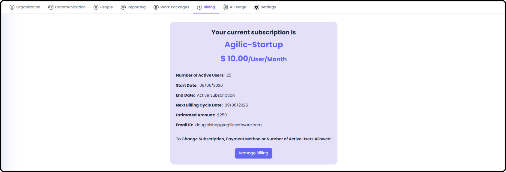
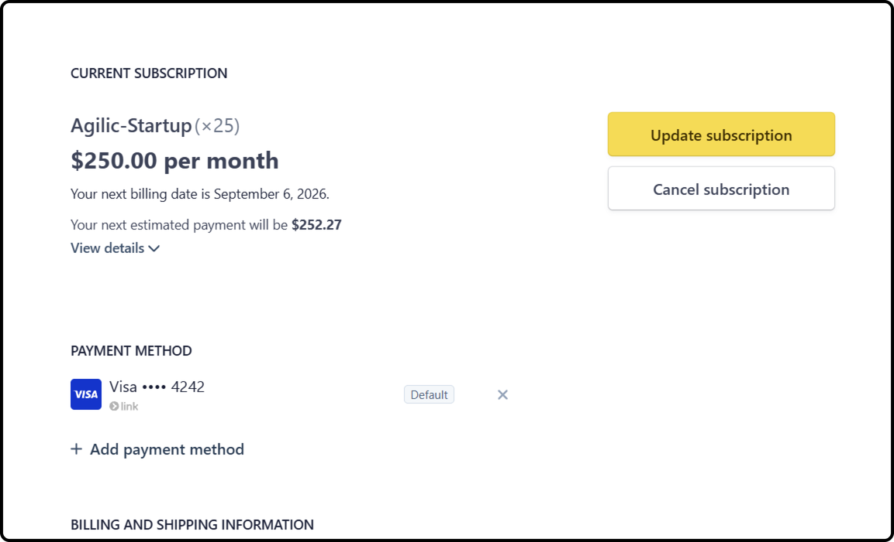

# Managing Billing & Subscription

*Version v15 • August 31, 2026 • Section 3: Recurring Admin Tasks • For: Billing Admins*

This guide covers your organization's subscription and AI usage tracking. Only the person flagged as Billing Admin can see this area — a narrower permission than general Org Admin access.

> **See also:** Billing Admin is a single-user role, and that person must already have Org Admin access. Anyone with Org Admin access can update who holds it — see [Permissions for People](/section-2-setting-up-your-org/permissions-for-people.md) (Section 2).

## Getting There

Go to Org Admin. If you're the Billing Admin, you'll see two additional tabs: Billing and AI Usage.

## Managing Your Subscription

**Step 1: Check Subscription Status**

The Billing tab shows whether your subscription is currently active, along with its start and end dates.

**Step 2: Update Subscription and Payment Details**

Select Manage Billing. This hands you off to a secure, Stripe-hosted billing portal — Agilic itself doesn't store or process your card details.

- Update your subscription
- Update your payment methods
- Cancel your subscription

> **Note:** Because this is a Stripe-hosted portal, invoice history and payment method management happen outside the main Agilic interface.

## Reviewing AI Usage

**Step 3: Check Token Usage**

The AI Usage tab's Token Usage view shows both current and historical token usage for your organization.

- Reports total tokens, input tokens, output tokens, provider cost, and customer cost
- Break usage down by User, AI Model, Work Package, or Record Type using the tabs
- Results are sortable and searchable

**Step 4: Review Billing History**

The Billing History view shows the cost of tokens for past periods, with token counts and costs formatted for readability.

> **Tip:** Use Token Usage to keep an eye on current-period costs, and Billing History when you need to look back at a specific past period.
