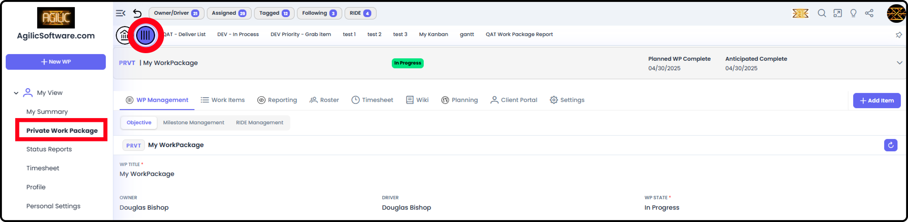
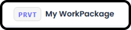
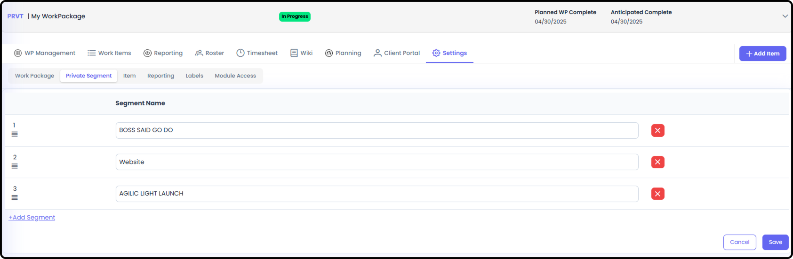

# Private Work Packages

*Version v18 • August 31, 2026 • Section 4: Core Day-to-Day Work • For: All users*

This is a summary-level overview of Private Work Packages — what they are and how they're identified. For the fuller picture of how they show up in your personal views, see My View Overview (Section 8).

## Getting There

You can access your Private Work Package (PWP) any time from any screen by selecting the PWP navigation button.

## What a Private Work Package Is

Every User is given a dedicated Private Work Package with a WP ID showing as "PRVT." This reserved prefix is validated at creation time (when a User is added into Agilic) — a regular Work Package's code can't start with those four characters.

## How This Differs from a Standard Work Package

Private Work Packages function exactly like a regular Work Package but they are a distinct concept from the standard Work Package. Private Work Packages are intended for your own personal needs within the context of your Organization. How you deal with personal work is very different from how you approach official work.

Differences between standard Work Packages (WP) and Private Work Packages (PWP) include:

- You have the ability to customize Work Item Type naming (Training, Compliance, Doc Appointments, Boss Said Go Do, etc.) and you can have more than four Work Item Types
- You can manage your own work that falls outside of official project tasks
- No one else can see your Private WP information — not even your boss
- **Tip:** You are the default Owner / Driver of your Private Work Package — this means all the features available to a regular Work Package are available to you in your PWP.

## To Add / Edit Work Item Type Names

In the Private Work Package, go to Settings → Private Segment. Private Segments are similar to Work Item Types, but you are allowed to create your own.

- There you can add Additional Segments and adjust the order the segments appear in.

## Related Tasks

- For the full picture of how Private Work Packages appear in your personal views, see My View Overview (Section 8)
