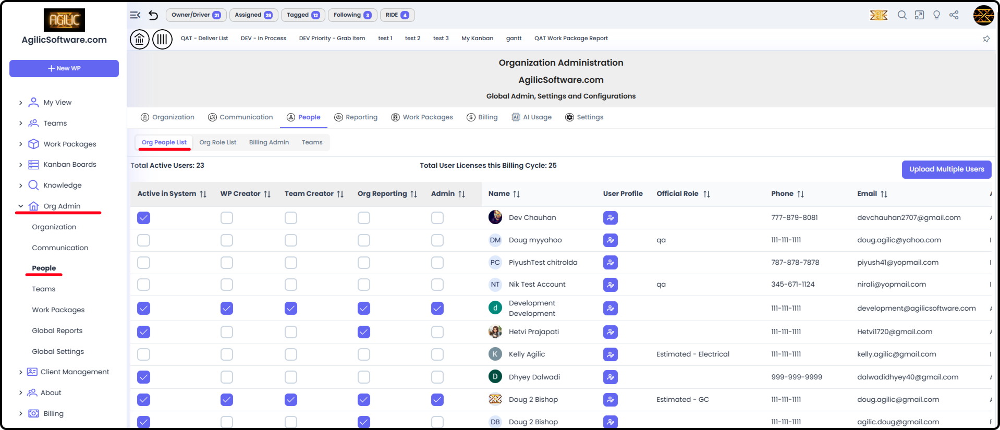
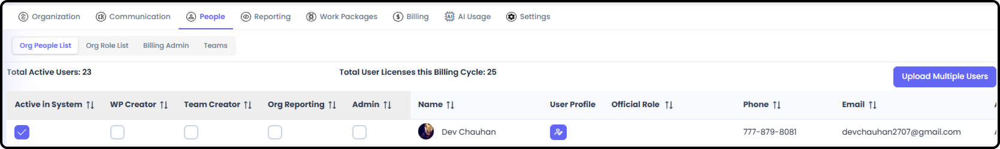
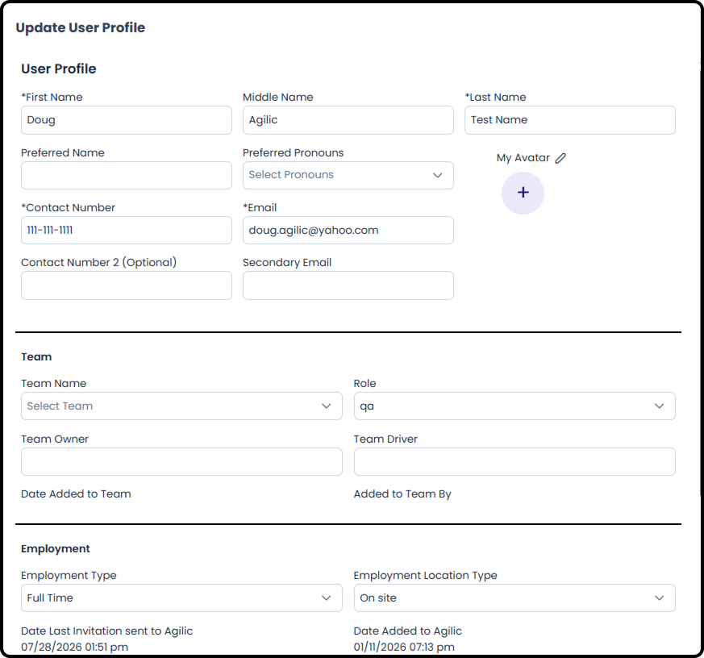
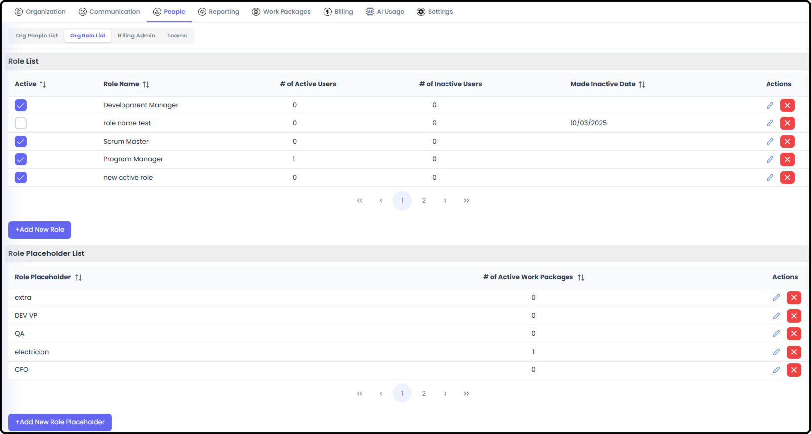
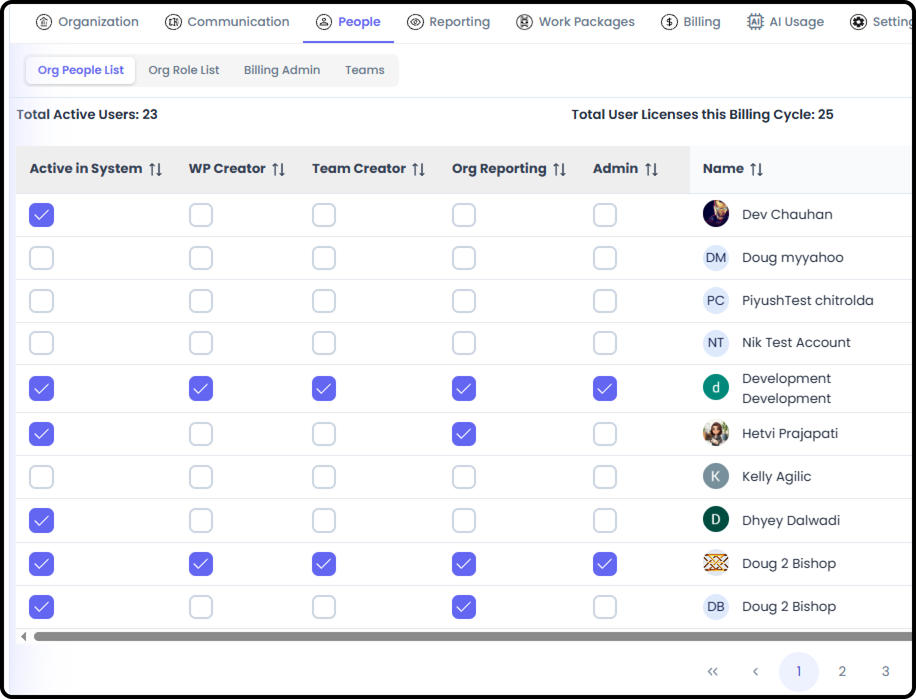
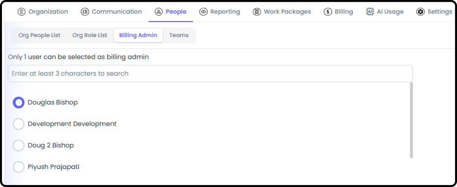
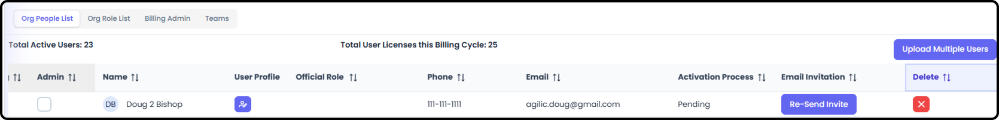
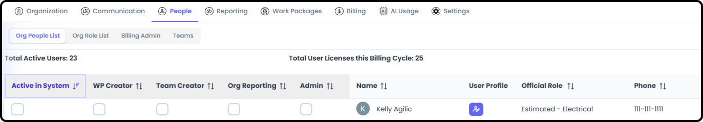

# Updating Permissions for People

*Version v18 • August 31, 2026 • Section 4: Core Day-to-Day Work • For: Org Admins*

This guide covers changing an existing person's access after they've already been added to your organization — revoking or adjusting what they can do, as opposed to the initial invite and permission grant.

> **See also:** For inviting a brand-new person and granting their initial permissions, see [Adding & Managing People](/section-3-recurring-admin-tasks/adding-managing-people.md) (Section 3). For the full model of how access works in Agilic, see [Permissions for People](/section-2-setting-up-your-org/permissions-for-people.md) (Section 2).

## Getting There

Go to Org Admin → People → Org People List, then adjust the check boxes for the person whose access you want to change.

## Changing a Person's Role

**Step 1: Open Their Profile**

From the Org People List, open the person's User Profile view.

Note: if a user has not accepted the initial email invite, Org Admin can update their email here. If they have accepted, then their primary email can not be changed.

**Step 2: Update Their Role**

Change their assigned Role to reflect a change in job title or function. Role options come from the Org Role List managed in Org Admin → People → Roles.

Note: Role Placeholders can also be added here. These placeholders can function like real people until you know who actually needs to be assigned.

> **Tip:** Changing someone's Role only updates their job title/skillset label — it has no effect on what they're actually able to do in Agilic. Standard Permission Types (below) control that separately.

## Updating Standard Permission Types

**Step 3: Add or Remove a Permission Type**

From the same Org People List entry, toggle any of the four Standard Permission Types:

- WP Creator — ability to create Work Packages
- Team Creator — ability to create Teams
- Org Reporting — ability to access org-level reporting
- Admin — full Org Admin access, which includes all other levels

> **Note:** Every organization must always have at least 1 person with Admin (Org Admin) access — the system won't let you remove the last one.

## Updating Billing Admin

Billing Admin is a single-user role, separate from the Standard Permission Types above. Go to Org Admin → Billing Admin to change who holds it — the person must already have Org Admin access.

> **See also:** For the full Billing Admin rules, see [Permissions for People](/section-2-setting-up-your-org/permissions-for-people.md) (Section 2) and [Managing Billing & Subscription](/section-3-recurring-admin-tasks/managing-billing.md) (Section 3).

## Removing Someone's Access Entirely

If someone leaves your organization, you'll need to remove their access.

**Step 4: De-Activate the User / Remove All of a Person's Permissions**

From the same Org People List entry, if you want to remove a person entirely from the organization:

- If the person has never responded to the invite to join, go to the Delete column and click the X button for the person. If the button does not exist, you can't delete the person and have to make them Inactive instead.

From the same Org People List entry, to make a user Inactive:

- Uncheck the "Active in System" box for the user.

- They will then show as Inactive in the Activation Process column.
- Making a user Inactive will prevent them from logging into the system and remove them from your license count.

- If you wish to re-activate a user in the future, you will need to mark them as Active in the system again and re-send their invite.

## Related Tasks

- For a new person's initial invitation and permission grant, see [Adding & Managing People](/section-3-recurring-admin-tasks/adding-managing-people.md) (Section 3)
- For Work Package-level roster changes, see Create Work Package / Add People to WP (Section 6)
- For the full access model, see [Permissions for People](/section-2-setting-up-your-org/permissions-for-people.md) (Section 2)
