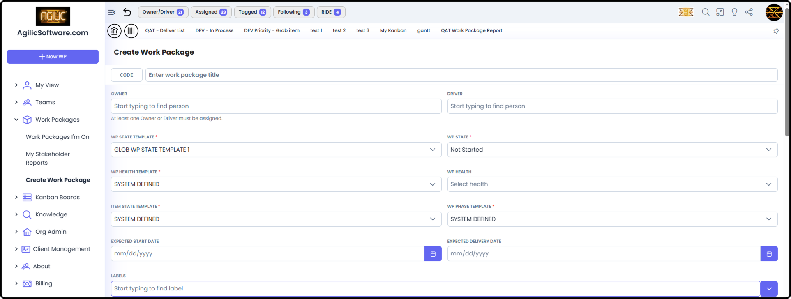
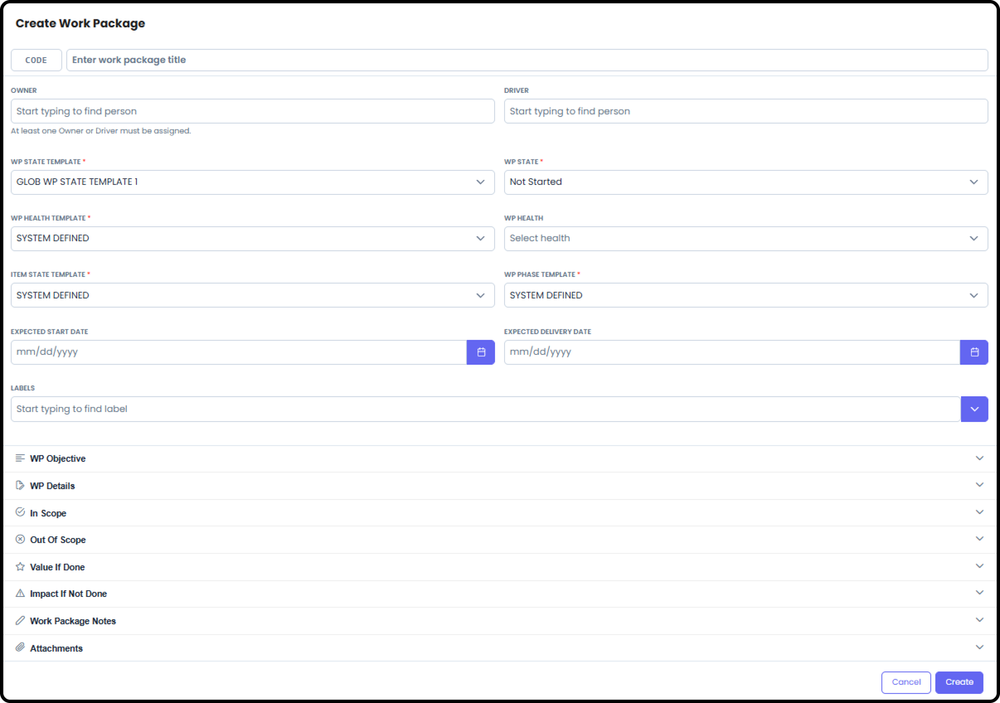
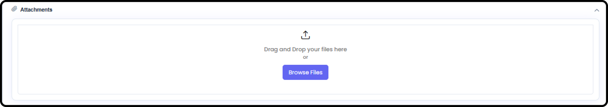
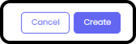

# Create Work Package / Add People to WP

*Version v13 • August 31, 2026 • Section 6: Inside a Work Package*

A Work Package (WP) is the core unit of work in Agilic. This guide walks through creating a new Work Package and getting people added to the WP — something you'll do every time a new project or task needs its own dedicated space.

## Creating a Work Package

**Step 1: Start a New Work Package**

From the main Work Packages list, select Create Work Package.

Note: if you do not see the Create Work Package link, then you do not have permissions to create a new Work Package. Please talk to your Org Admin for permissions.

**Step 2: Fill In the Objective and Required Details**

Fill in the WP's objective/purpose and core details — this becomes what appears on the Work Package Management landing page.

> **Tip:** A clear objective here sets the tone for the whole Work Package — it's the first thing everyone sees.

**Step 3: Minimum Fields Required to Create a New Work Package**

The minimum required fields are:

- WP ID — this is a unique ID you create.
  - ID codes can not be duplicated.
  - ID codes can't start with "PRVT" — that prefix is reserved for private Work Packages.

  > **See also:** Every user automatically gets one dedicated Private Work Package — this validation just guards against manually creating a regular WP with that prefix. See [Private Work Packages](/section-4-core-day-to-day-work/private-work-packages.md) (Section 4).

- WP Title — the title of the Work Package
- Owner / Driver — at least one Owner OR Driver is required to be entered. They must be someone Active on the Org People List.
- WP State Template — there is a System Defined default that you can change in Org Admin → Settings
- WP State — this will be the State of the WP upon creation of the effort. This list comes from the WP State Template being used.
- WP Health Template — there is a System Defined default that you can change in Org Admin → Settings. WP Health is not a required field to be used, but you must have a WP Health Template selected when you create the Work Package.
- Item State Template — there is a System Defined default that you can change in Org Admin → Settings. These define the options for Item State of all Standard Items and RIDEs.
- WP Phase Template — there is a System Defined default that you can change in Org Admin → Settings. Phases are actually assigned to individual Items. This allows you to have multiple phases with active Items simultaneously.
- All other fields are optional

**Template Notes:** Templates are established at the Org Admin level. If your org has not set up default templates, then the "System Defined" template will appear. After creating the Work Package, you can go in and modify those in the WP Settings.

> **See also:** Org-wide defaults for these are set in [Org Settings](/section-2-setting-up-your-org/org-settings.md) (Section 2).

**Step 4: Add Attachments (Optional)**

You can attach relevant files at creation time, or add them later.

**Step 5: Save (Create)**

Once created, your new Work Package opens to its Work Package Management landing page.

## Related Tasks

- To manage the Work Package's day-to-day work, see [Work Item Types](/section-4-core-day-to-day-work/work-item-types.md) (Section 4)
- To track risks, issues, dependencies, and escalations, see [Working RIDE Items](/section-4-core-day-to-day-work/working-ride-items.md) (Section 4)
- For defining scope, preparing your roster, and setting allocations before this stage, see [Pre-Planning Capabilities](/section-6-work-package-overview/pre-planning-capabilities.md) (Section 6)
- For details on what different access levels mean, see [Permissions for People](/section-2-setting-up-your-org/permissions-for-people.md) (Section 2)
