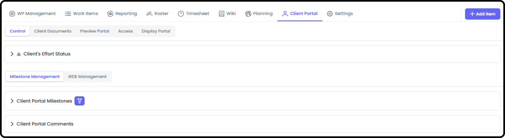
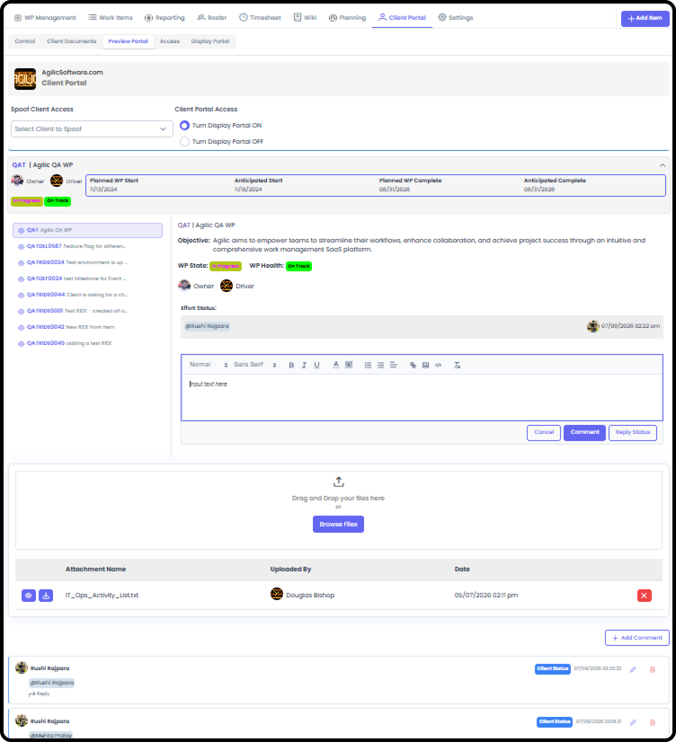
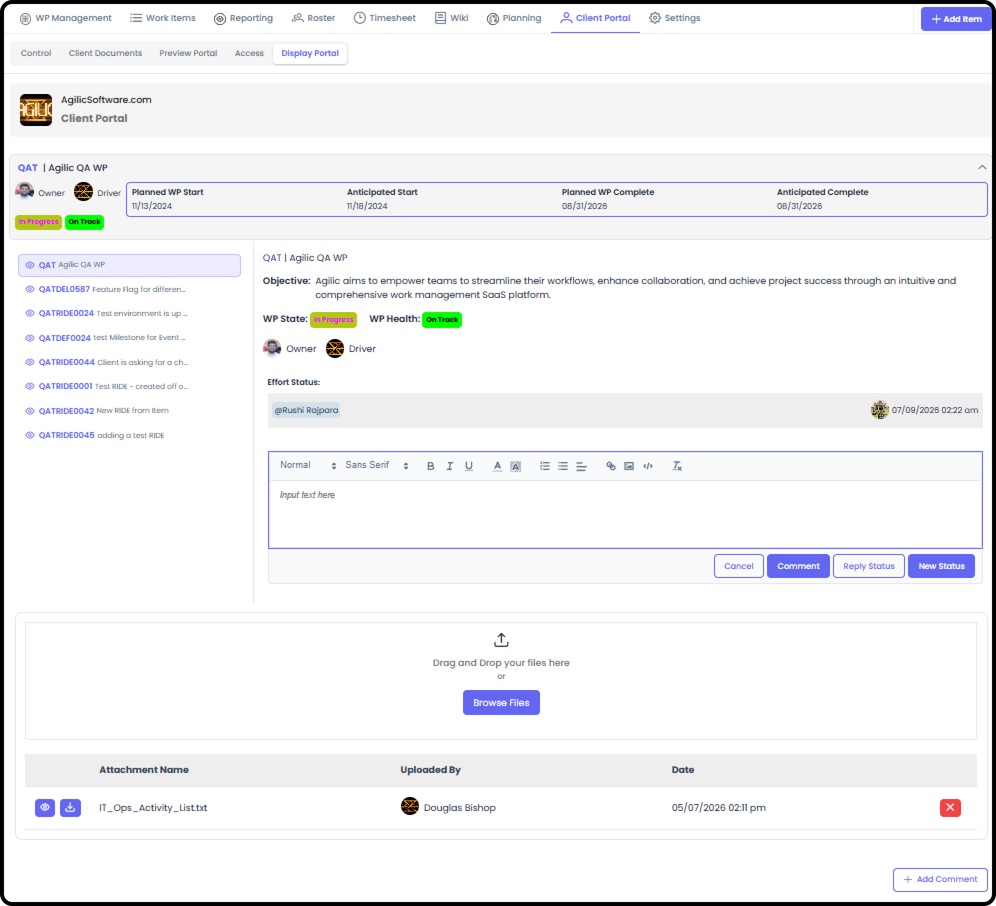

# Work Package Client Portal Management

*Version v13 • August 31, 2026 • Section 6*

Only relevant if this Work Package has external clients. Controls exactly what a client can see — which milestones, RIDE items, and status updates get shared with them.

> **See also:** For what the client actually experiences, see Client Portal — Getting Started (Section 9). For the internal user side, see Client Portal Module (Section 9). For the admin side of managing client companies and contacts, see Managing Client Companies & Contacts (Section 10).

## Getting There

Inside a Work Package, go to the Client Portal Management tab.

If you are unable to see the Client Portal tab, then it is not currently turned on for this Work Package. To turn on the Client Portal, go to WP Settings → Module Access.

Only the Owner/Driver or an Org Admin can turn on the Client Portal.

## Control

Input the client's effort status, and manage Client Milestone Management and Client RIDE Management — this is where you decide which milestones and RIDE items actually get shared with the client.

## Client Documents

A history of all documents uploaded to the Client Portal — including documents that have since been deleted.

## Preview Portal

Input your client's name to see exactly what they'll see when they log in.

## Access

The list of clients who can see this Client Portal, and their assigned permission levels.

## Display Portal

A maximized view of the Client Portal, designed for screen sharing.

