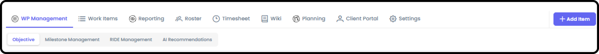
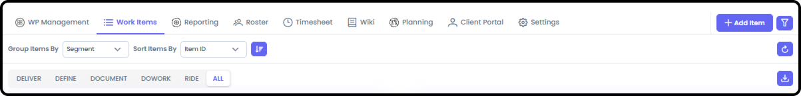
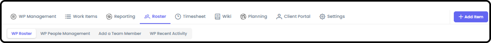
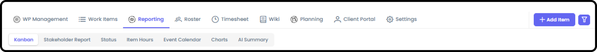
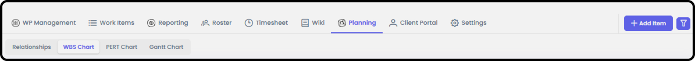
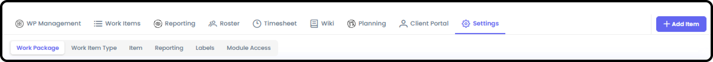
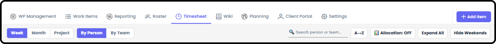
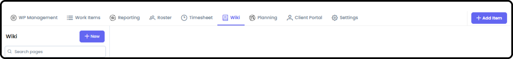
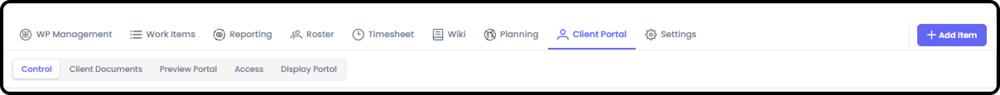

# Work Package Overview

*Version v13 • August 31, 2026 • Section 6*

This is the connector document for everything inside a Work Package (WP) — the core unit of work in Agilic. Several areas already have their own deep-dive guides; this document ties them together and covers what doesn't have a dedicated home yet.

> **See also:** For a first-day tour of every tab, see [How to Navigate a Work Package](/section-1-new-user-orientation/navigate-a-work-package.md) (Section 1). For creating a WP and managing its roster, see [Create Work Package / Add People to WP](/section-6-work-package-overview/create-work-package.md) (Section 6).

## Work Package Management

The WP's landing page starts you on the Objective and gives you access to Milestone Management, RIDE Management, and AI Recommendations.

## Pre-Planning

Defining the Work Package's objective and scope, preparing your roster, and setting resource allocations — everything that happens before you're ready to plan out the schedule.

> **See also:** Full deep-dive coverage in [Pre-Planning Capabilities](/section-6-work-package-overview/pre-planning-capabilities.md) (Section 6).

## Work Items and RIDE

Define, Do Work, Document, and Deliver are the four standard Work Item Types; RIDE is a related fifth type for Risks, Issues, Dependencies, and Escalations.

> **See also:** Fully covered in [Work Item Types](/section-4-core-day-to-day-work/work-item-types.md), [Working Standard Items](/section-4-core-day-to-day-work/working-standard-items.md), and [Working RIDE Items](/section-4-core-day-to-day-work/working-ride-items.md) (all Section 4).

## Roster

Who's on this specific Work Package, and how to add, remove, or manage their access.

> **See also:** Fully covered in [Create Work Package / Add People to WP](/section-6-work-package-overview/create-work-package.md) (Section 6).

## Reporting

Kanban, Stakeholder Report, Status, Item Hours, Event Calendar, Charts, and AI Summary — the reporting views scoped to this Work Package.

> **See also:** Full detail on every report type is in Section 15 (Reporting Detail).

## Planning

Relationships, Work Breakdown Structure (WBS), PERT Chart, and Gantt Chart — the scheduling and breakdown tools for this Work Package.

> **See also:** Full deep-dive coverage in [Work Package Planning](/section-6-work-package-overview/work-package-planning.md) (Section 6).

## Settings

WP-level configuration — Work Package, Work Item Type, Item, Reporting, Labels, and Module Access sub-tabs.

> **See also:** Full deep-dive coverage in [Work Package Settings](/section-6-work-package-overview/work-package-settings.md) (Section 6).

## Timesheet

Time-tracking for this Work Package. Only people who are on the Roster of the Work Package can access the Timesheet.

Only the WP Owner/Driver (and Org Admin) can see everyone's Allocations and time logging. Individuals can see Allocations and log time for themselves.

> **Note:** Only the Owner/Driver of the WP (or Org Admin) can update Allocations for a person.

> **See also:** Item-level Hours Summary (Planned vs. Logged) is covered in [Working Standard Items](/section-4-core-day-to-day-work/working-standard-items.md) (Section 4). The full Timesheet guide is Timesheets (Section 12).

## Wiki

File/document storage for the Work Package.

## Client Portal Management

Only relevant if this WP has external clients. Controls exactly what a client can see — which milestones, RIDE items, and status updates get shared with them.

> **See also:** Full deep-dive coverage in [Work Package Client Portal Management](/section-6-work-package-overview/work-package-client-portal-management.md) (Section 6).
