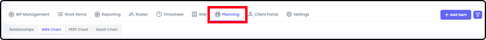
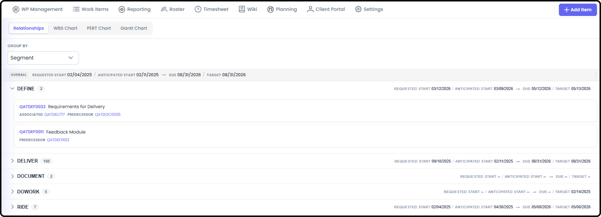
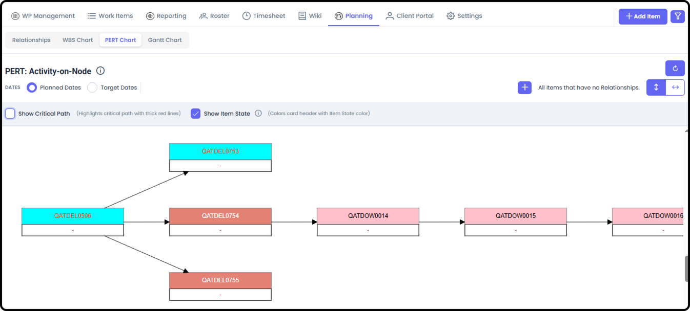
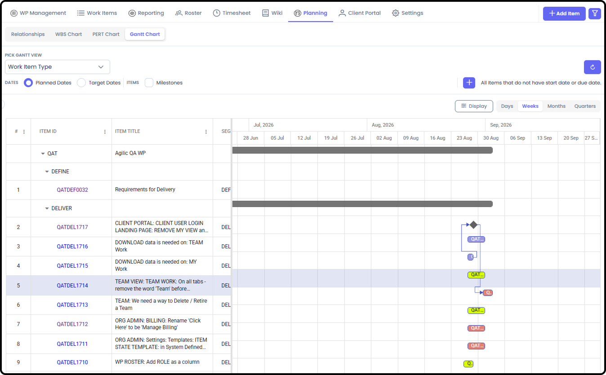

# Work Package Planning

*Version v13 • August 31, 2026 • Section 6: Inside a Work Package • For: WP Roster members*

Standard project planning — used once you have your team assembled and are ready to plan out the schedule. Covers Task Relationships, Work Breakdown Structure (WBS), PERT Chart, Gantt Chart, and Baseline Planned.

> **See also:** For everything that comes before this stage — defining the Work Package itself, and preparing your roster — see [Pre-Planning Capabilities](/section-6-work-package-overview/pre-planning-capabilities.md) (Section 6).

## Getting There

Inside a Work Package, go to the Planning tab.

## Relationships

A list of items showing which item has what relationships to other items.

- Associated — a breadcrumb link to similar content, with no schedule dependency
- Predecessor — the item that comes before another item
- Successor — the item that comes after another item
- RIDE / Impacted Items — RIDEs can be directly related to an item. Regular items will show which RIDE items are related, while RIDE items will show which regular items they impact.

> **See also:** Relationships are also set from an item's own detail view — see [Working Standard Items](/section-4-core-day-to-day-work/working-standard-items.md) (Section 4).

> **See also:** Relationships are also set from a RIDE's own detail view — see [Working RIDE Items](/section-4-core-day-to-day-work/working-ride-items.md) (Section 4).

## Work Breakdown Structure (WBS)

Organize your work in a WBS format — the default Planning view.

- Create your WBS structure by adding layers on the right-hand WBS side and editing those layer names.
  - Move the layers around by drag and drop.
  - Manually search for and move items from the left-hand column to the WBS.
- Or use the dedicated AI Agent button on the page to automatically create a draft WBS for you, flavored by what you tell it.
- Make multiple WBS versions, and mark the one you want to use as "Active."
  - Once Active, you can bulk mark those WBS items as Baseline Planned.

## PERT Chart

A visual flow chart showing Predecessors, Successors, and the Critical Path. You can see the PERT pathway using Planned Dates or Target Dates.

You can also see progress, as the PERT cards can show the Item State color.

> **See also:** For Forward Pass and Backward Pass — automatic schedule recalculation — see Work Package Planning Tools (Section 11).

## Gantt Chart

A timeline diagram, with the ability to show rows organized in different ways (by State, by Phase, etc.).

> **See also:** For the full range of grouping options (including Milestones-only and RIDE-only views), see Work Package Planning Tools (Section 11).

