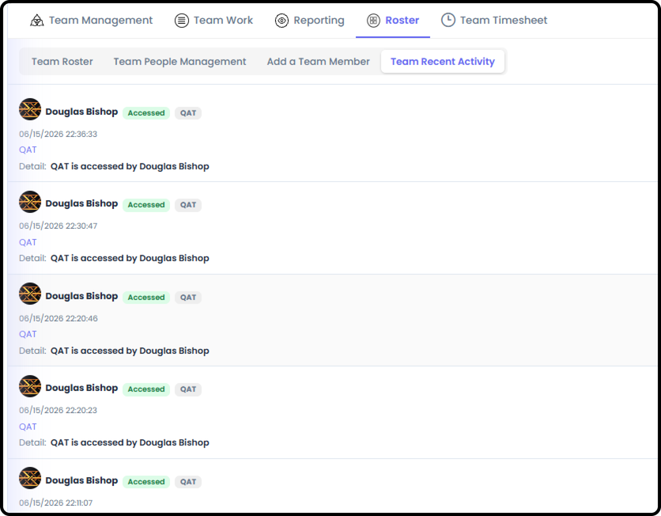
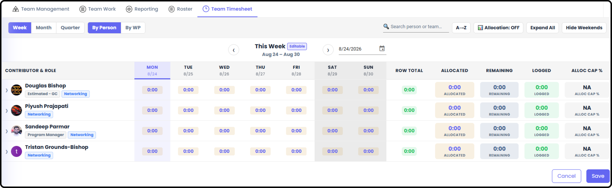

# My Team Overview

*Version v10 • August 31, 2026 • Section 7*

This is the connector document for My Team — a standing group you belong to, separate from any single Work Package. My Team closely mirrors My View, scoped to your team instead of just you; this guide covers what's different and points to My View Overview (Section 8) for anything shared between the two.

> **See also:** For a first-day tour, see [How to Navigate a Team](/section-1-new-user-orientation/navigate-a-team.md) (Section 1).

## Getting There

Select Team Summary from your main navigation. Only visible if you're a member, Owner, or Driver of a team — if you don't belong to one, you won't have a My Team area to open.

## Team Management

The landing view for your team, defaulting to Team Purpose.

**Team Purpose**

Displays various information about the team — its stated purpose, useful links, and related context.

**Milestone Management**

Shows all milestones the members of the team are involved in, across every Work Package they're part of.

Can be sorted by:

- Escalated
- Due Date
- Target Date
- WP ID
- WP Title
- Item ID
- Item State
- On Roadmap
- Responsible

**RIDE Management**

Shows all RIDE items the members of the team are involved in.

Can be sorted by:

- Escalated
- Due Date
- Target Date
- WP ID
- WP Title
- Item ID
- Item State
- Likelihood
- Impact
- Severity
- Responsible

## Team Work

Tabs for Work Packages team members are the Owner/Driver of, tabs for items your team is Assigned to, and a tab for RIDE items your team is involved in — the team-scoped equivalent of My Work.

> **See also:** Compare to My Work in My View Overview (Section 8), which is scoped to just you.

## Reporting

Team Reports and Charts — the same report types available at the Work Package and My View levels, scoped to items your team's members are Assigned to or Owner/Driver of, across every Work Package they're part of.

> **See also:** Full detail on every report type — Kanban, Stakeholder Report, Status, Item Hours, and Charts — now lives in Section 15: Reporting Detail. Everything there applies here, scoped to your team. Note: at the Team level, Item Hours can show Estimated, Recorded, and Remaining instead of Planned/Logged, when members enter that detail directly on the item.

## Roster

People management for the team.

**Team Roster**

Shows the team members and their contact information.

- Anyone can see this information

**Team People Management**

Basic administrative information for the team, and team member removal.

**Add a Team Member**

Where you add a team member who is already in the organization.

**Team Recent Activity**

Basic audit information of who accessed what, and when.

> **See also:** Full step-by-step instructions for managing the roster are in [Creating & Managing Teams](/section-3-recurring-admin-tasks/creating-managing-teams.md) (Section 3).

## Team Timesheet

The entire team's allocations and logged hours.

- Only the Owner, Driver, and Org Admin can see everyone's information
- Remaining team members can see only what their teammates are Assigned to

> **See also:** Compare to My Timesheet in My View Overview (Section 8), which is scoped to just you.
