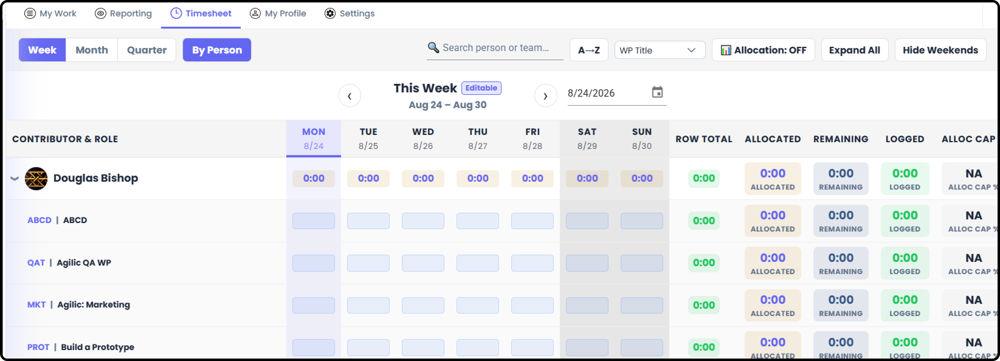
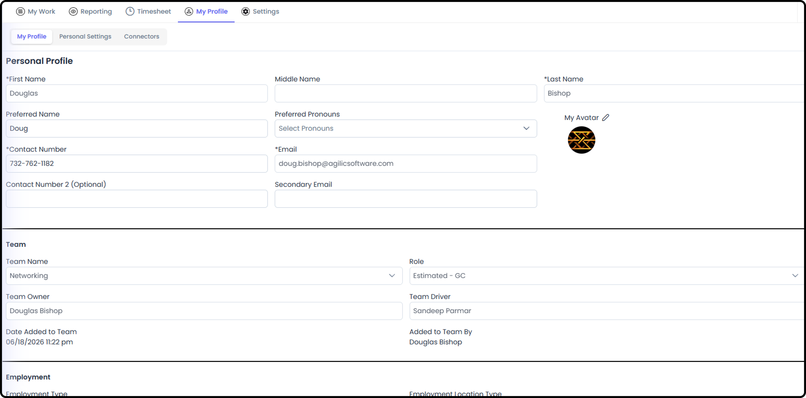
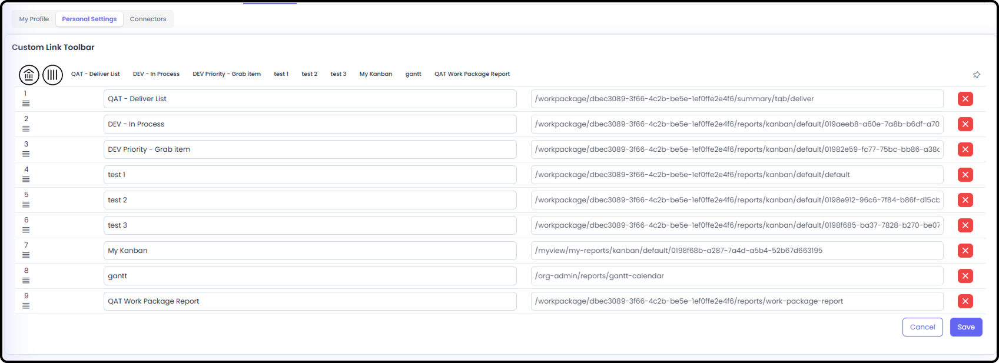
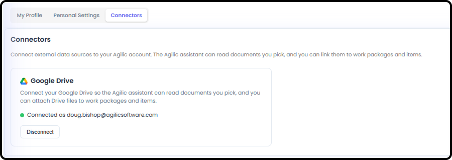
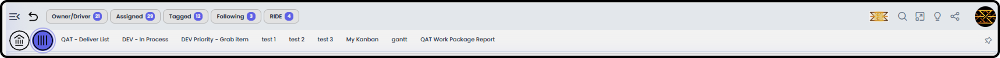

# My View Overview

*Version v12 • August 31, 2026 • Section 8*

This is the connector document for My View — your personal dashboard, pulling together everything relevant to you across every Work Package you're part of. It ties together the first-day tour and points to the dedicated Reporting deep-dive.

> **See also:** For a quick first-day tour, see [How to Navigate as a User](/section-1-new-user-orientation/navigate-as-user.md) (Section 1). For the full Reporting deep-dive (which also applies to My Team's Reporting tab), see [My View Reporting](/section-8-my-view-overview/my-view-reporting.md) (Section 8).

## Getting There

My View is where you land immediately after logging in, and is also reachable at any time via the Home button in the persistent top toolbar.

## My Work

A tabbed view of items relevant to you, pulled from across all your Work Packages.

- Owner/Driver — Work Packages where you're the Owner or Driver
- Assigned — items assigned to you and/or are Responsible for
- Tagged — items you've been tagged/mentioned on
- Following — items you're following
- RIDE — Risks, Issues, Dependencies, and Escalations relevant to you, across all your Work Packages
- All — a combined view of everything above

> **See also:** Each of these tabs is also reachable directly from the persistent top toolbar's quick-access pills — see [How to Navigate as a User](/section-1-new-user-orientation/navigate-as-user.md) (Section 1).

## Reporting

Personalized versions of things you'll also see inside Work Packages you're on and your Private Work Package.

> **See also:** Full deep-dive coverage in [My View Reporting](/section-8-my-view-overview/my-view-reporting.md) (Section 8).

## My Timesheet

Showing all your allocations and logged hours within every Work Package you're part of.

> **See also:** Item-level Hours Summary (Planned vs. Logged) is covered in [Working Standard Items](/section-4-core-day-to-day-work/working-standard-items.md) (Section 4). The full Timesheet guide is Timesheets (Section 12).

## My Profile

Your personal account area.

**Profile Detail**

Your account details and additional personal information.

**Personal Settings**

Custom link toolbar and UI options — this is where you manage the Custom Links pinned to your persistent top toolbar.

> **See also:** Pinning a Custom Link from the toolbar itself is covered in [How to Navigate as a User](/section-1-new-user-orientation/navigate-as-user.md) (Section 1).

**Personal Connectors**

Connect external data sources to your own account. Currently supports Google Drive.

## Private Work Packages (PWP)

Every user is given one dedicated Private Work Package (PWP), with a WP ID prefixed "PRVT." You're the default Owner/Driver, so all the features available to a regular Work Package are available to you in your Private Work Package.

- Has customizable naming for Work Item Types to better align with managing your own personal categories.
- Reachable at any time via the Private Work Package button in the persistent top toolbar.
- No one else in the organization can see your Private Work Package — not even your manager.

> **See also:** More detail in [Private Work Packages](/section-4-core-day-to-day-work/private-work-packages.md) (Section 4).

> **See also:** For standard features available, see Work Package Overview (Section 6).
