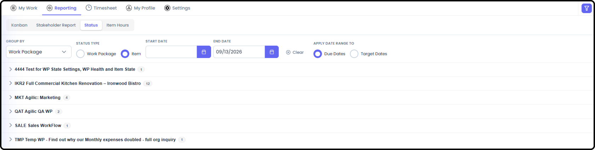

# My View Reporting

*Version v12 • August 31, 2026 • Section 8*

Everything under My View's Reporting tab works exactly like the Work Package-level reports, except every view here pulls data across every Work Package you're part of, rather than just one. Full detail on every report type now lives in Section 15: Reporting Detail — this page covers only what's different at the My View level.

> **See also:** For the full write-up of every report type below, see the corresponding document in Section 15 — Reporting Detail. For the personal dashboard this tab lives inside, see [My View Overview](/section-8-my-view-overview/my-view-overview.md) (Section 8).

## Getting There

From My View, go to the Reporting tab.

## Kanban

Same as Work Package Kanban, except cards are pulled from every Work Package you're part of, not just one.

> **See also:** Full detail: Kanban (Section 15). Step-by-step usage with screenshots: Using Kanban Boards (Section 13).

## Stakeholder Report

A personalized version of the Stakeholder Report — your status and escalated RIDE items and milestones, pulled across every Work Package you're on.

Select the Work Package you want to view the Stakeholder Report of, and it will take you directly to the report.

> **See also:** Full detail: Stakeholder Report (Section 15).

## Status

Same date-oriented list view as the Work Package version, scoped to items relevant to you across every Work Package.

> **See also:** Full detail: Status Report (Section 15).

## Item Hours

Your own logged hours, broken down by item, across every Work Package you're part of.

> **See also:** Full detail: Item Hours (Section 15).

## Charts

The same RIDE Charts and Item Charts available at the Work Package level, scoped to you across every Work Package.

> **See also:** Full detail: Charts (Section 15).
