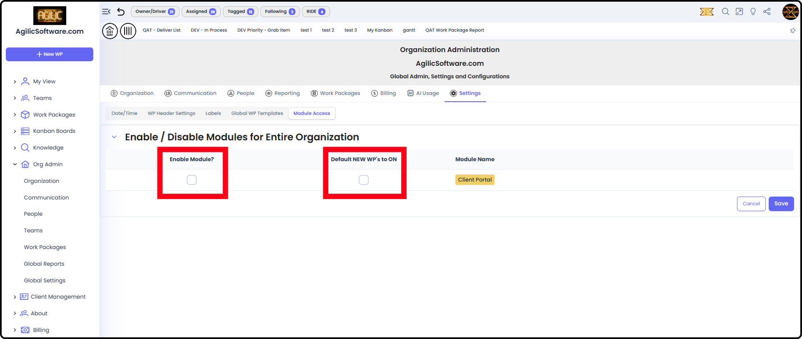
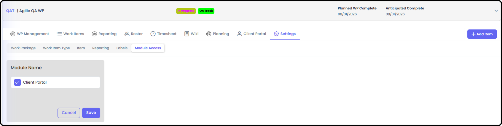
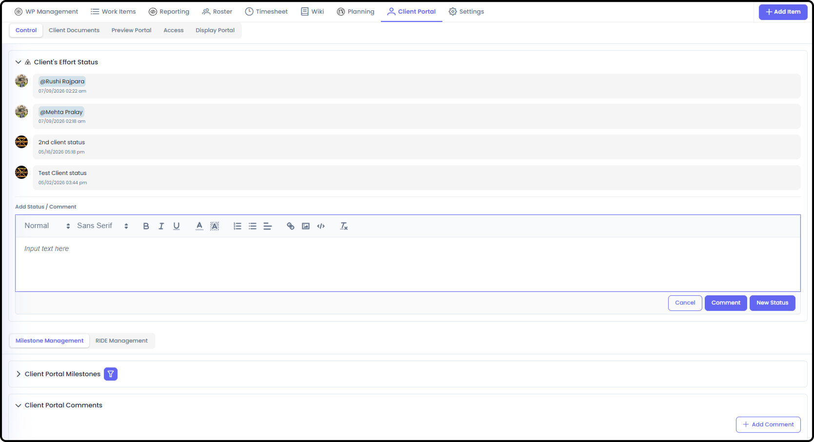
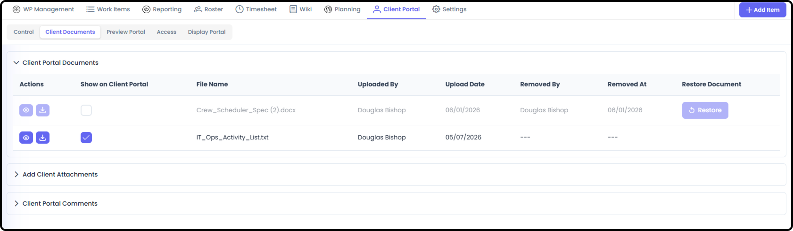
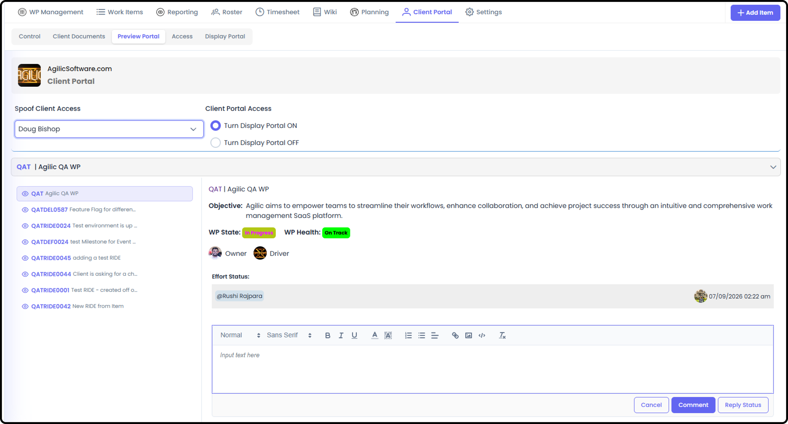
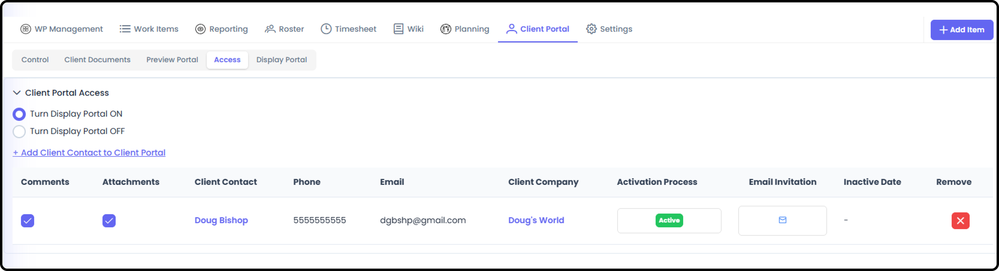
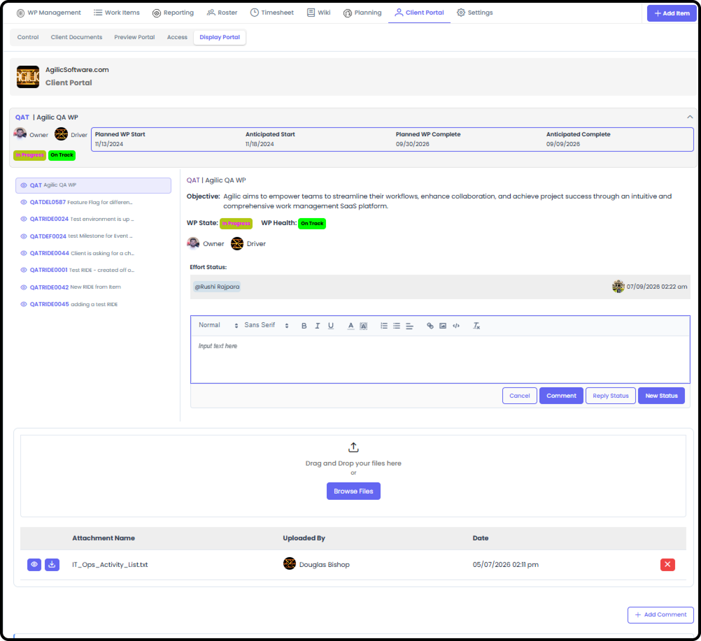

# Client Portal Module — Overview

*Version v12 • August 31, 2026 • Section 9: External Collaboration • For: Internal users (Org Admins, WP Owner/Drivers)*

This guide introduces the Client Portal from your organization's side — what it is, how it gets turned on, and how it fits together, before you drill into the step-by-step admin screens.

> **See also:** For what your client actually experiences once invited, see [Client Portal — Getting Started](/section-9-client-portal/client-portal-getting-started.md) (Section 9). For the full step-by-step admin controls inside a specific Work Package, see [Work Package Client Portal Management](/section-6-work-package-overview/work-package-client-portal-management.md) (Section 6). For managing client companies and contacts org-wide, see Managing Client Companies & Contacts (Section 10).

## What the Client Portal Is

The Client Portal is a simplified, external-facing view your organization can share with clients — a lighter alternative to sending status updates by email. It shows only what your project team chooses to share: selected milestones, RIDE items, status updates, comments, and attachments. Depending on the settings you choose, your clients can upload documents directly to the Portal as well.

## Turning It On

The Client Portal is enabled in two layers:

**1. Org-wide** — an Org Admin enables the Client Portal feature for the entire organization.

> **See also:** Org-wide enablement is covered in [Org Settings](/section-2-setting-up-your-org/org-settings.md) (Section 2).

**2. Per Work Package** — once enabled org-wide, each Work Package that wants to use it must turn it on individually, from that WP's Settings → Module Access. Only the Work Package's Owner/Driver, or an Org Admin, can turn on the Client Portal for a given Work Package.

## Who Can Manage It

Anyone on the WP Roster can access the Client Portal for a given Work Package.

> **See also:** Full permission detail in [Permissions for People](/section-2-setting-up-your-org/permissions-for-people.md) (Section 2).

## The Pieces, at a Glance

Once enabled on a Work Package, the Client Portal Module gives your team direct control and management of external users and what they can see. For full step-by-step instructions on using the Client Portal Module, see [Work Package Client Portal Management](/section-6-work-package-overview/work-package-client-portal-management.md) (Section 6).

There are 5 sub-tabs for the Client Portal Module:

- Control
- Client Documents
- Preview Portal
- Access
- Display Portal

## Control

This is control of the content the client will see on the Display Portal:

- Client Effort Status — similar to Work Package Status, but a dedicated field for updating the client.
- Milestone Management — shows all milestones and allows you to mark which ones to show on Display Portal.
- RIDE Management — shows all RIDEs and allows you to mark which ones to show on Display Portal.
- Client Portal Comments — all comments made within the Client Portal screens, including by the client on the Display Portal, can be seen here.

## Client Documents

A history of all documents uploaded to the Client Portal — including documents that have since been deleted.

- Client Portal Documents — ability to see and download all documents that have been uploaded to the Portal.
- Add Client Attachments — ability to upload additional documents.
- Client Portal Comments — all comments made within the Client Portal screens, including by the client on the Display Portal, can be seen here.

## Preview Portal

See exactly what a specific client will see, before they see it.

- Spoof Client Access — add the client user's name here and it will display what that user will see when the Display Portal is on.
- Client Portal Access On / Off — ability to turn on and off the Display Portal. This control is for everyone with access, not just an individual user.
- Client Portal Comments — all comments made within the Client Portal screens, including by the client on the Display Portal, can be seen here.

## Access

Manage which client contacts can see this Work Package's portal, and their permission level.

- Client Portal Access On / Off — ability to turn on and off the Display Portal. This control is for everyone with access, not just an individual user.
- Add Clients to Client Portal — to add a user, that person must be listed in the Client Management tool.
- Displays the current list of client users who can see the Display Portal.

  Note: every Work Package is limited to 5 client users per Work Package.

## Display Portal

A maximized, screen-share-friendly view of the client's experience — used internally when walking a client through their portal live, rather than something the client operates themselves.

- Company Info
- WP Name
- WP Client Effort Status
- Client Stakeholder Report — this works the same as a regular Stakeholder Report but uses the Client Effort Status, Milestones, and RIDEs marked in the Client Portal Control section.

  Note: all comments here are saved to the Client Portal Comments.

- Milestones and RIDE items marked to show on Client Portal

> **Note:** What the client themselves can do — leaving comments, viewing/uploading attachments — is documented separately in [Client Portal — Getting Started](/section-9-client-portal/client-portal-getting-started.md) (Section 9), since that's the client's own experience, not something managed from this internal Display Portal screen.

## Managing Client Companies & Contacts

Client companies and individual client contacts are managed org-wide, separately from any single Work Package's access settings.

> **See also:** Full detail in Managing Client Companies & Contacts (Section 10).
